+++
title = "Build your personal website without spending any money"
date = 2020-05-25

[taxonomies]
tags = ["static-site", "free", "web-development"]

[extra]
footnote_backlinks = true
social_media_card = "img/social_cards/default.jpg"
+++

In this article, we'll walk-through how to setup a Jekyll powered blog using the Minimal mistakes theme.

It’s not always clear why we need need a personal website. But here’s the truth, mostly if we are developers. A website is an effective medium to let the world know who we are, what we are capable of, and what our values are.

It depends on the purpose of website that you want to build for example blog, portfolio, landing page, multi-purpose ...But for my case, I need a website to:
- Showcase my projects
- Blog about my experiences, my knowledge in the programming and my other interests
- Share information about me that would be of interest to a recruiter, including my resume, email, and links to my Github, Medium, and LinkedIn pages.
- Being able to easily generate and publish blog posts is another extremely beneficial, but not required featured.

In the first time, I tried to create my website with the pages html, css and serve its with github pages. But I would need a a lot of time to complete it. That does not include the time I need to customize the website for each post.

I search the solution on the internet, and I found the awesome technology "Static Site Generator". 


## STATIC SITE GENERATOR

You may be hear already about the static site generator. They aren't new. They were what we used to build the web before dynamic CMSs (WordPress, Drupal, etc.) took over.

What's new, then? Modern tools—like static site generators—came out over the last years and expanded the capabilities of static sites.

Static site generator is an application takes a template directory containing raw text files in various formats, runs it through a converter (like Markdown) and its Liquid renderer, and spits out a complete, ready-to-publish static website suitable for serving with your favorite web server.

With the growth of the [JAMstack](https://jamstack.org/) and its community, Static Site Generators are becoming more and more popular.

So why static generator?
- Fast
- Security
- Development work flow: no need to create the backend serve. This makes it incredibly easy to run your site locally, automate builds, switch to a different host, etc.
- A lot of themes available, fast build, easy for maintenance. That's true. You even build a beautiful website after some minutes.

There a lot of static site generators, check out on [staticgen.com](https://www.staticgen.com/)

<div align="center">
  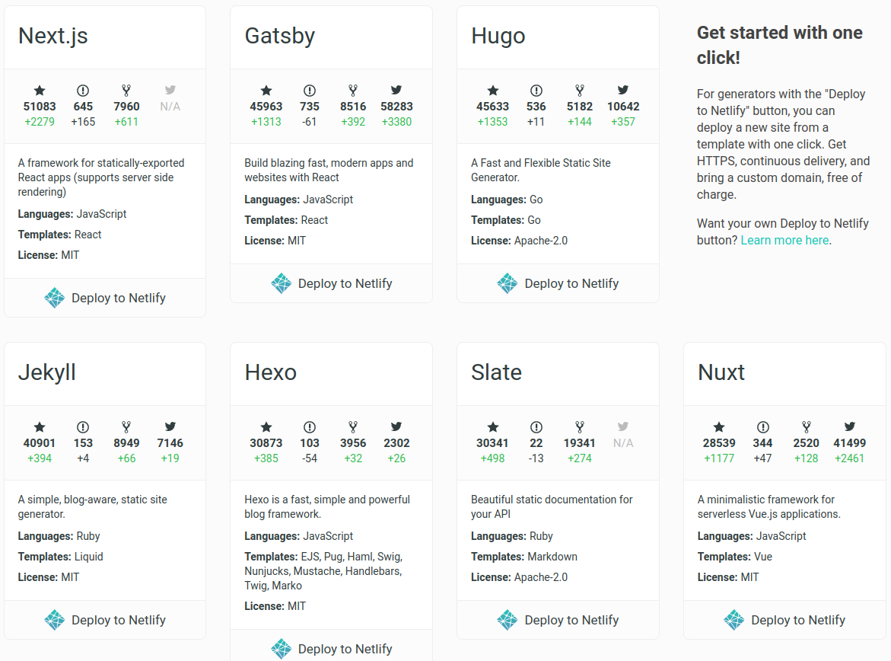
</div>


In this article I will present one of them : Jekyll

### Jekyll

Jekyll is a static site generator extremely popular. It is GitHub co-founder Tom Preston-Werner's popular Ruby open source program. It prompts developers to transform your plain text into static websites and blogs. Jekyll is the engine behind GitHub Pages, which you can use to host sites right from your GitHub repositories.

Jekyll is built with Ruby programming language. I'm now learning the web development with Ruby & Ruby on Rails at [The Hacking Project](https://www.thehackingproject.org/). So if you're coming from a Ruby/ROR background like me, you'll want to check in with Jekyll.

So let's see how I create my personal blog. **And don't forget that will be totally free.**

## INSTALLATION & BUILD

There are multiple ways to get started with Jekyll, each with its own variations. Here a few options:
- Install Jekyll locally via the command line, create a new boilerplate website using `jekyll new`, build it locally with `jekyll build`, then serve it.
  
  Make sure you installed jekyll on your machine `gem install bundler jekyll`. For the full installation, you can check out on the official guide [**jekyllrb.com**](https://jekyllrb.com/).
- Take a Jekyll theme and clone it to your local machine, install Jekyll locally via the command line, make updates to your website, build it locally, and then serve it. (You can also fork a starting point and make changes it)

We'll get start with the easiest option: Take a available theme of Jekyll. This will only get us up and running in a few minutes.

**So, let's choose a theme together**

Nowadays, there are a lot of Jekyll themes, both free and paid. Developers are design the templates perfectly for any corporate business and blogging website.

You can check some excellent paid Jekyll themes [here](https://themeforest.net/category/static-site-generators?clickid=TBN2XOQfVxyOTEOwUx0Mo3EHUkiWRC0dN0eB0o0&iradid=275988&iradtype=ONLINE_TRACKING_LINK&irgwc=1&irmptype=mediapartner&irpid=2056025&utm_campaign=af_impact_radius_2056025&utm_medium=affiliate&utm_source=impact_radius).

But as the title I wrote, we will build our website without paying anything, we'll choose only the free themes. 

You can found almost the free Jekyll themes on the [Free Jekyll Themes](https://jekyllthemes.io/free) and choose the one you prefer. 


### 2.1 Minimal mistakes Jekyll theme

I will show you a really good one theme for building a blog. It is "Minimal mistake theme", create by [Michael Rose](https://Github.com/mmistakes). Thank so much [Michael](https://mademistakes.com/) has provide an awesome Jekyll theme for the community.

Its advantages:
  - Free theme
  - Very recommended by community: 7k starts and 12k forks on Github [Source Github mmistakes](https://github.com/mmistakes/minimal-mistakes)
  - Full features for blog.
  - Responsive mobile, tablet, desktop
  - Compatible with GitHub Pages.
  - Support for Jekyll's built-in Sass/SCSS preprocessor.
  - Nine different skins (color variations).
  - Several responsive layout options (single, archive index, search, splash, and paginated home page).
  - Commenting support (powered by Disqus, Facebook, Google+, Discourse, static-based via Staticman, and utterances).
  - Google Analytics support.


We have already a starting point, the thing we need to do now is install this theme on your machine.

### 2.2 Clone Minimal mistakes theme to your machine

As we will use the Github page to serve our blog. So,before we clone it on the local machine, I will present how I create a new repository on Github. 

You may probably no need to do the same way because there are many different ways to do it. This way is just a simpler way for me.

### 2.3 Init repository on the local machine
- Create a repository on Github
  
  I don't use the `git init` via the command line, but I create directly it on Github.

  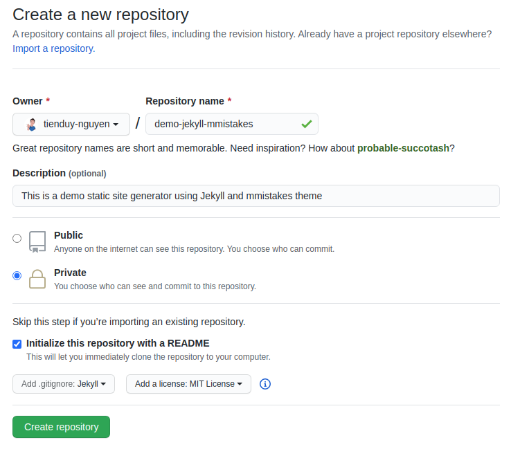{:class="lazyload"}
  

  With this way, we can define easily the visibility of repos: public or private and we can initialize with the template of `.gitingore` and `LICENSE`.
  I named this repo [demo-jekyll-mmtakes](https://github.com/tduyng/demo-jekyll-mmistakes)

  **If you want to this website is the origine Github pages**. It means the domain name of your website is *github-user-name.github.io*. You will need to create a repository with this name: "github-user-name.github.io".

  For example my Github pages: **tduyng.github.io**, so I need to create a repository named: "tduyng.github.io".

  You can check to know how to create a Github pages on the official document of github: [https://guides.github.com/features/pages/](https://guides.github.com/features/pages/)

- After we clone the repository that we just created with `git clone` on local machine.
- Now, we will clone [mmistakes repository](https://github.com/mmistakes/minimal-mistakes).
  
  <div align="center">
    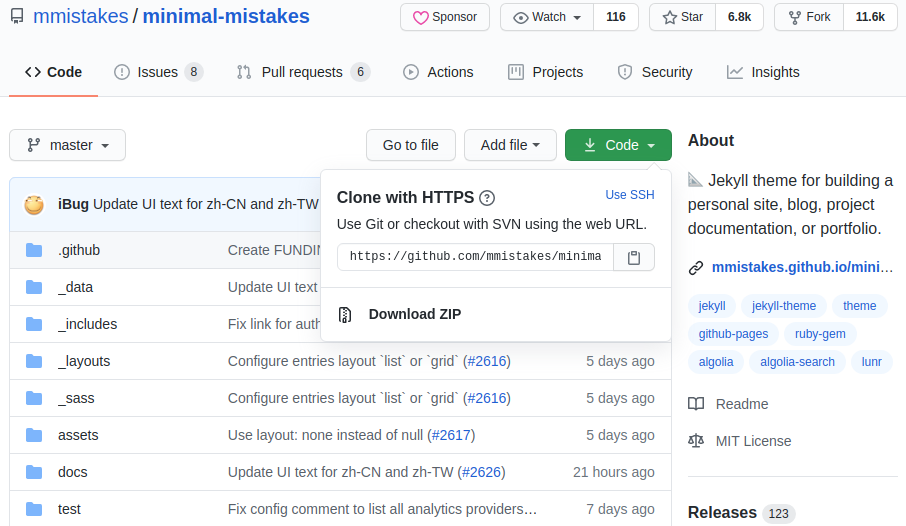
  </div>


- Enter in the directory of mmistakes, remove **.git**, **LICENSE**, and **README** file
- Then we move all files in mmistakes directory to our local repository: **demo-jekyll-mmistakes**
- Don't hesitate to make a git commit when you finish that step with a message "Init mmistake theme" for example.

### 2.4 Setup development environment

First, let’s make sure that your development environment is ready.

- Make sure you installed [Ruby](https://www.ruby-lang.org/en/) and [Ruby gems](https://rubygems.org/), and [Jekyll](https://jekyllrb.com/) on your computer.
- You’ll be using your own text editor and terminal app.
- When your development is ready, you can try run server to look your page how it is.
  
  Use `bundle install` to install all gems dependencies, and `jekyll serve` or `bundle exec jekyll serve` to run server. The page will be running on the `localhost:4000`

  The result on your browser:

  <div align="center">
    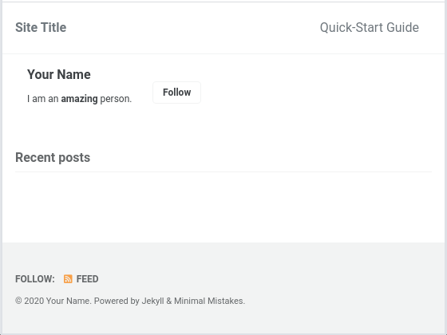
  </div>

  We have nothing to show on the page now, because, we need to customize the mmistakes theme and create a new post.

### 2.5 Customize mmistakes theme

#### 2.5.1 Configurations

Tree folder of our project before customize 
<div align="center">
  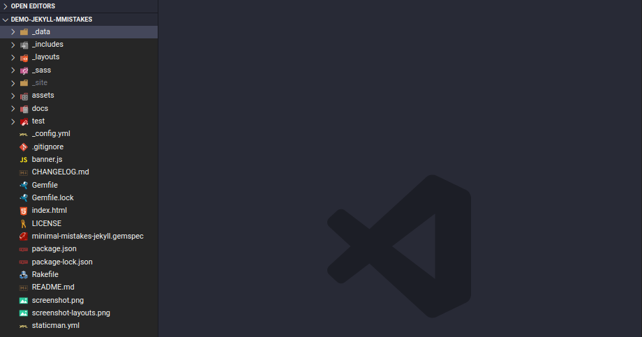
</div>

To customize your website, you need modify the `_config.yml` to create the initial settings for your website.

In the `config.yml`, Michael has been detailed very clearly the signification of each tag. 

For example, I modified the `config.yml` file for my blog: 

  - The basic information of website
    ```yml
    # theme: 'minimal-mistakes-jekyll'
    remote_theme           : "mmistakes/minimal-mistakes"
    minimal_mistakes_skin: 'mint' # "air", "aqua", "contrast", "dark", "dirt", "neon", "mint", "plum", "sunrise"

    # Site Settings
    locale: 'en-US'
    title: 'Adev42 blog'
    title_separator: '|'
    subtitle: # site tagline that appears below site title in masthead
    name: 'Tien Duy'
    description: 'Software - Fullstack Web developper'
    url: &url 'https://tduyng.github.io' # the base hostname & protocol for your site e.g. "https://mmistakes.github.io"
    baseurl: # the subpath of your site, e.g. "/blog"
    repository: 'tduyng/demo-jekyll-mmistakes' # GitHub username/repo-name e.g. "mmistakes/minimal-mistakes"
    teaser: '/assets/images/page-cover.png' # path of fallback teaser image, e.g. "/assets/images/500x300.png"
    logo: # path of logo image to display in the masthead, e.g. "/assets/images/88x88.png"
    masthead_title: # overrides the website title displayed in the masthead, use " " for no title
    breadcrumbs: true # true, false (default)
    words_per_minute: 200
    ```

    `minimal_mistake_skin: 'mint` is the background color for your website. There 9 options to choose: "air", "aqua", "contrast", "dark", "dirt", "neon", "mint", "plum", "sunrise". Check detail  how it looks at [skin mmistake](https://github.com/mmistakes/minimal-mistakes).


  - Search provider: I use "lurn" by default. If you want to use "algolia" you can change it.
    ```yml
    search: # true, false (default)
    search_full_content: # true, false (default)
    search_provider: lunr # lunr (default), algolia, google
    algolia:
      application_id: # YOUR_APPLICATION_ID
      index_name: # YOUR_INDEX_NAME
      search_only_api_key: # YOUR_SEARCH_ONLY_API_KEY
      powered_by: # true (default), false
    google:
      search_engine_id: # YOUR_SEARCH_ENGINE_ID
      instant_search: # false (default), true
    ```
  - Site author: your social information
    ```yml
    author:
      name: *name
      avatar: '/assets/images/avatar.jpg' # path of avatar image, e.g. "/assets/images/bio-photo.jpg"
      bio: 'Love people who code'
      location: 'Paris, France'
      email: 'tienduy.nguyen.dev@gmail.com'
      links:
        - label: 'Website'
          icon: 'fas fa-fw fa-link'
          url: 'https://tduyng.github.io'
        - label: 'Twitter'
          icon: 'fab fa-fw fa-twitter-square'
          url: &twitterUrl 'https://twitter.com/tienduy_nguyen'
        - label: 'LinkedIn'
          icon: 'fab fa-fw fa-linkedin'
          url: &linkedinUrl 'https://linkedin.com/in/tduyng'
        - label: 'GitHub'
          icon: 'fab fa-fw fa-github'
          url: &githubUrl 'https://github.com/tduyng'
        # - label: 'Facebook'
        #   icon: 'fab fa-fw fa-facebook-square'
        #   url: &fbUrl 'https://www.facebook.com/'
        # - label: 'StackOverflow'
        #   icon: 'fab fa-fw fa-stack-overflow'
        #   url: &stackOverflowUrl 'https://stackoverflow.com/'
      
    # Site Footer
    footer:
      links:
        - label: 'Twitter'
          icon: 'fab fa-fw fa-twitter-square'
          url: *twitterUrl
        - label: 'LinkedIn'
          icon: 'fab fa-fw fa-linkedin'
          url: *linkedinUrl
        - label: 'GitHub'
          icon: 'fab fa-fw fa-github'
          url: *githubUrl

    ```
  - Gem plugin using. Here I add one plugin more: jemoji which allow us use the emoji markdown on our page.
    
    ```yml
    plugins:
      - jekyll-paginate
      - jekyll-sitemap
      - jekyll-gist
      - jekyll-feed
      - jekyll-include-cache
      - jemoji
    whitelist:
      - jekyll-paginate
      - jekyll-sitemap
      - jekyll-gist
      - jekyll-feed
      - jekyll-include-cache
      - jemoji
    ```
We can provide the technology comment as Facebook, Disqus ... and google analytic for out website in this `_config.yml`. But I don't need it for this moment.

Ok, that's is the principle tags wee need to customize. Now we will add the gem dependencies in gems files

#### 2.5.2 Gemfile

Your Gemfile now is empty, you need to add some jekyll plugin that you have been declared in you `_config.yml` file.

```ruby
source "https://rubygems.org"

# Hello! This is where you manage which Jekyll version is used to run.
# When you want to use a different version, change it below, save the
# file and run `bundle install`. Run Jekyll with `bundle exec`, like so:
#
#     bundle exec jekyll serve
#
# This will help ensure the proper Jekyll version is running.
# Happy Jekylling!
ruby "2.7.1"
gem "jekyll", "~> 3.8.5"

# This is the default theme for new Jekyll sites. You may change this to anything you like.
# gem "minima", "~> 2.0"
gem "minimal-mistakes-jekyll"

# If you want to use GitHub Pages, remove the "gem "jekyll"" above and
# uncomment the line below. To upgrade, run `bundle update github-pages`.
# gem "github-pages", group: :jekyll_plugins

# If you have any plugins, put them here!
group :jekyll_plugins do
  gem "jekyll-remote-theme"
  gem "jekyll-paginate"
  gem "jekyll-sitemap"
  gem "jekyll-gist"
  gem "jekyll-feed", "~> 0.6"
  gem "jemoji"
  gem "jekyll-include-cache"
end
```
After modified your gem file, we will return in the terminal:

#### 2.5.3 Run server
```bash
bundle install # install all gems in Gemfile
bundle update # update multiple gems
```

and to run serve, you tap

```bash
bundle exec jekyll serve
```

Open you browser at `localhost:4000` and watch the result now.


<div align="center">
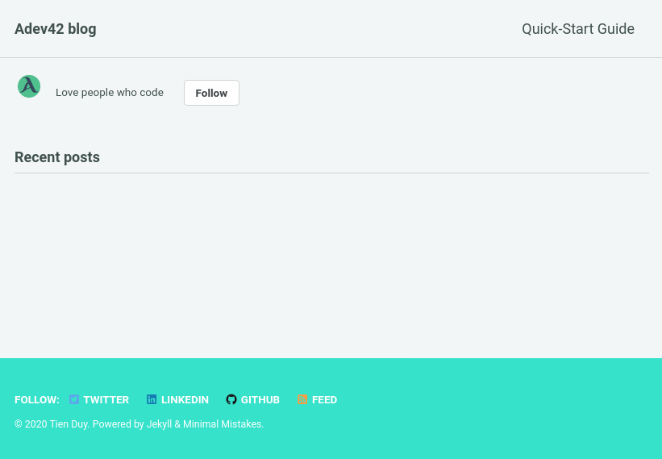
</div>

That is better, isn't it?

You are almost finished the customization, we will go create the first posts and customize our navbar.

#### 2.5.4 Create posts

We need to put all the posts in the `_posts` folder. If you don't find it, you just create a new one with the same name.

When you clone the mmistakes folder from Github. You will have two folder who name: `docs` and `test`. Two these folder contain the documentations and the examples for each type of post. It will help you very much.

To make quickly a demo, I will copy all the posts in the `test/_posts` in my `_posts` folder. For the posts, you can use both the markdown file and html file. In my case, I prefer markdown file because it faster to write and customize.

If you don't know how to write in markdown file, you can take a look on the tutorial [markdownguide.org](https://www.markdownguide.org/getting-started/).

So what we need to write in markdown for each post to make sure the website work properly?

The important things are
- title
- categories
- tag

The first part of one post: 

```md
---
title: "Markup: HTML Tags and Formatting"
header:
  teaser: "assets/images/markup-syntax-highlighting-teaser.jpg"
categories:
  - Markup
tags:
  - content
  - css
  - formatting
  - html
  - markup
---
```
The second part is your content of post. 
```md
A variety of common markup showing how the theme styles them.

## Header two

### Header three

#### Header four

##### Header five

###### Header six

## Blockquotes

Single line blockquote:

> Stay hungry. Stay foolish.

Multi line blockquote with a cite reference:

> People think focus means saying yes to the thing you've got to focus on. But that's not what it means at all. It means saying no to the hundred other good ideas that there are. You have to pick carefully. I'm actually as proud of the things we haven't done as the things I have done. Innovation is saying no to 1,000 things.

<cite>Steve Jobs</cite> --- Apple Worldwide Developers' Conference, 1997
{: .small}

## Tables                        |

| Header1                       | Header2 | Header3 |
| :---------------------------- | :-----: | ------: |
| cell1                         |  cell2  |   cell3 |
| cell4                         |  cell5  |   cell6 |
| ----------------------------- |
| cell1                         |  cell2  |   cell3 |
| cell4                         |  cell5  |   cell6 |
| ============================= |
| Foot1                         |  Foot2  |   Foot3 |
```
The more features, you will find in the documentations of this theme.

Here is some example of our pages when we added already the posts:

<div align="center">
  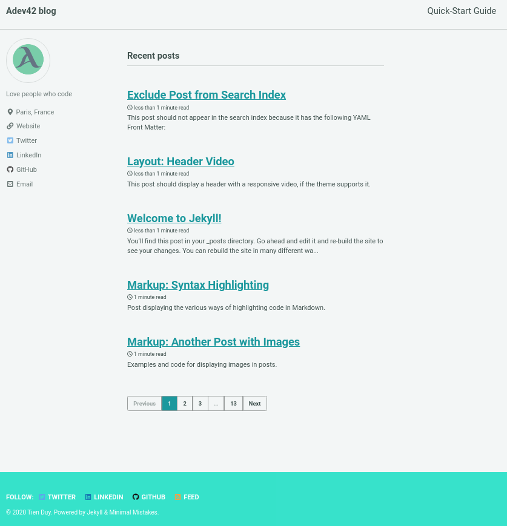
  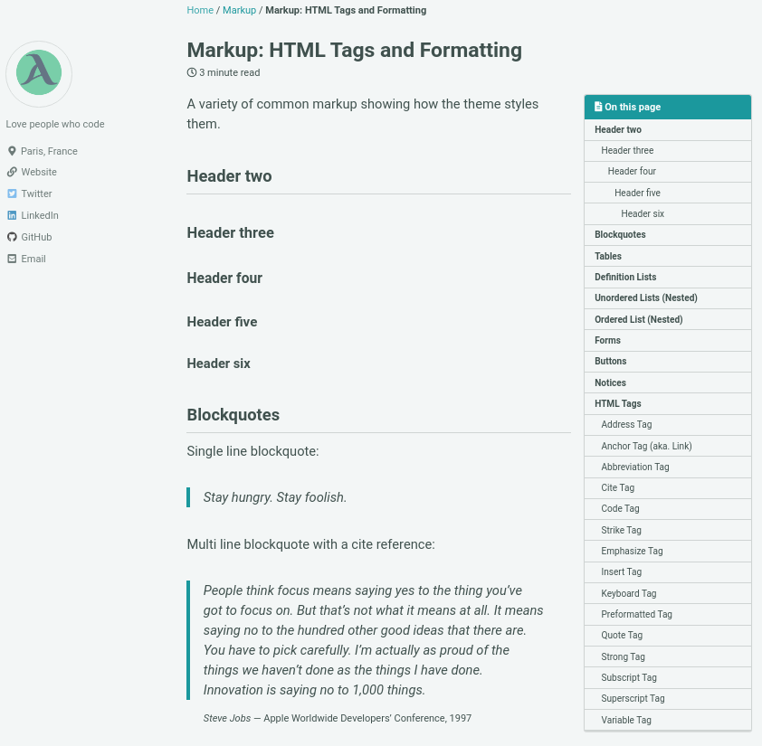
  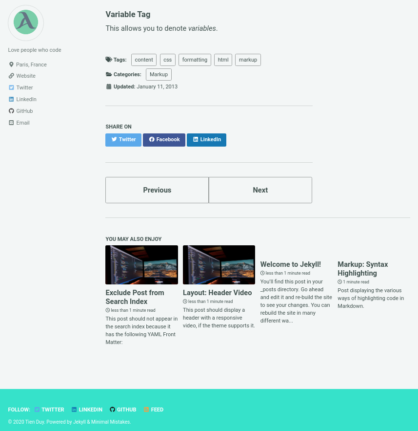
</div>


As you can see, the minimal mistakes theme is really excellent. It helps us to have a modern blog with the very awesome features:
- Pagination, next page, previous page
- Menu of header in each post
- Custom type header of post with image, video, overlay image
- Group articles by categories and tags, category archives, tag archives
- Feature share article to Twitter, Facebook, Linkedin
- Show the related articles in the last of post
- Highlight syntax
- Search engine
- Responsive
- And so much more ...

I really love this theme. Thank again for [Michael](https://mademistakes.com/).

So, the last thing we need to do in this article is **navigation**.

#### 2.5.5 Navigation

It's very simple because Michael did it for us. We just make some changes.

You look in the tree folder, we have an folder who name `_data` and we can find `navigation.yml`.

You will customize like this:

```yml
# main links
main:
  - title: 'About'
    url: https://mmistakes.github.io/minimal-mistakes/about/
  - title: 'Posts'
    url: /posts/
  - title: 'Categories'
    url: '/categories'
  - title: 'Tags'
    url: '/tags'
  - title: 'Search'
    url: '/search'
```

The result is: 
<div align="center">
  Posts page
  

  Categories page
  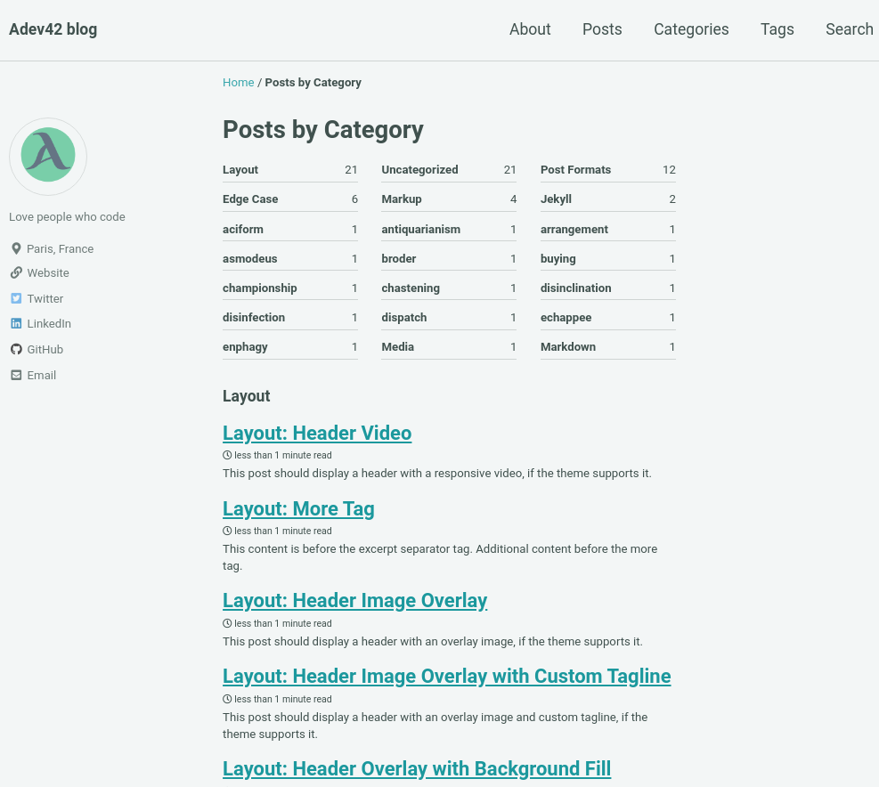

  Tag pages
  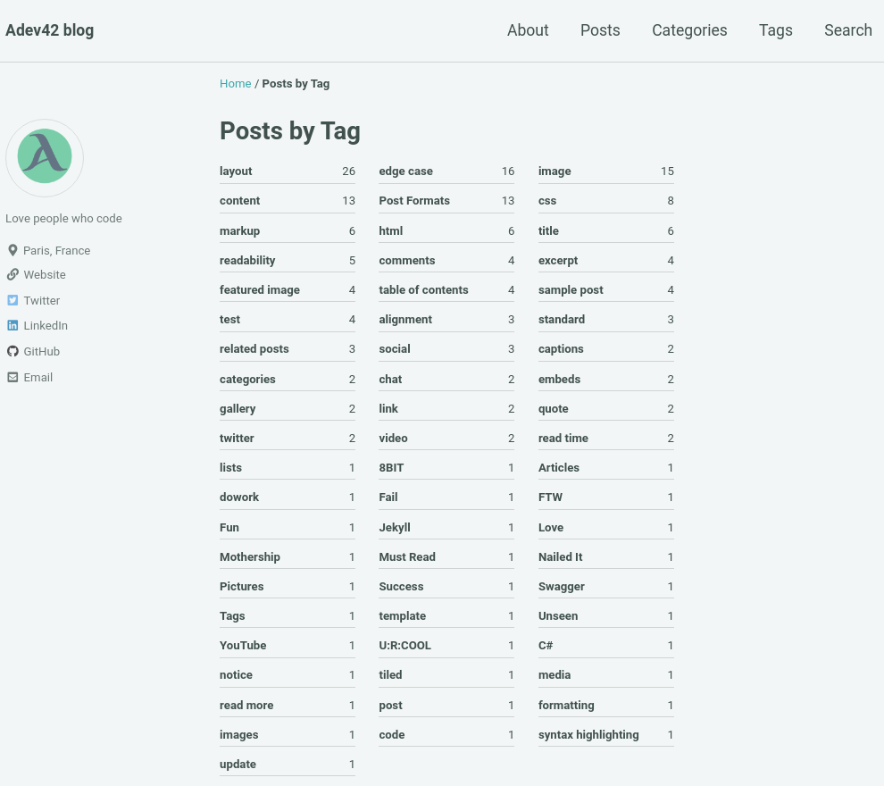
</div>


Are you curious about the jekyll? Checkout at [Jekyll quickstart](https://jekyllrb.com/docs/)

#### 2.5.6 Build

When you finish an article, you need to build file with:

```bash
bundle exec jekyll build
```
It will build automatic to the html, css files in the `site` folder. 

### 2.6 Deploy on Github pages

Push and commit all the changes to your github repository.

If you do not set Github pages for this repo, you need to do it.

Go to the `Settings` of repository on Github, active the Github pages.

Detail on [guide Github page](https://guides.github.com/features/pages/).

When you are all done that, you will have your beautiful website on `your-github-user-name.github.io`.

---

So that is a demo I want to show you. Now you can start to write your first articles. I maybe miss some details because this demo is already quite long. But I hope you will not have problems with that. Good luck!

------------------------------


## Extra  topics

- Using your own domain name. It's not expensive.
- [Managing a custom domain for your GitHub Pages site](https://docs.github.com/en/github/working-with-github-pages/managing-a-custom-domain-for-your-github-pages-site)
- Other static site generator: Gastbyjs, nextjs, nuxtjs, hugo ...


## Reference
- Demo online [https://adev42.com/demo-jekyll-mmistakes/](https://adev42.com/demo-jekyll-mmistakes/)
- My article on medium [Build your personal website without spending any money](https://medium.com/@tienduy/build-your-personal-website-without-spending-any-money-30e6b2264e08)
- My repo demo Github [demo-jekyll-mmistakes](https://github.com/tduyng/demo-jekyll-mmistakes)
- Jekyll home page of Jekyll [https://jekyllrb.com/](https://jekyllrb.com/)
- Documentation of minimal mistake theme [https://mmistakes.github.io/minimal-mistakes/](https://mmistakes.github.io/minimal-mistakes/)
- Interesting blog about jekyll [https://blog.webjeda.com/](https://blog.webjeda.com/)
- Using github pages [https://pages.github.com/](https://pages.github.com/)

