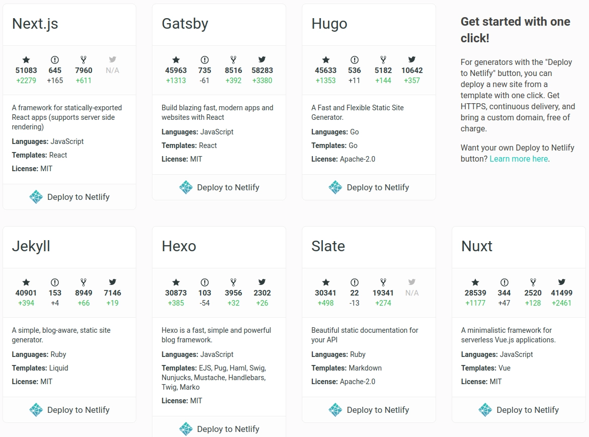
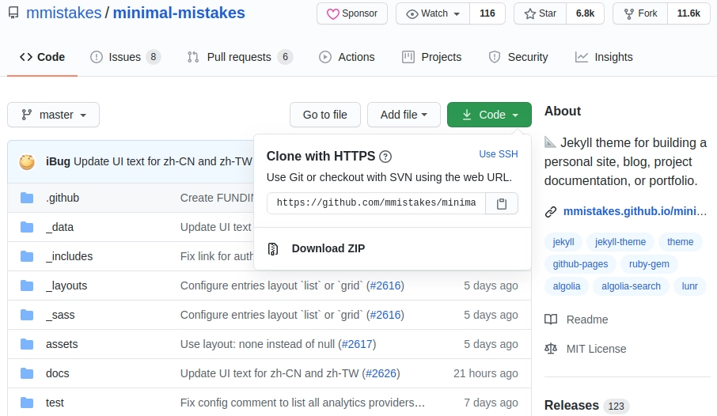
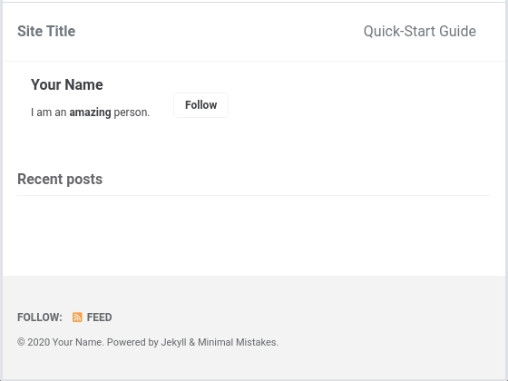
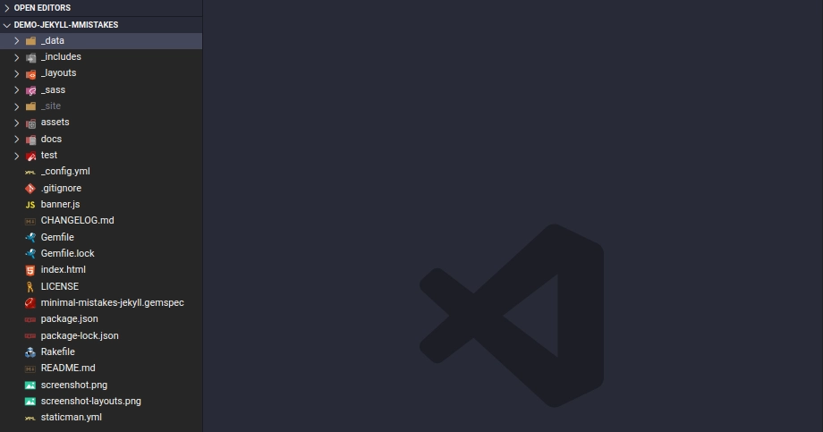
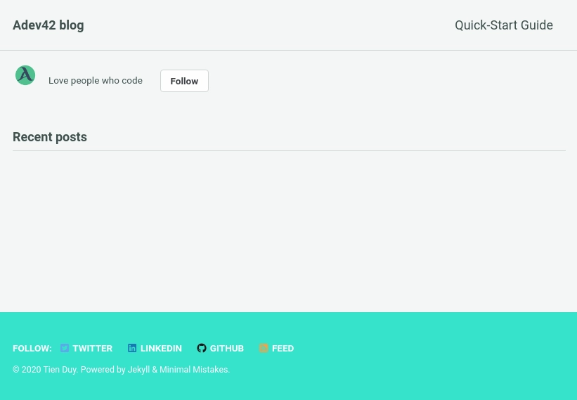
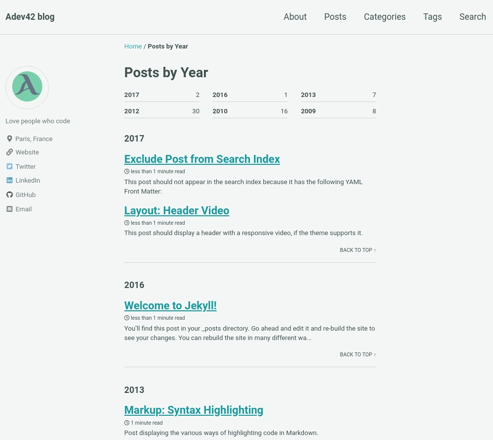
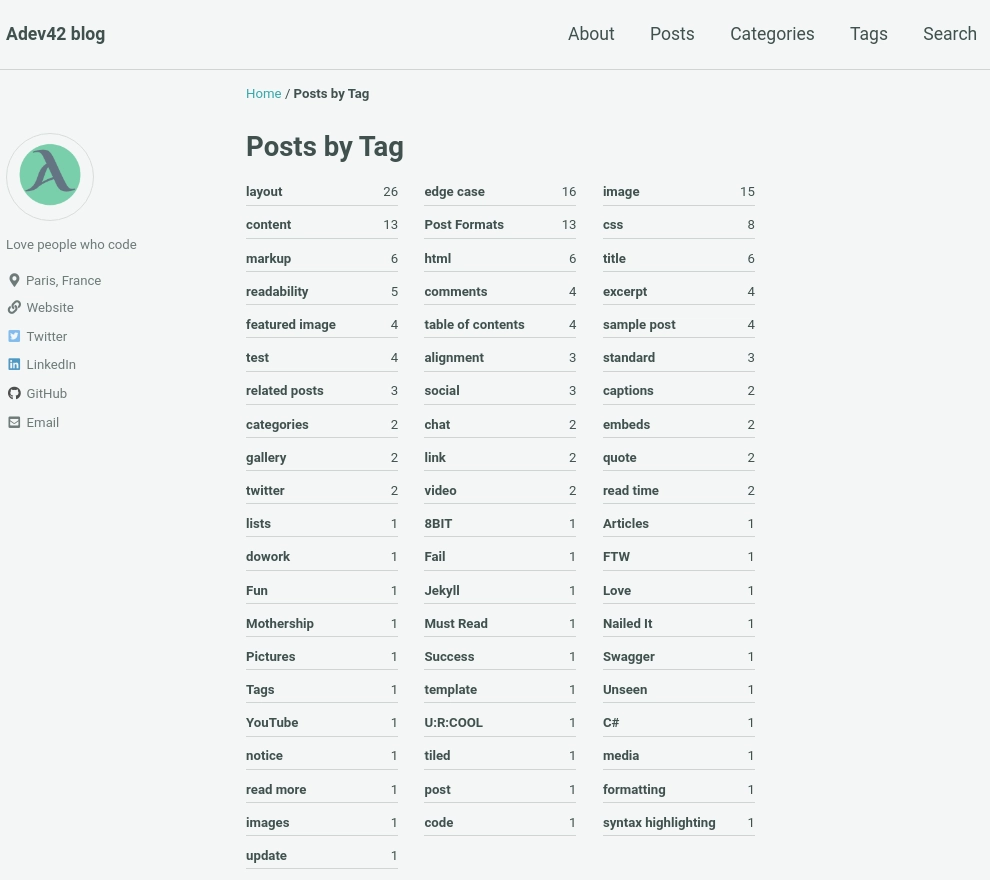

+++
title = "Build your personal website without spending any money"
description = "Learn how to build your own personal website using Jekyll and GitHub Pages without spending a dime. Dive into the step-by-step process and get your website up and running in no time."
template = "post.html"
date = 2020-05-25
tags = ["blog", "static-site-generator", "free", "web-development"]
generate_feed = true

[extra]
comment = false
reaction = true
toc = true
copy = true
featured = true
outdate_alert = true
outdate_alert_days = 365
img = "/img/post-cover.webp"
+++

In this article, we'll walk through how to set up a Jekyll-powered blog using the Minimal Mistakes theme.

It’s not always clear why we need a personal website, but here’s the truth, especially for developers: a website is an effective medium to let the world know who we are, what we are capable of, and what our values are.

The purpose of the website you want to build can vary; it could be a blog, portfolio, landing page, or multi-purpose site. In my case, I need a website to:

- Showcase my projects
- Blog about my experiences, my knowledge in programming, and my other interests
- Share information about me that would be of interest to a recruiter, including my resume, email, and links to my GitHub, Medium, and LinkedIn pages
- Being able to easily generate and publish blog posts is another extremely beneficial feature, though not required.

Initially, I tried to create my website using HTML, CSS, and serving it with GitHub Pages. However, I realized it would take a lot of time to complete, not to mention the time needed to customize the website for each post.

I searched for a solution on the internet and found the awesome technology called "Static Site Generator."

## STATIC SITE GENERATOR

You may have already heard about static site generators. They aren't new; they were what we used to build the web before dynamic CMSs (WordPress, Drupal, etc.) took over.

What's new is that modern tools—like static site generators—have emerged over the last few years and expanded the capabilities of static sites.

A static site generator is an application that takes a template directory containing raw text files in various formats, processes them through a converter (like Markdown) and its Liquid renderer, and outputs a complete, ready-to-publish static website suitable for serving with your favorite web server.

With the growth of the [JAMstack](https://jamstack.org/) and its community, Static Site Generators are becoming more and more popular.

So, why use a static generator?

- Speed
- Security
- Development workflow: no need to create the backend server. This makes it incredibly easy to run your site locally, automate builds, switch to a different host, etc.
- There are a lot of themes available, fast build, easy maintenance. That's true. You can even build a beautiful website within minutes.

There are many static site generators available; you can check them out on [staticgen.com](https://www.staticgen.com/)

<div align="center">
  
</div>
In this article, I will present one of them: Jekyll.

### Jekyll

Jekyll is an extremely popular static site generator. It is an open-source program in Ruby created by GitHub co-founder Tom Preston-Werner. Jekyll enables developers to transform plain text into static websites and blogs. It serves as the engine behind GitHub Pages, allowing you to host sites directly from your GitHub repositories.

Jekyll is built with the Ruby programming language. I'm currently learning web development with Ruby & Ruby on Rails at The Hacking Project. So, if you come from a Ruby/ROR background like me, you'll want to explore Jekyll.

Now, let's see how I created my personal blog. And don't forget that it will be totally free.

## INSTALLATION & BUILD

There are multiple ways to get started with Jekyll, each with its own variations. Here are a few options:

Install Jekyll locally via the command line, create a new boilerplate website using jekyll new, build it locally with jekyll build, then serve it.

Make sure you have installed Jekyll on your machine with gem install bundler jekyll. For the full installation guide, you can check out the official guide on [jekyllrb.com](https://jekyllrb.com/).

Take a Jekyll theme and clone it to your local machine, install Jekyll locally via the command line, make updates to your website, build it locally, and then serve it. (You can also fork a starting point and make changes to it.)

We'll start with the easiest option: using an available Jekyll theme. This will get us up and running in just a few minutes.

So, let's choose a theme together.

Nowadays, there are many Jekyll themes, both free and paid. Developers design these templates perfectly for any corporate business and blogging website.

You can explore some excellent paid Jekyll themes [here](https://themeforest.net/category/static-site-generators).

But as the title suggests, we will build our website without paying anything, choosing only free themes.

You can find almost all the free Jekyll themes on [Free Jekyll Themes](https://jekyllthemes.io/free) and choose the one you prefer.

### 2.1 Minimal Mistakes Jekyll Theme

I will introduce you to a really good theme for building a blog: the "Minimal Mistakes" theme, created by [Michael Rose](https://github.com/mmistakes). Thank you so much, [Michael](https://mademistakes.com/), for providing an awesome Jekyll theme for the community.

Its advantages:

- Free theme
- Highly recommended by the community: 7k stars and 12k forks on GitHub (Source GitHub mmistakes)
- Full features for a blog
- Responsive design for mobile, tablet, and desktop
- Compatible with GitHub Pages
- Support for Jekyll's built-in Sass/SCSS preprocessor
- Nine different skins (color variations)
- Several responsive layout options (single, archive index, search, splash, and paginated home page)
- Commenting support (powered by Disqus, Facebook, Google+, Discourse, static-based via Staticman, and utterances)
- Google Analytics support

We already have a starting point; now, all we need to do is install this theme on your machine.

### 2.2 Clone Minimal Mistakes theme to your machine

As we will use GitHub Pages to serve our blog, before we clone it to the local machine, I will explain how to create a new repository on GitHub.

You probably won't need to do it the same way, as there are many different ways to do it. This is just a simpler way for me.

### 2.3 Initialize repository on the local machine

- Create a repository on GitHub

Instead of using git init via the command line, I create it directly on GitHub.
{:class="lazyload"}

This way, we can easily define the visibility of the repository: public or private, and we can initialize it with the template of .gitignore and LICENSE.
I named this repo [demo-jekyll-mmtakes](https://github.com/tduyng/demo-jekyll-mmistakes).

If you want this website to be the origin GitHub pages, meaning the domain name of your website is github-user-name.github.io, you will need to create a repository with this name: "github-user-name.github.io".

For example, my GitHub pages: tduyng.github.io, so I need to create a repository named: "tduyng.github.io".

You can check how to create GitHub Pages in the official GitHub documentation: <https://guides.github.com/features/pages/>

- After we clone the repository that we just created with git clone on the local machine.

- Now, we will clone mmistakes repository.

<div align="center">
  
</div>

- Enter the mmistakes directory, remove .git, LICENSE, and README files

- Then, we move all files from the mmistakes directory to our local repository: demo-jekyll-mmistakes

- Don't hesitate to make a git commit when you finish that step with a message "Init mmistake theme," for example.

### 2.4 Setup development environment

First, let’s make sure your development environment is ready.

Ensure you have installed [Ruby](https://www.ruby-lang.org/en/) and [RubyGems](https://rubygems.org/), and [Jekyll](https://jekyllrb.com/) on your computer.

You’ll be using your own text editor and terminal app.

Once your development environment is set up, you can try running the server to view your page as it is.

Use bundle install to install all gem dependencies, and jekyll serve or bundle exec jekyll serve to run the server. The page will be running on localhost:4000

The result in your browser:

<div align="center">
  
</div>
We have nothing to show on the page now because we need to customize the Minimal Mistakes theme and create a new post.

### 2.5 Customize Minimal Mistakes Theme

#### 2.5.1 Configurations

Before customizing, let's take a look at the folder structure of our project:

<div align="center">
  
</div>
To customize your website, you'll need to modify the _config.yml file to set up the initial settings.

In the config.yml, Michael has detailed the significance of each tag. For example, here's how I modified the config.yml file for my blog:

```yml
author:
  name: *name
  bio: 'Love people who code'
  location: 'Paris, France'
  email: 'z@tduyng.github.io'
  links:
    - label: 'Website'
      url: 'https://tduyng.github.io'
    - label: 'Twitter'
      url: &twitterUrl 'https://twitter.com/tienduy_nguyen'
    - label: 'LinkedIn'
      url: &linkedinUrl 'https://linkedin.com/in/tduyng'
    - label: 'GitHub'
      url: &githubUrl 'https://github.com/tduyng'

footer:
  links:
    - label: 'Twitter'
      url: *twitterUrl
    - label: 'LinkedIn'
      url: *linkedinUrl
    - label: 'GitHub'
      url: *githubUrl
```

Here, you can provide your social information, such as your name, bio, location, and email. Additionally, you can include links to your website, Twitter, LinkedIn, and GitHub profiles.

```yml
plugins:
    - jekyll-paginate
    - jekyll-sitemap
    - jekyll-gist
    - jekyll-feed
    - jekyll-include-cache
    - jemoji
```

Lastly, you can specify the gem plugins you want to use. For example, I've added the jemoji plugin, which allows us to use emoji markdown on our page.

These are just some of the configurations you can customize in the \_config.yml file. Once you've made your changes, save the file and move on to the next step.

#### 2.5.2 Gemfile

Your Gemfile is currently empty, so you need to add some Jekyll plugins that you've declared in your `_config.yml` file.

```ruby
source "https://rubygems.org"

ruby "2.7.1"
gem "jekyll", "~> 3.8.5"
gem "minimal-mistakes-jekyll"

group :jekyll_plugins do
  gem "jekyll-remote-theme"
  gem "jekyll-paginate"
  gem "jekyll-sitemap"
  gem "jekyll-gist"
  gem "jekyll-feed", "~> 0.6"
  gem "jemoji"
  gem "jekyll-include-cache"
end
```

After modifying your Gemfile, return to the terminal.

#### 2.5.3 Run Server

```bash
bundle install # Install all gems in Gemfile
bundle update # Update multiple gems
```

To run the server, type:

```bash
bundle exec jekyll serve
```

Open your browser at localhost:4000 to view the result.

<div align="center">
  
</div>

Looks better, right?

You're almost finished with the customization. Next, we'll create the first posts and customize our navbar.

#### 2.5.4 Create Posts

All posts should be placed in the \_posts folder. If you don't have one, simply create it.

When you clone the Minimal Mistakes repository from GitHub, you'll find two folders named docs and test. These folders contain documentation and examples for different types of posts, which can be very helpful.

For a quick demo, copy all the posts from the test/\_posts folder to your \_posts folder. You can use both Markdown and HTML files for your posts. Personally, I prefer Markdown because it's faster to write and customize.

If you're new to Markdown, you can learn from tutorials like markdownguide.org.

Each post should include:

- Title
- Categories
- Tags

Here's an example of the first part of a post in Markdown:

```md
---
title: 'Markup: HTML Tags and Formatting'
header:
    teaser: 'assets/images/markup-syntax-highlighting-teaser.webp'
categories:
    - Markup
tags:
    - content
    - css
    - formatting
    - html
    - markup
---
```

And here's an example of the content of the post:

```md
A variety of common markup showing how the theme styles them.

## Header Two

### Header Three

#### Header Four

##### Header Five

###### Header Six

## Blockquotes

Single line blockquote:

> Stay hungry. Stay foolish.

Multi-line blockquote with a cite reference:

> People think focus means saying yes to the thing you've got to focus on. But that's not what it means at all. It means saying no to the hundred other good ideas that there are. You have to pick carefully. I'm actually as proud of the things we haven't done as the things I have done. Innovation is saying no to 1,000 things.
> <cite>Steve Jobs</cite> --- Apple Worldwide Developers' Conference, 1997
> {: .small}

## Tables

| Header1 | Header2 | Header3 |
| :------ | :-----: | ------: |
| cell1   |  cell2  |   cell3 |
| cell4   |  cell5  |   cell6 |
| ------- |
| cell1   |  cell2  |   cell3 |
| cell4   |  cell5  |   cell6 |
| ======= |
| Foot1   |  Foot2  |   Foot3 |
```

For more features, refer to the documentation of this theme.

Once you've added the posts, you can see the result in your browser. The Minimal Mistakes theme offers many excellent features for a modern blog, as demonstrated in the screenshots.

Next, we'll focus on navigation.

#### 2.5.5 Navigation

Customizing the navigation is straightforward as Michael has already set it up for us. We just need to make some adjustments.

Navigate to the \_data folder in the directory tree, and you'll find navigation.yml. Customize it as follows:

```yml
# main links
main:
    - title: 'About'
      url: https://mmistakes.github.io/minimal-mistakes/about/
    - title: 'Posts'
      url: /posts/
    - title: 'Categories'
      url: '/categories'
    - title: 'Tags'
      url: '/tags'
    - title: 'Search'
      url: '/search'
```

The resulting navigation will appear as follows:

<div align="center">
  Posts page
  
Categories page


Tag pages


</div>
If you're curious about Jekyll, you can learn more at [Jekyll quickstart](https://jekyllrb.com/docs/).

#### 2.5.6 Build

After finishing an article, you'll need to build the files with:

```bash
bundle exec jekyll build
```

This command will automatically generate HTML and CSS files in the site folder.

### 2.6 Deploy on GitHub Pages

Push and commit all the changes to your GitHub repository.

If you haven't set up GitHub Pages for this repository yet, you'll need to do so.

Navigate to the Settings of your repository on GitHub, and activate GitHub Pages.

For more detailed instructions, refer to the [GitHub Pages guide](https://guides.github.com/features/pages/).

Once you've completed these steps, your beautiful website will be live at your-github-user-name.github.io.

## Extra topics

- Using your own domain name. It's not expensive.
- [Managing a custom domain for your GitHub Pages site](https://docs.github.com/en/github/working-with-github-pages/managing-a-custom-domain-for-your-github-pages-site)
- Other static site generator: Gastbyjs, nextjs, nuxtjs, hugo ...

## Reference

- Demo online [https://tduyng.github.io/demo-jekyll-mmistakes/](https://adev42.com/demo-jekyll-mmistakes/)
- My repo demo Github [demo-jekyll-mmistakes](https://github.com/tduyng/demo-jekyll-mmistakes)
- Jekyll home page of Jekyll [https://jekyllrb.com/](https://jekyllrb.com/)
- Documentation of minimal mistake theme [https://mmistakes.github.io/minimal-mistakes/](https://mmistakes.github.io/minimal-mistakes/)
- Interesting blog about jekyll [https://blog.webjeda.com/](https://blog.webjeda.com/)
- Using github pages [https://pages.github.com/](https://pages.github.com/)
