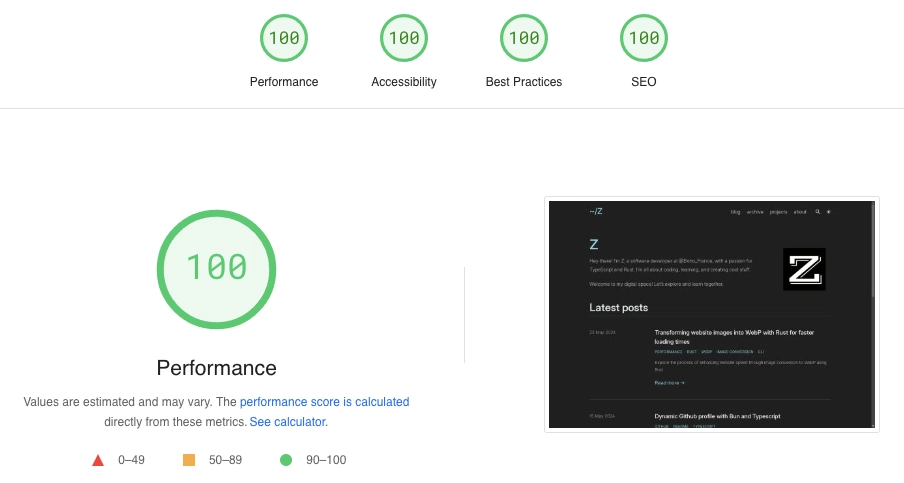
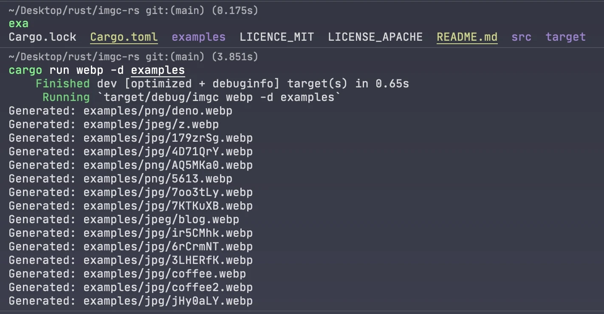

+++
title = "Transforming website images into WebP with Rust for faster loading times"
description = "Explore the process of enhancing website speed through image conversion to WebP using Rust"
template = "post.html"
date = 2024-05-23
updated = 2024-05-23
tags = ["performance", "rust", "webp", "image-conversion", "cli"]
generate_feed = true

[extra]
comment = true
reaction = true
toc = true
copy = true
featured = true
img = "img/page_speed.webp"
+++

Hi everyone 👋,

Recently, I attended [Ekinoday](https://www.ekino.fr/), our company’s annual conference, where my colleagues share knowledge on various topics, from technology to life tips. This event is always very interesting for me.

I had a chance to talk with my colleague [Raphaël Tho Vo](https://github.com/thovo), who gave a presentation on optimising web performance. [Raphaël](https://github.com/thovo) mentioned that many people don’t realise how much image size and format can effect the web performance. Large image files can slow down a website significantly, affecting user experience.

Raphaël explained that we can improve performance by using better image formats. He mentioned several modern formats like [AVIF, WebP, JPEG 2000](https://www.smashingmagazine.com/2021/09/modern-image-formats-avif-webp/). Among these, AVIF and WebP are the most supported by web browsers today.

Inspired by Raphaël’s advice, I decided to take a closer look at my website's performance. I host my site on GitHub, using [Zola](https://www.getzola.org/), a static site engine, along with the [Tabi](https://github.com/welpo/tabi) theme. This theme is beautifully designed and well-coded.

I tested my website with [PageSpeed Insights](https://pagespeed.web.dev/) and got a perfect score of 100/100 in everything: Performance, Accessibility, Best Practices, and SEO.

<br/>

However, I noticed that I still use a lot of PNG and JPEG images. Switching to WebP could significantly decrease image sizes and improve more load times.

### Converting images to WebP with Rust

How can we accomplish this?

To optimise images, I had to convert them to WebP format. I chose this format because it's effective and widely supported across different web browsers. But I needed a quick way to convert multiple images to WebP and reuse it multiple times.

There are online tools available to help, but that's not the solution I'm looking for at the moment. Instead, I've chosen to create my own solution using Rust. Rust is great for this because it's fast and easy to use for simple programs. Making this program will help me learn more about Rust.

The objectif is to convert all kinds of images into WebP with just one command, making it fast and easy.

Now, let's coding!

For this program, I used the [image](https://github.com/image-rs/image) crate for decoding and encoding images. This crate supports many different image formats:

| Format   | Decoding            | Encoding            |
| -------- | ------------------- | ------------------- |
| AVIF     | Yes (8-bit only) \* | Yes (lossy only)    |
| BMP      | Yes                 | Yes                 |
| Farbfeld | Yes                 | Yes                 |
| GIF      | Yes                 | Yes                 |
| HDR      | Yes                 | Yes                 |
| ICO      | Yes                 | Yes                 |
| JPEG     | Yes                 | Yes                 |
| EXR      | Yes                 | Yes                 |
| PNG      | Yes                 | Yes                 |
| PNM      | Yes                 | Yes                 |
| QOI      | Yes                 | Yes                 |
| TGA      | Yes                 | Yes                 |
| TIFF     | Yes                 | Yes                 |
| WebP     | Yes                 | Yes (lossless only) |

\*\*To encode an image to WebP, I created a function `encode_webp`:

```rust
use image::{DynamicImage, WebPEncoder, ExtendedColorType};

pub fn encode_webp(image: &DynamicImage) -> Result<Vec<u8>, String> {
    // Convert the image to RGBA format
    let rgba_image = image.to_rgba8();
    let mut webp_data = Vec::new();
    // Create a WebP encoder (support only lossless feature for now)
    let encoder = WebPEncoder::new_lossless(&mut webp_data);
    encoder
        .encode(
            rgba_image.as_raw(),
            rgba_image.width(),
            rgba_image.height(),
            ExtendedColorType::Rgba8, // Image crate support only Rgb8 or Rgba8 data
        )
        .map_err(|e| format!("{e}"))?;

    Ok(webp_data)
}
```

The `DynamicImage` type from [image](https://github.com/image-rs/image) crate allows us to handle different image formats. I convert the image to RGBA format and use the WebPEncoder to encode it.

**Next, I wrote a function to convert a single image**:

```rust
use image::io::Reader;
use std::{fs, path::Path};

fn convert_image(input_path: &Path, output_dir: &Option<String>) -> Result<(), String> {
    // Open and decode the image
    let image_render =
        Reader::open(input_path).map_err(|e| format!("Failed to open image: {}", e))?;
    let image = image_render
        .decode()
        .map_err(|e| format!("Failed to decode image: {}\n", e))?;

    // Encode the image to WebP
    let webp_data = encode_webp(&image)?;

    // Determine the output path
    let output_path = if let Some(output_dir) = output_dir {
        Path::new(output_dir)
            .join(input_path.file_stem().unwrap())
            .with_extension("webp")
    } else {
        input_path.with_extension("webp")
    };

    // Write the WebP image to the output path
    fs::write(output_path.clone(), webp_data.to_vec())
        .map_err(|e| format!("Failed to write WebP file: {}", e))?;

    println!("Generated: {}", output_path.display());

    Ok(())
}

```

This function first opens and decodes the image, then encodes it to WebP format using the previously defined `encode_webp` function. Finally, it writes the resulting WebP image to either the specified output directory or the same location as the original image.

**To convert all images in a directory, I created a function `convert_images`:**

```rust
use image::{io::Reader, DynamicImage};
use rayon::prelude::*;
use std::{
    fs,
    path::Path,
};

fn convert_images(path: &Path, output_dir: &Option<String>) -> Result<(), String> {
    if path.is_dir() {
        let entries: Vec<PathBuf> = fs::read_dir(path)
            .map_err(|e| format!("Read directory failed: {e}"))?
            .filter_map(|entry| entry.ok().map(|e| e.path()))
            .collect();

        entries.par_iter().try_for_each(|path| {
            if path.is_dir() {
                convert_images(path, output_dir)
            } else if is_supported(path) {
                convert_image(path, output_dir)
            } else {
                Ok(())
            }
        })?;
    }
    Ok(())
}

fn is_supported(path: &Path) -> bool {
    match fs::read(path) {
        Ok(data) => {
            if path.extension().unwrap_or_default() == "webp" {
                return false;
            }
            image::guess_format(&data).is_ok()
        }
        Err(_) => false,
    }
}

```

This function checks if the path is a directory. If it is, it reads all entries and recursively processes each one. If the path is an image, it converts it to WebP. The `par_iter()` method from the [rayon](https://github.com/rayon-rs/rayon) crate enables parallel processing for better performance.

Finally, the `main` function serves as the entry point of the application:

```rust
use clap::Parser;
use image::{io::Reader, DynamicImage};
use rayon::prelude::*;
use std::{
    fs,
    path::{Path, PathBuf},
};

#[derive(Parser, Debug)]
struct CliArgs {
    #[clap(short, long)]
    dir: Option<String>,

    #[clap(short, long)]
    output: Option<String>,
}

fn main() {
    let args = CliArgs::parse();
    let dir = args.dir.unwrap_or_else(|| ".".to_string());
    let output_dir = args.output;

    let path = Path::new(&dir);
    if let Err(e) = convert_images(path, &output_dir) {
        eprint!("Error {}", e)
    }
}
```

I use the [clap](https://github.com/clap-rs/clap) crate to create the CLI. The program accepts a directory containing images to convert and an optional output directory (see more at convert_image function)

### Addressing generated image size issues

While working on converting images to WebP format, I encountered a problem: some of the converted images turned out to be larger in size than the originals. This was concerning because my goal was to reduce image size to improve website performance.

I realized that this happened because the image crate in this moment is only supported a `new_lossless` feature for WebP conversion. This feature maintains the same quality as the original image, sometimes resulting in larger file sizes.

To address this issue, I explored other options and came across the [webp](https://github.com/jaredforth/webp) crate.

This crate, built on the `libwebp-sys` and `image` crate, allows us to better encode images to WebP format with `quality` control.

I found that by setting the `quality` parameter to the maximum value of `100`, we could consistently generate WebP images with smaller sizes than the originals. In fact, I could reduce the image size by up to 45%.

To apply the `webp` crate into my code, I only needed to make a slight modification to the `encode_webp` function. Here's the updated code snippet:

```rust
use image::DynamicImage;
use webp::{Encoder,WebPMemory};

pub fn encode_webp(image: &DynamicImage) -> Result<WebPMemory, String> {
    let encoder = Encoder::from_image(image)
        .map_err(|e| format!("Failed to create a webp encoder: {}", e))?;
    let webp_data = encoder.encode(100.0);
    Ok(webp_data)
}
```

Now, with this program, I can quickly convert all images from my website to WebP format.

Here's an example of a command-line `webp` in this tool:


You can check out the full code on my GitHub repo: [imgc-rs](https://github.com/tduyng/imgc-rs).

I think this project has a lot of potential. We can add a lot more features like batch processing, additional image format conversions, and more. All suggestions and contributions are welcome to make it even better.

Thank you for reading so far! I hope you found this article helpful and gained some new ideas. If you have any questions or suggestions, feel free to reach out.
