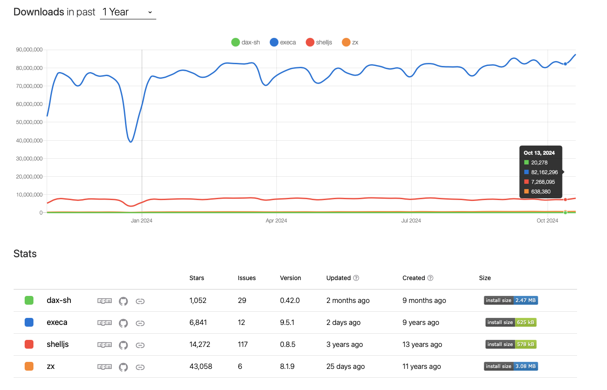
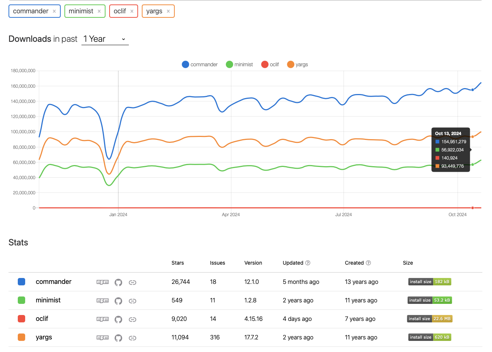

+++
title = "Scripting tools - A Node.js friendly alternative to makefile"
description = "Using execa and commander is an alternative that can be considered for replacing makefile in a Node.js project"
date = 2025-01-29

[taxonomies]
categories = ["DEVELOPMENT"]
tags = ["scripting", "makefile", "nodejs", "typescript", "shell"]

[extra]
comment = true
reaction = true
enjoy = true
outdate_alert = true
outdate_alert_days = 365
img = "img/makefile.webp"

+++

Article originally published at [medium.com](https://medium.com/ekino-france/scripting-tools-a-node-js-friendly-alternative-to-makefile-45efb7fe23ee)

## TL;DR

Using `execa` and `commander` is an alternative that can be considered for replacing makefile in a Node.js project.

## Introduction

At [ekino](https://ekino.fr), in some projects handled by our Node.js team, we heavily use **Makefile** to automate tasks such as testing,
lints, Docker integration, code checking, deployment, Kubernetes management, load testing with K6, and all automating stuff.
They have been our preferred tool for many years due to their simplicity, efficiency, and adaptability to various workflows.

As our projects have grown, these files have become increasingly more complex and harder to maintain and understand, especially for team members who are not familiar with shell scripting.
Because of these challenges, we've started looking into using JavaScript tools for automating tasks.

Our goal is to simplify our processes, make them easier for everyone on the team to use, and see what advantages this new approach might bring.

## Challenges with makefile

While `make` has been a reliable tool, they have limitations that are more noticeable in current projects. Here are some our key issues:

- _Debugging with make is not easy_

    Make doesn't provide clear error messages. If something goes wrong, we often have to figure out confusing shell outputs. Many errors come from shell-specific issues,
    like syntax problems or incorrect environment configurations, which can be difficult to resolve.

    Debugging options are limited. For example, `make -d` provides verbose logs, but there's no way to set breakpoints or trace errors like we can in JavaScript/Typescript

- _Environment variables are hard to manage_

    Make handles all environment variables the same way, without organizing them. This makes it hard to manage settings across environments like development, staging, and production.
    Unlike JavaScript, which uses modules and scoped variables for better control.

- _Challenges for non-UNIX developers_

    Make is very particular about things like tab indentation and specific shell syntax, which can be confusing for developers who are not familiar with Unix-like systems.

- _Limited support for parallel and asynchronous tasks_

    Make can handle basic parallelisms using the `-j` flag, but they don't work well with truly asynchronous tasks. For complex workflows,
    especially those that need tasks to run in parallel or asynchronously, things can get very difficult to manage without advanced shell scripting.

- _Readability and maintenance issues_

    As makefiles get bigger, their straightforward, step-by-step instructions become harder to read and manage.
    It's not always clear how tasks depend on each other, and without features like functions or imports, handling a large makefile can feel like trying to untangle a big mess.

    JavaScript provides ways to organize code using functions and libraries, which helps keep the code neat and easy to maintain.

**Other alternatives to makefile**

In addition to Node.js-based tools, there are 2 good alternatives to makefile:

- **[Justfile](https://github.com/casey/just)** (Rust-based)
- **[Taskfile](https://github.com/go-task/task)** (Go-based with YAML syntax)

**Justfile** is written in Rust, which makes it very fast. Its syntax is simpler and more user-friendly than makefile, supporting environment variables from `.env` files and offering cross-platform compatibility.
It also integrates well with various languages, including JavaScript (using ` #!/usr/bin/env node`) and a lot of other cool features. It's a very promising tool.

**Taskfile**, built with Go, provides a YAML-based configuration that is fast and structured. It is designed to simplify task definitions and improve maintainability compared to makefile.

Both tools solve many problems of makefile. However, they also come with their own challenges.
Using them would require learning a new syntax and adding additional setup steps, such as installing these tools in our Node.js Docker images, which isn’t ideal for our workflow.

Since we're looking for a JavaScript solution that works well with our current projects, we won't explore these options further in this research.
However, they are still good choices for teams that want something different from JavaScript (especially `Justfile`)

## Objectif

We need a solution that uses JavaScript/Typescript, a language our developers is already comfortable with. Our goal is to make scripting easier to write, update, and understand.

Here's what we're looking for:

- The tool should reduce complexity and make scripts easy to understand, even for those with little scripting experience.
- It should work naturally with JavaScript and TypeScript, fitting into our existing projects without friction.
- Combining the power of JavaScript with shell commands should be easy.
- Clear error messages, stack traces, and debugging tools are essential for identifying and fixing problems quickly.
- It should handle multiple tasks, background tasks effectively using Node.js's native features.
- The tool should work as a JavaScript library or a command-line tool, giving us options depending on the use case. Commands should be easy to use, with helpful features like `--help` for quick guidance.
- It must work consistently across different plateforme Windows, macOS, and Linux

## Tools exploration

Here's an overview of some tools we've explored:

- **JS shell libraries**

    These libraries allow developers to write scripts that combine JavaScript's flexibility with shell-like commands, making automation tasks intuitive and efficient:

    - **[zx](https://github.com/google/zx)**: A Google-developed library that simplifies scripting by combining JavaScript with shell syntax.
    - **[execa](https://github.com/sindresorhus/execa)**: Built on top of the [`child_process`](https://nodejs.org/api/child_process.html) core module. This tool makes it easy to execute commands, handle errors, and integrate them directly into JavaScript code.
    - **[dax](https://github.com/dsherret/dax)**: Similar to `zx`, optimized for shell scripting within JavaScript, developed for Deno and Node.js.
    - **[shelljs](https://github.com/shelljs/shelljs)**: A Portable Unix shell commands for Node.js

- **JavaScript CLI libraries**

    For building command-line interfaces (CLIs) in JavaScript, these libraries offer varying levels of complexity and features:

    - **[commander](https://github.com/tj/commander.js)**: Simple CLI building with argument parsing, command support, and `--help` generation.
    - **[yargs](https://github.com/yargs/yargs)**: Yargs helps to build interactive command line tools, by parsing arguments and generating an elegant user interface.
    - **[minimist](https://github.com/minimistjs/minimist)**: Lightweight option parser for CLI arguments, ideal for simpler CLI tools.
    - **[oclif](https://github.com/oclif/oclif)**: CLI for generating, building, and releasing oclif CLIs. Built by Salesforce.

## Compared and select tools

### JS shell libraries

| Criteria           | **zx**                                                                     | **execa**                                                                      | **dax**                                                                  | **shelljs**                                                                         |
| ------------------ | -------------------------------------------------------------------------- | ------------------------------------------------------------------------------ | ------------------------------------------------------------------------ | ----------------------------------------------------------------------------------- |
| **GitHub stars**   |                     |                |                |                        |
| **Popularity**     | Gaining traction rapidly                                                   | Established and widely used                                                    | Newer tool with growing interest (Original developed for Deno)           | The oldest tool, widely used                                                        |
| **Maintainers**    | Google                                                                     | Sindre Sorhus (A open source legend) and Mickael Hebert                        | David Sherret (Deno team)                                                | Nate Fischer (Google engineer)                                                      |
| **Released**       | Regularly                                                                  | Regularly                                                                      | Regularly                                                                | Not relesed since 2022                                                              |
| **Contributors**   |       |  |  |          |
| **Issues**         |              |         |         |                 |
| **Npm**            |                               |                                |                         |                                   |
| **Dependencies**   | 0 dependency, but include a lot of external builtin utilities              | 12 dependencies                                                                | 2 dependencies                                                           | 3 dependencies                                                                      |
| **Install size**   |                    |                     |              |                        |
| **Cross-platform** | Limited to POSIX-compliant environments (Linux, macOS)                     | Yes                                                                            | Yes (Deno, Node.js-compatible across platforms)                          | Yes                                                                                 |
| **Documentation**  | Comprehensive and beginner-friendly, includes examples and guides          | Highly detailed with structured sections, examples , debugging guides          | Thorough, but slightly less mature than `zx` or `execa` docs             | Clear and straightforward documentation                                             |
| **Ease of use**    | User-friendly, support syntax with `$` as shorthand for executing commands | User-friendly and powerful, support shorthand syntax `$`                       | Easy to use, support `$` shorthand, some features still maturing         | Familiar UNIX-like syntax, lacks `$` shorthand, suitable for cross-platform scripts |

<br/>

<figcaption style="font-size: 0.8em; color: gray; margin-top: 4px; text-align: center;">Image from npmtrends.com</figcaption>
<br/>

Here are some examples demonstrating the syntax for each tool:

- zx

```js
#!/usr/bin/env zx

import { $ } from 'zx'

await $`rm -rf project_a`
await $`mkdir project_a`
await $`touch project_a/index.js`
await $`echo "console.log('Hello, World!');" > project_a/index.js`
const output = await $`node project_a/index.js`
console.log(output.stdout)
```

- execa

```js
#!/usr/bin/env node

import { $ } from 'execa'

await $`rm -rf project_b`
await $`mkdir project_b`
await $`touch project_b/index.js`
await $({
    shell: true,
})`echo "console.log('Hello, World!');" > project_b/index.js`
await $({ stdout: 'inherit' })`node project_b/index.js`
```

By default, `execa` does not activate the shell behavior. Here’s why, according to the creator:

> In general, [shells](<https://en.wikipedia.org/wiki/Shell_(computing)>) should be avoided because they are:
>
> - Not cross-platform, encouraging shell-specific syntax.
> - Slower, because of the additional shell interpretation.
> - Unsafe, potentially allowing [command injection](https://en.wikipedia.org/wiki/Code_injection#Shell_injection) (see the [escaping section](https://github.com/sindresorhus/execa/blob/main/docs/escaping.md#shells)).

If you need to use a shell or capture shell output in `execa`, you must explicitly enable it by setting `$({ shell: true })` or `$({stdout: 'inherit'})` in the options, as shown in the example

- dax

```js
#!/usr/bin/env -S deno run --allow-all

import $ from 'dax-sh'

await $`rm -rf project_c`
await $`mkdir project_c`
await $`touch project_c/index.js`
await $`echo "console.log('Hello, World!');" > project_c/index.js`
await $`node project_c/index.js`
```

- shell.js

```js
#!/usr/bin/env node

import shell from 'shelljs'

shell.rm('-rf', 'project_d')
shell.mkdir('project_d')
shell.touch('project_d/index.js')
shell.exec(`echo "console.log('Hello, World!');" > project_d/index.js`)
shell.exec('node project_d/index.js')
```

- Same thing we can do with makefile

```makefile
run_js:
	rm -rf project_e
	mkdir project_e
	touch project_e/index.run_js
	echo "console.log('Hello makefile');" > project_e/index.js
	node project_e/index.js

.PHONY: run_js

```

These examples shows how each tool deals with simple tasks, but they are very different when it comes to more complicated tasks. When looking at these tools, we aimed to find one that is feature-rich, well-documented, and reliably maintained.

`zx` is an interesting option developed by Google. This typically means it’s stable and well-maintained. However, zx is somewhat heavy, as it includes several built-in utilities (e.g., chalk, which, yaml) that may not always be necessary for every project. While this bundling can simplify scripting tasks, it could add unnecessary overhead, especially in lightweight use cases.

`Execa` is an excellent option for scripting tasks. It’s lightweight, cross-platform, well-documented, and incredibly popular, (with 100M downloads per week compared to `zx`'s 720k). This level of adoption places it among the most widely used npm libraries, which is quite impressive.
But there are also some limitations. `execa` only supports Node.js versions `18.19.0` and above. While this is fine for modern projects (the current LTS version is 22.11.0), if we need to use it for a legacy project, that won't be possible. Additionally, `execa` has 12 dependencies, which is relatively high for a utility library of this type. However, these dependencies are actively maintained by the library’s creator, so I think that’s acceptable (considering the number of downloads and contributors, we likely won’t face security issues with these dependencies). Still, if they could reduce the dependencies to 3–4, it would make `execa` even more streamlined and appealing.

`Dax` is also a quite interesting tool developed for both Deno and Node.js compatibility. It’s written in Rust and uses the [deno_task_shell](https://github.com/denoland/deno_task_shell) parser, which ensures good performance. However, it’s still relatively young and might lack some maturity. Looking at the API of this library, it seems sufficient for handling most basic scripting needs. But I encountered an issue when managing errors. The `.catch` function does not always work as expected, which suggests that the result of the `await` function may not be a true `async` function. For example:

```bash
await $`kubectl delete secrets aws-ecr-secret -n ${namespace}`.catch(() => true); // Throws: TypeError: $(...).catch is not a function
```

In most cases, this issue can be resolved using a `try-catch` block, although it does make the syntax slightly more verbose.

`Shelljs` works well as a cross-platform tool and is reliable for basic tasks. However, it relies on older syntax and lacks the shorthand flexibility found in more modern tools like `zx` and `execa`. Additionally, its less frequent updates make it feel somewhat outdated and less suitable for current development requirements.

There is also an interesting comparison of the APIs of `execa` and `zx` (the two most widely used libraries in this list), which can be found [here](https://github.com/sindresorhus/execa/blob/main/docs/bash.md). Here’s a summary of key differences:

| Criteria             | **execa**                                                                                                                                                                                           | **zx**                                                                                                                                                 |
| -------------------- | --------------------------------------------------------------------------------------------------------------------------------------------------------------------------------------------------- | ------------------------------------------------------------------------------------------------------------------------------------------------------ |
| **Shell**            | Does not require a shell; can run JavaScript directly with `#!/usr/bin/env node`.                                                                                                                   | Requires `zx` as the shell; uses `#!/usr/bin/env zx` for execution.                                                                                    |
| **Modularity**       | Designed to be small and modular; does not include any built-in utilities, allowing for focused functionality.                                                                                      | Includes many built-in utilities (e.g., chalk, yaml, which), which can simplify tasks, so it can be heavy                                              |
| **Debugging**        | - Offers verbose debugging options, including timestamps, command completion, duration, and interleaved commands.<br>- Pure functional.                                                             | - Provides less detailed information than `execa` during debugging.<br>- Statefull, retaining options and the current directory.                       |
| **Syntax**           | Features a simple and flexible syntax that aligns with Node.js standards for environment variables (e.g., `process.env.LANG`).<br>- Easily executes serial commands.<br>- Silent stdout by default. | - Less flexible with syntax; uses UNIX-style environment variables (e.g., `$LANG`).<br>- Does not silence stdout by default, which can clutter output. |
| **Piping**           | Supports simple piping with an intuitive API.                                                                                                                                                       | Offers less flexible piping with a more verbose syntax.                                                                                                |
| **Streams**          | Supports web streams and duplex streams, enhancing integration with modern APIs.                                                                                                                    | Does not support streams, which may limit certain use cases.                                                                                           |
| **Pipeline results** | Returns results from all commands in the pipeline, providing comprehensive data for further processing.                                                                                             | Only returns the result of the last command in the pipeline, which may restrict data access.                                                           |

From this comparison, it’s clear that `execa` has several advantages. Its API is closer to the Node.js syntax and ecosystem, making it feel more natural for developers familiar with Node.js.

#### What about the performance of these tools?

We made a simple benchmark for these tools using the examples provided. The results are shown below:

(Benchmark ran on Node.js 22.11.0, Bun: 1.1.37, Deno 2.1.1)

```bash
❯ hyperfine --warmup 3 "node zx.js" "node execa.js" "node dax.js" "node shell.js" "make run_js"
Benchmark 1: node zx.js
  Time (mean ± σ):     301.8 ms ±   9.1 ms    [User: 229.3 ms, System: 67.1 ms]
  Range (min … max):   295.1 ms … 326.0 ms    10 runs

Benchmark 2: node execa.js
  Time (mean ± σ):     340.7 ms ±  68.3 ms    [User: 258.1 ms, System: 88.1 ms]
  Range (min … max):   298.8 ms … 532.9 ms    10 runs

  Warning: Statistical outliers were detected. Consider re-running this benchmark on a quiet system without any interferences from other programs. It might help to use the '--warmup' or '--prepare' options.

Benchmark 3: node dax.js
  Time (mean ± σ):     241.4 ms ±  21.6 ms    [User: 217.3 ms, System: 46.1 ms]
  Range (min … max):   217.2 ms … 307.1 ms    12 runs

  Warning: Statistical outliers were detected. Consider re-running this benchmark on a quiet system without any interferences from other programs. It might help to use the '--warmup' or '--prepare' options.

Benchmark 4: node shell.js
  Time (mean ± σ):     411.8 ms ±  12.5 ms    [User: 325.4 ms, System: 86.8 ms]
  Range (min … max):   396.5 ms … 435.7 ms    10 runs

Benchmark 5: make run_js
  Time (mean ± σ):     165.8 ms ±  37.7 ms    [User: 90.5 ms, System: 47.7 ms]
  Range (min … max):   131.6 ms … 250.9 ms    15 runs

Summary
  make run_js ran
    1.46 ± 0.36 times faster than node dax.js
    1.82 ± 0.42 times faster than node zx.js
    2.05 ± 0.62 times faster than node execa.js
    2.48 ± 0.57 times faster than node shell.js
```

For benchmarking, you can see that executing code with `make` is consistently faster than using JavaScript tools for scripting. `dax` comes in second place, likely because it’s written in Rust, which ensures good performance. `execa` and `zx` are nearly the same in performance, while `shelljs` is the slowest.

I also tested other runtimes like `bun` and `deno`, but running scripts with `make` is still the fastest:

```bash
Summary
  make run_js ran
    1.43 ± 0.15 times faster than deno -A dax.js
    1.58 ± 0.50 times faster than bun dax.js
    1.74 ± 0.17 times faster than bun execa.js
    1.85 ± 0.22 times faster than node dax.js
    1.90 ± 0.19 times faster than bun zx.js
    1.97 ± 0.24 times faster than deno -A zx.js
    2.00 ± 0.21 times faster than deno -A execa.js
    2.30 ± 0.22 times faster than node execa.js
    2.32 ± 0.47 times faster than node zx.js
    2.69 ± 0.98 times faster than bun shell.js
    2.89 ± 0.51 times faster than deno -A shell.js
    3.05 ± 0.30 times faster than node shell.js
```

The differences in these benchmarks might be due to a small startup delay when executing JavaScript code with JS runtime. However, for typical scripting tasks, this difference is only in milliseconds, which isn’t really significant when running scripts.

After considering features, simplicity, documentation, support, and how well they adapt to our scripting system, the best candidates for our project are **execa** and **dax**. These two stand out as the most interesting options. Both offer plenty of useful features and are more than sufficient for our needs.

### JavaScript CLI libraries

After choosing the main tools for writing JavaScript code with shell scripts, there’s one crucial piece missing to create the perfect combination: a tool for creating command-line interfaces (CLI). To finish setting up our system, we looked at several options and compared what they can do to find the best one for us.

Here's a summary of the tools we checked out:

| Criteria         | **commander**                                                               | **yargs**                                                               | **minimist**                                                                    | **oclif**                                                               |
| ---------------- | --------------------------------------------------------------------------- | ----------------------------------------------------------------------- | ------------------------------------------------------------------------------- | ----------------------------------------------------------------------- |
| **GitHub Stars** |                |                |                |                |
| **Popularity**   | Very popular, widely used                                                   | Very popular, established                                               | Older but still widely used                                                     | Newer, gaining some traction                                            |
| **Released**     | Regularly                                                                   | Not relesed since 2023                                                  | Not relesed since 2023                                                          | Regularly                                                               |
| **Maintainers**  | Actively maintained by TJ Holowaychuk                                       | Actively maintained by the yargs team                                   | Maintained by Jordan Harband                                                    | Maintained by Salesforce                                                |
| **Contributors** |  |  |  |  |
| **Issues**       |         |         |         |         |
| **Npm**          |                         |                         |                              |                         |
| **Dependencies** | 0 dependency                                                                | 7 dependencies                                                          | 0 dependency                                                                    | 24 dependencies                                                         |
| **Install size** |              |              |                   |              |

<br/>

<figcaption style="font-size: 0.8em; color: gray; margin-top: 4px; text-align: center;">Image from npmtrends.com</figcaption>
<br/>

**Oclif** is an interesting option for generating CLI applications, but it’s not well-suited for our needs. At 22.6 MB, it’s too heavy for what we require. It’s better suited for building standalone programs rather than being used as a lightweight library within a project.

**Minimist**, on the other hand, is very small but too simple for our requirements. It lacks several features we need, such as subcommands, helpers, and similar-suggest support. Additionally, its documentation is quite poor, which makes it harder, less clearly to work with.

Both of **yargs** and **commander.js** are the better choice for us. Both libraries are widely used, and their documentation is good. We have used `yargs` in some projects, and while it works fine, we often run into typing issues when writing `yargs` commands in async TypeScript code. Using `commander.js` provided a better development experience overall. It offers simpler syntax, a clean and straightforward API, great TypeScript support (via `@commander-js/extra-typings`), built-in features like command suggestions, and a small footprint with zero dependencies.

So, this time, we chose `commander`.

## Examples of migrations

Now that we've picked the tools, let's look at some migration examples. These examples will show you how we moved from using makefile to our new system. Knowing these changes will help you understand the feedback in the next part better and make it more relevant.

1. **Linting**

In the example below, we’re migrating a linting script from `make` to `execa` in a Node.js script. The migration process consists of two parts:

- Writing the script with the shell scripting logic, here using `execa` for executing commands
- Creating the CLI commands with `commander` to handle options and arguments.

**makefile**:

```bash
FORMAT_FILE_EXTENSIONS = (ts|js|cjs|mjs|json|yaml|yml)
FOLDER_TO_FORMAT = (app|aws|conf|types|mocks|tests)
ALL_FORMAT_FILES = '*.${FORMAT_FILE_EXTENSIONS}' '${FOLDER_TO_FORMAT}/**/*.${FORMAT_FILE_EXTENSIONS}'

lint: ##@lint Lint all ts, js, yaml, json and feature files
    @make eslint
    @make prettier

eslint: ##@lint Run eslint
    @echo "${YELLOW}Running eslint${RESET}"
    ifdef CI
        @npx eslint "{app,tests,scripts}/**/*.{ts,js,cjs,mjs}" --quiet --cache
    else
        @npx eslint "{app,tests,scripts}/**/*.{ts,js,cjs,mjs}" --quiet --cache --fix
    endif
	@echo "${GREEN}✔ Well done!${RESET}"

prettier: ##@lint Run prettier on json and yaml files
    @echo "${YELLOW}Running prettier${RESET}"
    ifdef CI
        @npx prettier ${ALL_FORMAT_FILES} --log-level warn --check --cache --cache-location=.prettiercache --cache-strategy=metadata
    else
        @npx prettier ${ALL_FORMAT_FILES} --log-level warn --write --cache --cache-location=.prettiercache --cache-strategy=metadata
    endif
    @echo "${GREEN}✔ Well done! You can check the changed files with command git status.${RESET}"
```

The makefile defines tasks for running linting with **eslint** and **prettier**. It uses `make` commands to manage different environments (local/CI).

**Execa migration**:

```javascript
#!/usr/bin/env node

import { $ } from 'execa'
import { Command } from 'commander'
import { inherit, printExecaError } from './helper/execa.mjs'
import { colors } from './helper/colors.mjs'

const ESLINT_FILES = '{app,tests,scripts}/**/*.{ts,js,cjs,mjs}'
const PRETTIER_FILES = '{app,aws,conf,types,mocks,tests}/**/*.{ts,js,cjs,mjs,json,yml,yaml}'

const runEslint = async ({ fix, files }) => {
    console.log(colors.yellow('Running eslint'))

    await $(inherit)`yarn eslint ${files} --quiet --cache ${fix ? '--fix' : ''}`
        .catch((error) => printExecaError(error))
        .then(() => console.log(colors.green('✔ Well done!')))
}

const runPrettier = async ({ fix, files }) => {
    console.log(colors.yellow('Running prettier'))

    await $(
        inherit,
    )`yarn prettier ${files} --log-level warn --cache --cache-location=.prettiercache --cache-strategy=metadata ${
        fix ? '--write' : '--check'
    }`
        .catch((error) => printExecaError(error))
        .then(() =>
            console.log(
                colors.green(
                    '✔ Well done! You can check the changed files with command git status.',
                ),
            ),
        )
}

const runLint = async ({ fix }) => {
    await runEslint({ fix, files: ESLINT_FILES })
    await runPrettier({ fix, files: PRETTIER_FILES })
}

/********************************** CLI ******************************************/
const program = new Command()

program
    .command('eslint')
    .description('Run Eslint')
    .option('-f, --files <file-glob-pattern>', 'Eslint files', ESLINT_FILES)
    .option('--fix <boolean>', 'Fix option', true)
    .action(runEslint)

program
    .command('prettier')
    .description('Run Prettier')
    .option('-f, --files <file-glob-pattern>', 'Eslint files', PRETTIER_FILES)
    .option('--fix <boolean>', 'Fix option', true)
    .action(runPrettier)

program
    .command('lint')
    .description('Run Eslint & Prettier')
    .option('--fix <boolean>', 'Fix option', true)
    .action(runLint)

program.parse(process.argv)
```

In the JavaScript version, we replicate what we did in the makefile. We write the code in ESM syntax, define the variables, and create the logic for the tasks (such as linting and formatting). These tasks are migrated into a JavaScript file that uses `execa` to run the commands. The shorthand syntax `$` of execa makes it really handy and easy to execute all the shell commands.

For each task, we use the `Command` API from `commander` to define a command that is equivalent to the ones in the makefile, using the `program.command()` syntax. We can also add options or required arguments for each command, just like we would define flags or variables in a makefile.

In that example, we created a helper function, `printExecaError`, to improve how errors are printed to the terminal. By default, when using `execa` or any JS shell tools, we get verbose JS error outputs that can be hard to read. To address this, we ensure that only the root cause of the shell error is displayed, which makes the error more understandable and readable.

As you can see, the JavaScript solution is much longer than the makefile version. However, there is one major advantage: the JavaScript approach provides more flexibility for handling complex conditions, custom logic, and error handling.

2. **Testing**

**makefile**:

```bash
test-unit: ##@test Run unit tests
	@echo "${YELLOW}Running unit tests${RESET}"
	@yarn mocha 'tests/unit/**/*.[tj]s'

test-func: ##@test Run functional test. To add args to veggies, use args env var. 'args="--tags @tag1 --tags @tag2" make test-func'
	@echo "${YELLOW}Loading stack into test mode${RESET}"
	@make sync-docker-stack CONF_FILES=local,test
	@make make-in-app MAKE_RULE=wait-app-up
	@make make-in-app MAKE_RULE=veggies-cmd

veggies-cmd: ##@test Run veggies command
	@yarn veggies --format-options '{"colorsEnabled": true}' --require tests/functional/support tests/functional/features ${args}
```

In the `makefile`, we define 3 commands to execute unit tests (with Mocha) and functional tests (using [@ekino/veggies](https://github.com/ekino/veggies), a Cucumber helper). For the functional tests, we run the tests inside a Node.js container. The following methods are used to achieve this:

- `sync-docker-stack`: This command starts or resets all services in the Docker Compose setup.
- `make-in-app`: This command runs a specific task inside the `app` container.

Starting docker compose services and restarting the server usually takes a significant amount of time. Therefore, we need some logic to check if the application is ready to accept requests. We use the command `wait-app-up` to check if `localhost:3000` is up and running.

**Execa migration**:

```javascript
#!/usr/bin/env node
import { $ } from 'execa'
import { Command } from 'commander'
import { execInContainer, printExecaError } from './helper/execa.mjs'
import { colors } from './helper/colors.mjs'

const testUnit = async ({ files }) => {
    console.log(colors.yellow('Running unit tests'))
    await $({ stdio: 'inherit' })`yarn mocha ${files}`.catch((error) => printExecaError(error))
}

const testFunc = async ({ args }) => {
    console.log(colors.yellow('Running functional tests'))

    const cmd = `yarn veggies --format-options "{\\"colorsEnabled\\": true}" --require tests/functional/support tests/functional/features ${args}`
    await execInContainer({ containerName: 'app', command: cmd }).catch((error) =>
        printExecaError(error),
    )
}

/********************************** CLI ******************************************/
const program = new Command()

program
    .command('unit')
    .description('Execute unit tests')
    .option('-f, --files <file-glob-pattern>', 'Tests files', 'tests/unit/**/*.{ts,js,mjs}')
    .action(testUnit)

program
    .command('func')
    .description('Execute functional tests')
    .option('-a, --args <args>', 'Veggies args')
    .action(testFunc)

program.parse(process.argv)
```

In the JS version, we've simplified many of the principles. Locally, we've implemented Kubernetes to replace docker compose (using the same architecture and technologies as on the cloud with EKS). As a result, we no longer need the logic like `sync-docker-stack` to start or restart docker compose services, or the `wait-app-up` command.

Instead, we've adapted the Kubernetes commands to run separately. Restarting pods in Kubernetes is much faster, and the server is always up after the command reset pods finish. That's why you see simpler logic in the JS files. The only helper command we need now is `execInContainer`, which executes commands within a Kubernetes container.

## Feedbacks

We've provided a lot of details about our research up to this point. Thanks for sticking with us!

Everything we've talked about might seem quite theoretical, and you can find similar information online. However, in some articles about migration, I find it really helpful to hear about real life experiences, the challenges people face when they migrate a solution from X to Y. I think many of you might feel the same way (I hope you do!)

After doing this research and choosing the tools for our project, we still had many things to think about:

- Why should we migrate?
- How to migrate and how long will It take?
- Do we need to migrate all the existing makefile, or not?
- What problems will we encounter?
- Should we keep two systems running in parallel?
- What are the pros and cons of this migration?

At the time of writing this article, we haven’t migrated everything yet. We’ve only migrated some parts and want to gather feedback from each team member to see what they think about the process.

### Our context of this migration

In fact, we did this research while migrating from Docker Compose to Kubernetes using Helm. Since we use makefile a lot for writing scripts for manipulating with Docker, rewriting all of that code could be a huge challenge. It would take a lot of time and effort, especially to avoid breaking changes in the existing scripts.

That's why we considered it a good idea to start creating scripting tools in JavaScript for managing Kubernetes scripts. As mentioned before, we selected `execa` and `commander` for our scripting needs.

We started writing all the Kubernetes scripts, including those for testing, performance with K6, Sonar analysis, and coverage scripts, because these scripts also run within containers. Thus, we needed to test each command to ensure it works with Kubernetes and that our local Kubernetes setup is operating correctly.

Having completed this process, I believe we now have some interesting experience to share a more detailed account of our migration.

### Why migrate?

I’ve already mentioned some reasons earlier in the article, but now the question is: should you migrate as well?

The decision to migrate depends on your team’s needs and expertise. If you have a lot of experience with Bash scripts and makefile, you might find our approach to be more complicated than necessary, or even a bit excessive. It’s true that JavaScript syntax is much more verbose than Bash or makefile. To achieve the same results, you often need to write significantly more JavaScript code. **We totally get that! It’s one of the reasons we love makefile**. In the future, we might also look at other options like `justfile`.

However, if not everyone on your team is proficient with shell scripting, our proposed solution might be a better alternative. JavaScript can work well for bash scripting tasks, and you can even embed Bash scripts in your JavaScript if you prefer.

### How to migrate and timing?

This depends on your project. If your existing scripts are complex, it might be better to migrate them over slowly, one set of task with same logic, same utility at a time (example: linting, testing, deploy...). This approach will make it easier to control the process and better organize the code. Migrating in different steps also gives you time to test the new approach and see if it fits your project. Before starting, make sure you fully understand how your existing scripts work and what they do.

As for how long it will take, it really depends on your experience. The process might be fast for some or take longer for others, but you should avoid letting this migration affect production or sprint deadlines.

### Should we migrate everything?

Ideally, it’s best to have only one scripting system in your project for easier maintenance.

In our case, we have a lot of scripts, and we want to migrate all of them. But we also have deployment/release scripts that integrate with our GitLab CI. Often, it’s us (the backend engineers) writing these scripts, but sometimes our DevOps engineers will work with us, they will take some modifications or create new ones in makefile to handle cloud changes or blue/green deployments... Not everyone on that team is familiar with JavaScript. So, migrating everything to JavaScript might create some problems for them. We need to negotiate with all teams and come to an agreement about the migration.

### Why didn't we use the built-in Node.js module?

As we already know that Node.js also support some utils for execute shell commands and support command line as `child_process`, `parseArgs` de `node:util`. So why didn't we use these instead of adding more dependencies to our project?

The answer is pretty simple: their syntax and usability are not as user-friendly as we would like, making them harder to work with and requiring more effort to achieve our goals.

For example, `child_process` is already wrapped by the libraries like `zx`, `execa`, and `shelljs`. They provide additional features, utilities, and much cleaner syntax and much easy to use (such as the shorthand `$`). On the other hand, `parseArgs` only handles very basic tasks and lacks the flexibility needed for more complex command-line parsing. You can read more about this in [this issue discussion](https://bjornlu.com/blog/im-tired-of-node-builtin-apis) and [this article](https://bjornlu.com/blog/im-tired-of-node-b).

### Problems encountered during the migration?

- _Run scripts are less flexible_

    With JavaScript, running scripts isn’t as flexible as with makefile.

    For example, you can run a script in the following ways:

    - `node scripts/lint.js lint` (using any JS runtime like `bun`, `deno`, etc.)
    - `./scripts/lint.js lint` (if you’ve added the appropriate shebang at the top of the JS file: `#!/usr/bin/env node`)
    - Or, if you add the script to `package.json`, you can use your package manager: `npm run lint`, `pnpm run lint`, etc.

    While this works, it’s not as flexible as using `make lint`, and adding many commands to `package.json` can make it longer and more verbose.

- _JavaScript code is more verbose, bigger code base_

    As mentioned earlier, JavaScript code tends to be much longer than makefile code.

- _Manually writing global helpers_

    In makefile, we can create helper functions and use `perl` or other tools to automatically detect all public commands and print their descriptions (via comments added to each command). By simply typing `make help` or `make` (if the help command is set as the default), all existing commands are listed with explanations. This is incredibly practical and convenient.

    However, in JavaScript, we use the `commander`library for handling scripts. While `commander` provides built-in support for generating helpers for each `program` (or script module), it is limited to single files or modules. It does not support generating helpers for commands spread across multiple files. Even if we attempt to group multiple `program` instances together by importing them, it doesn’t work as expected—the help function will only display commands from the first imported file.

    To achieve the same `make help` functionality,, we would have to manually list all the commands from each script file. This is time-consuming and not as efficient. I hope we can find a better solution in the future.

- _Increased dependencies_

    One downside of migrating to JavaScript is the need for more dependencies. Each new library you install adds to the project’s dependencies, which can increase the maintenance burden over time. Since we’re using a lot of dependencies in our project, adding more in devDependencies isn’t a big deal for us, but it's something to consider.

- _Error handling is more complex_

    from `execa`. This makes error handling less intuitive and more verbose.

### What’s good about this migration?

One major benefit of this migration is that all team members now have a better understanding of how each script works and what it does.

For example, when we wrote our K6 performance testing scripts, which involve Grafana, InfluxDB, WireMock, and mock servers, it took us a lot of time to set up the makefile and Bash scripts with all the helpers, complex arguments, loops, and conditions. Reading and understanding that code wasn’t always easy.

With the same logic implemented in JavaScript, we can now write it much more clearly and maintainably. This is a big win for us, it’s a motivating factor for the team.

Despite its limitations, the team voted to proceed with the migration after completing a proof of concept (POC). While JavaScript requires more lines of code than `bash` or `make`, we think it can save us time when fixing issues, making updates, or trying to understand the code in the future.

This research also gave us the chance to rethink our whole script system. We took the time to look at every script, understand exactly what it does, and figure out if we could improve it. That helped us clean up and optimize parts of our system.

Now, we have more ideas and options to fit different projects and situations. This process has been a great learning experience for the whole team.

## Conclusion

When should you use makefile?

- Your team loves makefile, and you have significant experience with it.
- You're working with simple scripts that don't require much conditional logic, argument handling, or complex environments.
- You don't need to handle asynchronous or parallel tasks.
- Your CI/CD, Docker, and deployment systems already support makefile.
- You need a fast solution for simple tasks.

If these conditions don't apply, you might want to consider using the JavaScript approach we discussed.

In short, `make` is great for simple tasks, but for more complex scripts requiring helpers, conditionals, async operations, or detailed error handling, JavaScript can be a better fit.
