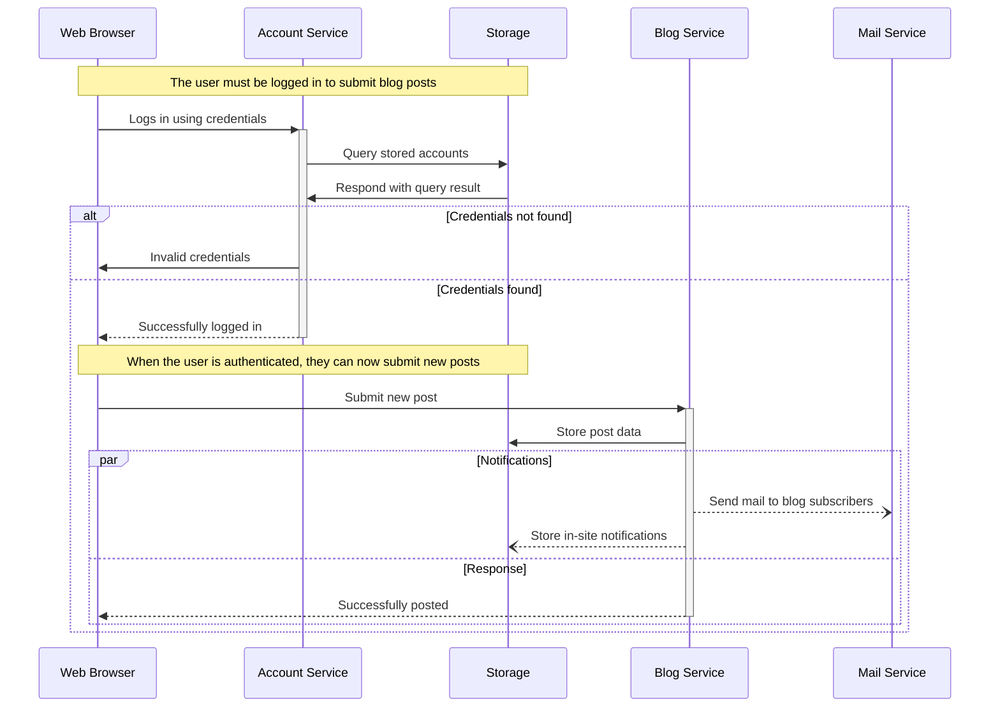

+++
title = "Callout"
description = "Callout detail"
template = "post.html"
date = 2025-04-18
generate_feed = true
tags = ["callout"]
draft = true

[extra]
comment = true
reaction = true
toc = true
copy = true
show_ended_words = true
img = "img/makefile.webp"
math = true
+++



## Inline code

inline `code` and more `inline code`

## Block code

```rs
fn plus_one(x: Option<i32>) -> Option<i32> {
    match x {
        None => None,
        Some(i) => Some(i + 1),
    }
}

let five = Some(5);
let six = plus_one(five);
let none = plus_one(None);
```

```diff
--- /path/to/original	timestamp
+++ /path/to/new	timestamp
@@ -1,3 +1,9 @@
+This is an important
+notice! It should
+therefore be located at
+the beginning of this
+document!
+
 This part of the
 document has stayed the
 same from version to
@@ -8,13 +14,8 @@
 compress the size of the
 changes.

-This paragraph contains
-text that is outdated.
-It will be deleted in the
-near future.
-
 It is important to spell
-check this dokument. On
+check this document. On
 the other hand, a
 misspelled word isn't
 the end of the world.
@@ -22,3 +23,7 @@
 this paragraph needs to
 be changed. Things can
 be added after it.
+
+This paragraph contains
+important new additions
+to this document.
```

```sh
git submodule add -b latest https://github.com/isunjn/serene.git themes/serene
```

## Line number

```rs,linenos
fn plus_one(x: Option<i32>) -> Option<i32> {
    match x {
        None => None,
        Some(i) => Some(i + 1),
    }
}

let five = Some(5);
let six = plus_one(five);
let none = plus_one(None);
```

```rs,linenos,linenostart=93
fn plus_one(x: Option<i32>) -> Option<i32> {
    match x {
        None => None,
        Some(i) => Some(i + 1),
    }
}

let five = Some(5);
let six = plus_one(five);
let none = plus_one(None);
```

## Highlight

```rs {linenos=inline hl_lines=["2-5",9]
fn plus_one(x: Option<i32>) -> Option<i32> {
    match x {
        None => None,
        Some(i) => Some(i + 1),
    }
}

let five = Some(5);
let six = plus_one(five);
let none = plus_one(None);
```

## Filename

```rs {title="src/main.rs"}
fn plus_one(x: Option<i32>) -> Option<i32> {
    match x {
        None => None,
        Some(i) => Some(i + 1),
    }
}

let five = Some(5);
let six = plus_one(five);
let none = plus_one(None);
```

```rs {linenos=inline hl_lines=["3-4"] style=emacs title="src/main.rs"}
fn plus_one(x: Option<i32>) -> Option<i32> {
    match x {
        None => None,
        Some(i) => Some(i + 1),
    }
}

let five = Some(5);
let six = plus_one(five);
let none = plus_one(None);
```

```go {linenos=inline hl_lines=[3,"6-8"] style=emacs}
package main

import "fmt"

func main() {
    for i := 0; i < 3; i++ {
        fmt.Println("Value of i:", i)
    }
}
```

```text {linenos=inline}


{}
```

## Katex

Given the radius $r$ of a circle, the area $A$ is:

$$
A = \pi \times r^2
$$

And the circumference $C$ is:

$$
C = 2 \pi r
$$

Inline math: $E = mc^2$

Display math:

$$
f(x) = \int_{-\infty}^\infty \hat f(\xi)\,e^{2 \pi i \xi x} \, d\xi
$$
