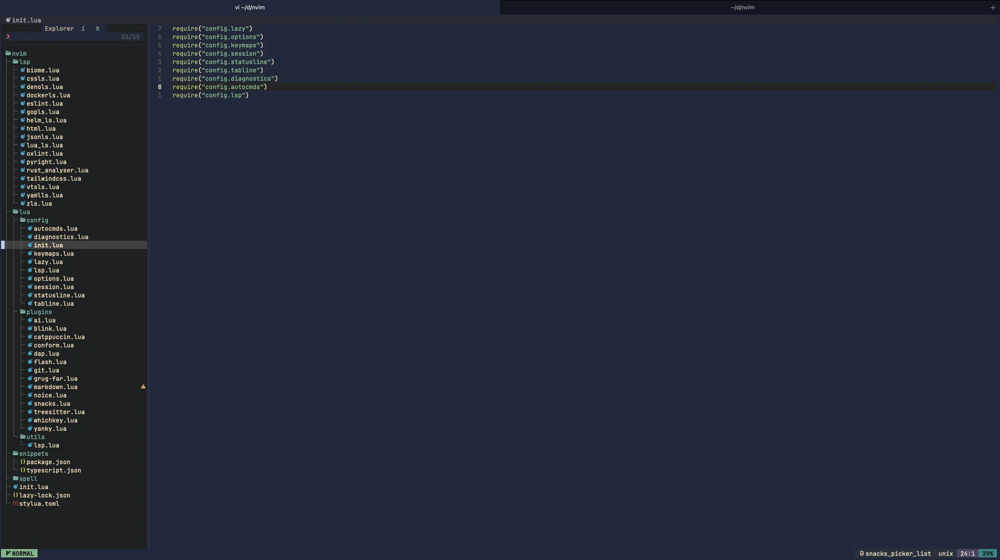

+++
title = "My Journey from IDEs to Neovim"
description = "Just sharing my story with Neovim and why I finally made the switch"
template = "post.html"
date = 2025-09-01
generate_feed = true
aliases = ["/blog/neovim-story", "/blog/ide-to-neovim"]
tags = ["neovim", "vim", "ide", "vscode"]
series = "neovim"
series_order = 1

[extra]
comment = true
reaction = true
toc = true
copy = true
outdate_alert = true
outdate_alert_days = 365
img = "/img/dashboard.webp"

+++

## How it started?

Back in 2019, I spent a lot of time on YouTube watching programmers. I was curious about how they worked, especially those using Vim. What I noticed was how they did everything so fast, no mouse, no menus, just pure typing. They could jump between files, make complex changes, and refactor code all in seconds. It looked almost like magic. Their hands seemed glued to the keyboard, and the workflow was so clean and focused. Watching them made me think, “Wow, this is really cool, I want to try that too. Maybe I can code faster, more efficiently, and spend less time wasting time clicking around.”

So, I decided to give it a shot. I downloaded Vim, opened my terminal, and started searching for guides online. I was excited, but that excitement soon turned into frustration.

## My first try

Like many beginners, my first experience with Vim was… rough.

I quickly realized it wasn't as easy as just opening the editor and starting to type. There were a lot of obstacles, and I struggled a lot during those first weeks.

- Setting up plugins was confusing. I used Vim so I setup my configuration with Vim script. I didn't understand Vim script very well, the documentation was poor, and every guide I read looked complicated or incomplete. I tried to add autocompletion, syntax highlighting, and other features, but it took me many hours just to get simple things working. Sometimes, I would copy-paste commands, only for my setup to break later, and I had no idea why.

- LSP and linters kept breaking. I wanted to set up language servers for Python, TypeScript, HTML, CSS, and others, but it was a constant struggle. Sometimes, I'd get strange error messages that made no sense.

- Too many commands to remember. Unlike VSCode, where I just clicked icons or used simple shortcuts, Vim required me to memorize lots of key combinations. Moving around, copying, pasting, searching, go to definition, refactor ...etc everything needed specific shortcuts. I kept forgetting them, which slowed me down even more.

- Basic tasks took forever. Things like opening a file, switching buffers, or refactoring code that were quick in IDEs now took much longer in Vim.

After about two or three weeks of this, I gave up. I went back to VSCode and only used Vim for quick edits in the terminal. I thought "Maybe I'm just not smart enough for this."

## Why I tried again at the end of 2024

By 2024, several things made me reconsider Neovim. My daily development workflow was getting more and more frustrating.

### My IDEs were getting slow

- **WebStorm** was killing my productivity. Sure, it has amazing features, but when I works on the big projects and the mono repos, on my machine it takes 8+ seconds just to start. It eats tons of RAM and completely freezes when I open large files. I'd spend more time waiting for it to respond than actually coding.

- **VSCode** feels great at first: it starts fast, looks clean, and has many extensions. But in big projects, it quickly slows down. Find and replace, and run prettier/eslint auto takes too long, debugging uses too much memory, and adding more plugins only makes things worse.

- **Zed** looked promising with its speed, but it is missing basics I need every day. There is no proper debugging, git integration is limited, language server support is weak, and it still feels too new for serious work.

Meanwhile, I kept hearing that Neovim users were much faster compared to these IDEs.

### Working with multiple languages got more complicated

I started working with JavaScript/TypeScript, Python, Go, Rust and Zig. WebStorm didn’t suit this workflow. VSCode allows more extensions and plugins, but it felt slower.

### The AI problem

Here's what really pushed me over the edge: AI integration in IDEs is a mess.

Everyone talks about how great AI coding assistance is, but in practice it's frustrating:

- AI works randomly, sometimes it's helpful, sometimes it suggests complete garbage
- Some work projects ban AI tools, so I have to disable everything, but IDEs make this really hard to configure
- AI autocomplete kills creativity, it interrupts my thinking with suggestions I didn't ask for
- Can't use just AI chat, most IDEs force me to take all AI features or none

Most of the time I just want AI turned off, or maybe just access to chat for questions. But try configuring that in VSCode or WebStorm. It's either everything on or a confusing mess of settings.

### Terminal tools got really good

While IDEs were getting bloated, terminal tools were getting amazing:

- Modern terminals like Ghostty, WezTerm, Alacritty and Kitty actually work well and look good (they also support some interesting animations)
- Raise of Rust powered or terminal tools like ripgrep, zoxide, eza, fd, bat, lazygit, and yazi are incredibly fast

Working in the terminal stopped feeling like a punishment and started feeling productive.

### My wrists started hurting

I got a mechanical keyboard and realized how much damage all that mouse movement was doing. Constantly switching between keyboard and mouse for basic editing was:

- Straining my hands and wrists
- Breaking my focus every few seconds
- Slowing me down overall
- I prefer keeping my hands on the keyboard while typing

I needed a way to reduce mouse use, but GUI IDEs made that difficult without Vim-style bindings.

## What changed: Neovim got much better

Between my 2019 failure and 2024, the Neovim ecosystem evolved dramatically:

### Lua instead of Vimscript

**Before**: Neovim relied on Vimscript, which was often cryptic and prone to breaking for unclear reasons.

**Now**: I can configure Neovim using Lua, allowing for cleaner, more maintainable code.

### Better plugins and documentation

**Before**: Plugins were often experimental, lacked documentation, and could break unexpectedly.

**Now**: The Neovim ecosystem has matured, with well-documented plugins and a wealth of examples available online.

### Learning became approachable

- `which-key.nvim` shows available shortcuts as we type, no more memorizing everything
- Tons of dotfiles and tutorials everywhere, we can learn from real configurations
- Starter distributions like LazyVim, Kickstart, AstroVim, and LunarVim give us working setups immediately
- AI and community (reddit) can help debug or fix configuration issues and suggest improvements

### Built-in LSP support

**Before**: Complex third-party LSP setups that barely worked and broke constantly  
**Now**: Language servers work out of the box with native Neovim LSP

## My current setup: minimal but complete

Before becoming truly productive with Neovim, I first tried using Vim keybindings inside VSCode. This helped me get familiar with the shortcuts and the Vim way of editing. It was actually fun, and I felt more productive even in VSCode. (I’m planning to write an article on how I made VSCode keymaps feel like Neovim later)

But I quickly realized there were limits. VSCode’s interface and features kept me from experiencing true Vim, it was never 100% Vim experiences. So I gradually forced myself to switch back and forth between VSCode and Neovim until I felt confident and comfortable in Neovim. That process took me a few weeks.

Now, I work entirely in the terminal with Neovim. I don’t miss VSCode at all.

After lots of experimenting, I ended up with about **20 plugins**. That's it. They give me everything I need for professional development.

Here's my actual Neovim folder structure:

```
nvim/
├── init.lua                   # Entry point
├── lazy-lock.json             # Plugin versions (for reproducibility)
├── lsp/                       # Individual language server configs
│   ├── biome.lua              # Modern web linting
│   ├── vtsls.lua              # Advanced TypeScript
│   ├── pyright.lua            # Python intelligence
│   ├── gopls.lua              # Go language server
│   ├── rust_analyzer.lua      # Rust development
│   └── ... (+ language servers)
├── lua/
│   ├── config/                # Core configuration
│   │   ├── keymaps.lua        # VSCode-like shortcuts
│   │   ├── options.lua        # Neovim behavior
│   │   ├── statusline.lua     # Custom status bar
│   │   └── ...
│   ├── plugins/               # Plugin configurations
│   │   ├── blink.lua          # Rust-powered completion
│   │   ├── snacks.lua         # Multi-tool productivity
│   │   ├── conform.lua        # Code formatting
│   │   └── ...
│   └── utils/lsp.lua          # LSP helper functions
├── snippets/                  # Custom code snippets
└── spell/                     # Multi-language spell check
```

<br/>

<figcaption style="font-size: 0.8em; color: gray; margin-top: 4px; text-align: center;">My Neovim config folder</figcaption>
<br/>

## The results so far

**Daily workflow:**

- Everything happens in one place: coding, note-taking, file search, Git, and AI tools all inside Neovim. No more constant tool switching.
- Built-in terminal integration means I can run tests, scripts, or even AI assistants (Claude CLI, Gemini CLI, Opencode) directly from the editor.
- No mouse needed for 95% of tasks (In the browser I use the vimium extension, and on macOS I use homerow for full keyboard navigation)
- I code faster and feel more productive. Vim’s actions and motions are really powerful (`ci`, `ca`, `fuzzy search`, `LSP go-to`, `registers`, `marks`, `selections`,`macros` ...etc).
- Same interface for all 10+ programming languages
- Complete control over AI - I can turn it off, use just chat, or customize exactly what I want

**Performance:**

- Startup is almost instant (under 100 ms vs several seconds for VSCode or IntelliJ).
- Memory usage stays light (50–150 MB, compared to 400+ MB for VSCode and ~1 GB for WebStorm/IntelliJ).
- Large files are no problem, I can open 100 MB+ logs or 100k-line projects in under a second.
- Even with 30+ plugins loaded, Neovim still feels faster than a fresh install of most IDEs.
- CPU stays quiet, background LSP tasks or Treesitter parsing barely register compared to the heavy background processes of Electron-based editors.

I now work fully in Neovim and haven’t looked back at VSCode. It feels faster, lighter, and more in tune with how I want to code.

## Why I'm writing this series

Neovim changes fast. It's still version 0.x (I'm using 0.12), not 1.0 yet. Things can break between updates.

I'm sharing my setup because it works very well for me, and maybe it'll help you too. I'm not claiming it's perfect, just showing what I figured out after lots of trial and error.

This isn't expert advice. Just one developer sharing what actually works.

## Article series plan

Based on my setup, here are the core topics for upcoming articles:

- Part 2: basics setup (init.lua, keymaps, options, autocmds, diagnostics)
- Part 3: setup native LSP
- Part 4: setup vim.pack, snacks.nvim (+ which-key.nvim, nvim-web-devicons)
- Part 5: code quality tools (highlighting, theme)
- Part 6: setup smart completion with blink.cmp, snippets
- Part 7: setup formatter
- Part 8: setup git tools (gitsigns, diffview, lazygit)
- Part 9: debugging (nvim-dap, nvim-dap-ui)
- Part 10: enhanced editing experience (flash.nvim, yanky.nvim, grug-far.nvim, noice.nvim)
- Part 11: custom statusline
- Part 12: custom tabline
- Part 13: custom session

## FAQ

1. Did I used Helix?

Yes, I tried Helix. It’s nice, very fast, and simple to set up. But I still prefer Neovim because of its modal editing with actions + motions. Neovim also has far more plugins and better UI/UX. So I decided to stay with Neovim.

---

My complete Neovim configuration: [https://github.com/tduyng/nvim](https://github.com/tduyng/nvim)
