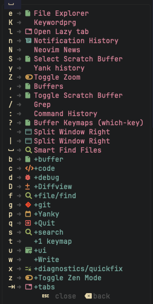
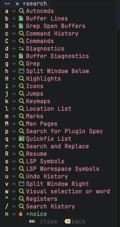

+++
title = "Part 4: Managing snacks.nvim with native vim.pack"
description = "Using Neovim's built-in package manager with snacks.nvim and which-key.nvim"
template = "post.html"
date = 2025-10-28
generate_feed = true
tags = ["neovim", "vim-pack", "snacks"]

[extra]
comment = true
reaction = true
toc = true
copy = true
outdate_alert = true
outdate_alert_days = 365
img = "/img/dashboard.png"
+++

In the previous articles, we set up native LSP. Now let's add plugins. I used to love lazy.nvim, it's an amazing plugin manager. But Neovim 0.12+ added `vim.pack`, a built-in package manager. I tried it and decided to switch.

## About Folke Lemaitre

Before we dive into plugins, I need to mention [Folke Lemaitre](https://github.com/folke). If you use Neovim, you already know his work. He created [lazy.nvim](https://github.com/folke/lazy.nvim) (the most popular plugin manager) and the distro [Lazyvim](www.lazyvim.org) (the most popular neovim distro), [which-key.nvim](github.com/folke/which-key.nvim) (the keymap helper), [tokyonight](https://github.com/folke/tokyonight.nvim) (beautiful colorscheme), and a lot of contributions in Neovim and many other essential plugins.

Everything Folke builds is polished, quite well-documented, and solves real problems. In this article, we'll use two of his plugins: `which-key.nvim` and `snacks.nvim`. When Folke releases something, you know it's good.

## Why vim.pack?

I used lazy.nvim for a long time. I really love that. It's great, lazy loading, nice UI, lockfiles, everything works. But I started asking: do I really need all those features?

Here's what I realized:

**What I actually need:**

- Install plugins from GitHub
- Update plugins
- Lock plugin versions
- Simple setup

**What I don't need:**

- Complex lazy loading config (most plugins load fast anyway)
- Plugin manager UI (I rarely use all features of it)
- Another dependency to learn and maintain

Neovim 0.12 added `vim.pack` with everything I need:

- `vim.pack.add()` - install/load plugins
- `vim.pack.update()` - update plugins
- `vim.pack.del()` - remove plugins
- `nvim-pack-lock.json` - lockfile support
- No extra plugin needed

So I switched. Less config, less magic, more control.

## How vim.pack Works

It's dead simple:

```lua
-- Install and load a plugin
vim.pack.add("https://github.com/folke/which-key.nvim")

-- Install multiple plugins at once
vim.pack.add({
  "https://github.com/folke/snacks.nvim",
  "https://github.com/nvim-tree/nvim-web-devicons",
})
```

That's it. When you start Neovim:

1. `vim.pack.add()` checks if the plugin exists locally
2. If not, it clones it from GitHub
3. The plugin is loaded and ready to use

No bootstrap script. No lazy loading config. Just add and go.

## Managing plugins

**Update plugins:**

```vim
:lua vim.pack.update()
```

This updates all plugins to latest commits and updates `nvim-pack-lock.json`.
I also setup keymap for that:

```lua
vim.keymap.set("n", "<leader>pu", "<cmd>lua vim.pack.update()<CR>")
```

**Lock versions:**

Neovim creates `nvim-pack-lock.json` automatically:

```json
{
    "plugins": {
        "which-key.nvim": {
            "rev": "3aab2147e74890957785941f0c1ad87d0a44c15a",
            "src": "https://github.com/folke/which-key.nvim"
        }
    }
}
```

**Remove plugins:**

Two ways:

1. Remove from config and restart Neovim (plugin stays in disk but won't load)
2. Remove completely:
    ```lua
    vim.pack.del({"plugin-name"})
    ```

## My setup structure

Here's how I organize plugins:

```
~/.config/nvim/
├── init.lua                  # Entry point
├── nvim-pack-lock.json       # Version lockfile (auto-generated)
├── lua/
│   ├── config/
│   │   └── init.lua          # Load all configs
│   └── plugins/
│       ├── init.lua          # Load all plugin files
│       ├── snacks.lua        # Snacks.nvim config
│       ├── whichkey.lua      # Which-key config
│       ├── blink.lua         # Completion
│       ├── treesitter.lua    # Syntax highlighting
│       └── ...               # Other plugins
```

**File: `init.lua`**

```lua
vim.g.mapleader = " "
vim.g.maplocalleader = " "

require "config"   -- Load configs first
require "plugins"  -- Then load plugins
```

**File: `lua/config/init.lua`**

```lua
require("config.options")
require("config.keymaps")
require("config.diagnostics")
require("config.autocmds")
require("config.lsp")
```

**File: `lua/plugins/init.lua`**

```lua
require("plugins.snacks")
require("plugins.whichkey")
require("plugins.blink")
require("plugins.treesitter")
-- ... other plugins
```

Each plugin gets its own file. Clean and modular.

## Setting up which-key.nvim

which-key.nvim is the plugin that changed everything for me.

When I started with Vim, the hardest part wasn't the motions or commands. It was remembering all the keymaps. Each plugin has its own shortcuts. Your own custom keymaps pile up. Coming from traditional IDEs where everything is in menus, suddenly having to memorize hundreds of key combinations felt impossible.

which-key.nvim solved this completely.

**Here's how it works:** Press `<leader>` and pause for a second. A popup appears showing all available keymaps that start with `<leader>`. See `<leader>g`? That's for git commands. `<leader>f`? File operations. You don't need to remember anything just look at the menu.

I use Neovim every single day. I still use which-key every single day. It's not just for beginners, it's for everyone who wants to code instead of memorizing shortcuts.

<div style="display: grid; grid-template-columns: 1fr 1fr; gap: 20px; margin: 24px 0; max-width: 800px;">
  <div style="display: flex; flex-direction: column; align-items: center;">
    
    <figcaption style="font-size: 0.8em; color: gray; margin-top: 8px; text-align: center;">which-key showing available shortcuts</figcaption>
  </div>
  <div style="display: flex; flex-direction: column; align-items: center;">
    
    <figcaption style="font-size: 0.8em; color: gray; margin-top: 8px; text-align: center;">Search through all keymaps with which-key</figcaption>
  </div>
</div>

Here is my setup for which-key.nvim (That I learn a lot from Lazyvim)

**File: `lua/plugins/whichkey.lua`**

```lua
vim.pack.add({
	"https://github.com/folke/which-key.nvim",
})

local wk = require("which-key")
wk.setup({
	preset = "helix",
})
wk.add({
	{ "<leader><tab>", group = "tabs" },
	{ "<leader>c", group = "code" },
	{ "<leader>d", group = "debug" },
	{ "<leader>D", group = "Diffview", icon = { icon = "", color = "orange" } },
	{ "<leader>p", group = "Yanky", icon = { icon = "󰃮 ", color = "yellow" } },
	{ "<leader>dp", group = "profiler" },
	{ "<leader>f", group = "file/find" },
	{ "<leader>g", group = "git" },
	{ "<leader>gh", group = "hunks" },
	{ "<leader>q", group = "quit/session" },
	{ "<leader>s", group = "search" },
	{ "<leader>u", group = "ui", icon = { icon = "󰙵 ", color = "cyan" } },
	{ "<leader>x", group = "diagnostics/quickfix", icon = { icon = "󱖫 ", color = "green" } },
	{ "[", group = "prev" },
	{ "]", group = "next" },
	{ "g", group = "goto" },
	{ "gs", group = "surround" },
	{ "z", group = "fold" },
	{
		"<leader>b",
		group = "buffer",
		expand = function()
			return require("which-key.extras").expand.buf()
		end,
	},
	{
		"<leader>w",
		group = "windows",
		proxy = "<c-w>",
		expand = function()
			return require("which-key.extras").expand.win()
		end,
	},
	-- better descriptions
	{ "gx", desc = "Open with system app" },
	{
		"<leader>fC",
		group = "Copy Path",
		{
			"<leader>fCf",
			function()
				vim.fn.setreg("+", vim.fn.expand("%:p")) -- Copy full file path to clipboard
				vim.notify("Copied full file path: " .. vim.fn.expand("%:p"))
			end,
			desc = "Copy full file path",
		},
		{
			"<leader>fCn",
			function()
				vim.fn.setreg("+", vim.fn.expand("%:t")) -- Copy file name to clipboard
				vim.notify("Copied file name: " .. vim.fn.expand("%:t"))
			end,
			desc = "Copy file name",
		},
		{
			"<leader>fCr",
			function()
				local cwd = vim.fn.getcwd() -- Current working directory
				local full_path = vim.fn.expand("%:p") -- Full file path
				local rel_path = full_path:sub(#cwd + 2) -- Remove cwd prefix and leading slash
				vim.fn.setreg("+", rel_path) -- Copy relative file path to clipboard
				vim.notify("Copied relative file path: " .. rel_path)
			end,
			desc = "Copy relative file path",
		},
		{
			"<leader>?",
			function()
				require("which-key").show({ global = false })
			end,
			desc = "Buffer Keymaps (which-key)",
		},
		{
			"<c-w><space>",
			function()
				require("which-key").show({ keys = "<c-w>", loop = true })
			end,
			desc = "Window Hydra Mode (which-key)",
		},
	},
	{
		-- Nested mappings are allowed and can be added in any order
		-- Most attributes can be inherited or overridden on any level
		-- There's no limit to the depth of nesting
		mode = { "n", "v" }, -- NORMAL and VISUAL mode
		{ "<leader>q", "<cmd>q<cr>", desc = "Quit" }, -- no need to specify mode since it's inherited
		{ "<leader>w", "<cmd>w<cr>", desc = "Write" },
	},
})
```

That's it. Now press `<leader>` and see the magic.

## Setting up snacks.nvim

snacks.nvim is Folke's response to plugin bloat. Instead of installing 10-15 separate plugins for basic features, snacks.nvim bundles them all into one well-integrated package.

Think about a typical Neovim setup:

- telescope.nvim, fzf.nvim for file finding
- neotree.nvim for explorer
- toggleterm.nvim, oil.nvim for terminal
- nvim-notify for notifications
- indent-blankline.nvim for indentation
- dashboard.nvim for dashboard
- zen-mode.nvim for focused writing
- image.nvim for display image
- Or a lot of plugins in mini.nvim system
- And more...

That's a lot of plugins. A lot of config. A lot of potential conflicts.

**snacks.nvim replaces all of that.**

One plugin. One config. Everything works together. And because it's from Folke, you know it's fast, reliable, and actually works.

**What's included:**

- **Picker** - file finder and grep (replaces telescope)
- **Explorer** - file tree (replaces nvim-tree/neo-tree)
- **Terminal** - integrated terminal (replaces toggleterm)
- **Notifier** - beautiful notifications (replaces nvim-notify)
- **Git integration** - lazygit wrapper + git utilities
- **Scratch buffers** - quick notes
- **Zen mode** - distraction-free writing
- **Dashboard** - startup screen
- **Indent guides** - visual indentation
- **Image preview** - view images in terminal
- **Statuscolumn** - better line numbers
- **And much more** - [full list here](https://github.com/folke/snacks.nvim)

After setting up snacks.nvim, you have a complete, productive Neovim environment. File finding, terminal, git, notifications, everything you need, no plugin hunting required.

Here is my setup for snacks:

**File: `lua/plugins/snacks.lua`**

```lua
vim.pack.add({
	"https://github.com/folke/snacks.nvim",
	"https://github.com/nvim-tree/nvim-web-devicons",
})

local Snacks = require("snacks")

Snacks.setup({
	animate = { enabled = true },
	bigfile = { enabled = true },
	dashboard = { enabled = false },
	dim = { enabled = true },
	explorer = { enabled = true, replace_netrw = true },
	image = { enabled = true },
	indent = { enabled = true },
	input = { enabled = true },
	layout = { enabled = true },
	notifier = { enabled = true },
	quickfile = { enabled = true },
	scope = { enabled = true },
	scratch = { enabled = true },
	scroll = { enabled = true },
	statuscolumn = { enabled = true },
	terminal = { enabled = true },
	toggle = { enabled = true },
	words = { enabled = false },
	zen = { enabled = true },

	picker = {
		sources = {
			files = {
				hidden = true,
				ignored = true,
				win = {
					input = {
						keys = {
							["<S-h>"] = "toggle_hidden",
							["<S-i>"] = "toggle_ignored",
							["<S-f>"] = "toggle_follow",
							["<C-y>"] = { "yazi_copy_relative_path", mode = { "n", "i" } },
						},
					},
				},
				exclude = {
					"**/.git/*",
					"**/node_modules/*",
					"**/.yarn/cache/*",
					"**/.yarn/install*",
					"**/.yarn/releases/*",
					"**/.pnpm-store/*",
					"**/.idea/*",
					"**/.DS_Store",
					"build/*",
					"coverage/*",
					"dist/*",
					"hodor-types/*",
					"**/target/*",
					"**/public/*",
					"**/digest*.txt",
					"**/.node-gyp/**",
				},
			},
			grep = {
				hidden = true,
				ignored = true,
				win = {
					input = {
						keys = {
							["<S-h>"] = "toggle_hidden",
							["<S-i>"] = "toggle_ignored",
							["<S-f>"] = "toggle_follow",
						},
					},
				},
				exclude = {
					"**/.git/*",
					"**/node_modules/*",
					"**/.yarn/cache/*",
					"**/.yarn/install*",
					"**/.yarn/releases/*",
					"**/.pnpm-store/*",
					"**/.venv/*",
					"**/.idea/*",
					"**/.DS_Store",
					"**/yarn.lock",
					"build*/*",
					"coverage/*",
					"dist/*",
					"certificates/*",
					"hodor-types/*",
					"**/target/*",
					"**/public/*",
					"**/digest*.txt",
					"**/.node-gyp/**",
				},
			},
			grep_buffers = {},
			explorer = {
				hidden = true,
				ignored = true,
				supports_live = true,
				auto_close = true,
				diagnostics = true,
				diagnostics_open = false,
				focus = "list",
				follow_file = true,
				git_status = true,
				git_status_open = false,
				git_untracked = true,
				jump = { close = true },
				tree = true,
				watch = true,
				exclude = {
					".git",
					".pnpm-store",
					".venv",
					".DS_Store",
					"**/.node-gyp/**",
				},
			},
		},
	},
})

vim.api.nvim_create_autocmd("User", {
	pattern = "VeryLazy",
	callback = function()
		Snacks.toggle.option("spell", { name = "Spelling" }):map("<leader>us")
		Snacks.toggle.option("wrap", { name = "Wrap" }):map("<leader>uw")
		Snacks.toggle.option("relativenumber", { name = "Relative Number" }):map("<leader>uL")
		Snacks.toggle.diagnostics():map("<leader>ud")
		Snacks.toggle.line_number():map("<leader>ul")
		Snacks.toggle
			.option("conceallevel", { off = 0, on = vim.o.conceallevel > 0 and vim.o.conceallevel or 2, name = "Conceal Level" })
			:map("<leader>uc")
		Snacks.toggle
			.option("showtabline", { off = 0, on = vim.o.showtabline > 0 and vim.o.showtabline or 2, name = "Tabline" })
			:map("<leader>uA")
		Snacks.toggle.treesitter():map("<leader>uT")
		Snacks.toggle.option("background", { off = "light", on = "dark", name = "Dark Background" }):map("<leader>ub")
		Snacks.toggle.dim():map("<leader>uD")
		Snacks.toggle.animate():map("<leader>ua")
		Snacks.toggle.indent():map("<leader>ug")
		Snacks.toggle.scroll():map("<leader>uS")
		Snacks.toggle.profiler():map("<leader>dpp")
		Snacks.toggle.profiler_highlights():map("<leader>dph")
		Snacks.toggle.zoom():map("<leader>wm"):map("<leader>uZ")
		Snacks.toggle.zen():map("<leader>uz")
	end,
})

-- stylua: ignore start
local   keymaps = {
    { "<leader>l", function() vim.cmd("Lazy") end, desc = "Open Lazy tab", },
    -- Top Pickers & Explorer
    { "<leader><space>", function() Snacks.picker.smart() end, desc = "Smart Find Files" },
    { "<leader>/", function() Snacks.picker.grep() end, desc = "Grep" },
    { "<leader>:", function() Snacks.picker.command_history() end, desc = "Command History" },
    { "<leader>n", function() Snacks.picker.notifications() end, desc = "Notification History" },
    { "<leader>e", function() Snacks.explorer() end, desc = "File Explorer" },
    {
      "<leader>,", function()
        Snacks.picker.buffers({
          win = {
            input = {
              keys = {
                ["dd"] = "bufdelete",
                ["<c-d>"] = { "bufdelete", mode = { "n", "i" } },
              },
            },
            list = { keys = { ["dd"] = "bufdelete" } },
          },
        })
      end, desc = "Buffers",
    },
    -- find
    { "<leader>fb", function() Snacks.picker.buffers() end, desc = "Buffers" },
    { "<leader>fc", function() Snacks.picker.files({ cwd = vim.fn.stdpath("config") }) end, desc = "Find Config File" },
    { "<leader>ff", function() Snacks.picker.files() end, desc = "Find Files" },
    { "<leader>fg", function() Snacks.picker.git_files() end, desc = "Find Git Files" },
    { "<leader>fp", function() Snacks.picker.projects() end, desc = "Projects" },
    { "<leader>fr", function() Snacks.picker.recent() end, desc = "Recent" },
    -- git
    { "<leader>gb", function() Snacks.picker.git_branches() end, desc = "Git Branches" },
    { "<leader>gl", function() Snacks.picker.git_log() end, desc = "Git Log" },
    { "<leader>gL", function() Snacks.picker.git_log_line() end, desc = "Git Log Line" },
    { "<leader>gs", function() Snacks.picker.git_status() end, desc = "Git Status" },
    { "<leader>gS", function() Snacks.picker.git_stash() end, desc = "Git Stash" },
    { "<leader>gd", function() Snacks.picker.git_diff() end, desc = "Git Diff (Hunks)" },
    { "<leader>gD", function() Snacks.picker.git_diff({ base = "origin" }) end, desc = "Git Diff (origin)" },
    { "<leader>gf", function() Snacks.picker.git_log_file() end, desc = "Git Log File" },
    -- Grep
    { "<leader>sb", function() Snacks.picker.lines() end, desc = "Buffer Lines" },
    { "<leader>sB", function() Snacks.picker.grep_buffers() end, desc = "Grep Open Buffers" },
    { "<leader>sg", function() Snacks.picker.grep() end, desc = "Grep" },
    { "<leader>sw", function() Snacks.picker.grep_word() end, desc = "Visual selection or word", mode = { "n", "x" } },
    -- search
    { '<leader>s"', function() Snacks.picker.registers() end, desc = "Registers" },
    { '<leader>s/', function() Snacks.picker.search_history() end, desc = "Search History" },
    { "<leader>sa", function() Snacks.picker.autocmds() end, desc = "Autocmds" },
    { "<leader>sb", function() Snacks.picker.lines() end, desc = "Buffer Lines" },
    { "<leader>sc", function() Snacks.picker.command_history() end, desc = "Command History" },
    { "<leader>sC", function() Snacks.picker.commands() end, desc = "Commands" },
    { "<leader>sd", function() Snacks.picker.diagnostics() end, desc = "Diagnostics" },
    { "<leader>sD", function() Snacks.picker.diagnostics_buffer() end, desc = "Buffer Diagnostics" },
    { "<leader>sH", function() Snacks.picker.highlights() end, desc = "Highlights" },
    { "<leader>si", function() Snacks.picker.icons() end, desc = "Icons" },
    { "<leader>sj", function() Snacks.picker.jumps() end, desc = "Jumps" },
    { "<leader>sk", function() Snacks.picker.keymaps() end, desc = "Keymaps" },
    { "<leader>sl", function() Snacks.picker.loclist() end, desc = "Location List" },
    { "<leader>sm", function() Snacks.picker.marks() end, desc = "Marks" },
    { "<leader>sM", function() Snacks.picker.man() end, desc = "Man Pages" },
    { "<leader>sp", function() Snacks.picker.lazy() end, desc = "Search for Plugin Spec" },
    { "<leader>sq", function() Snacks.picker.qflist() end, desc = "Quickfix List" },
    { "<leader>sR", function() Snacks.picker.resume() end, desc = "Resume" },
    { "<leader>su", function() Snacks.picker.undo() end, desc = "Undo History" },
    { "<leader>uC", function() Snacks.picker.colorschemes() end, desc = "Colorschemes" },
    -- LSP
    { "gd", function() Snacks.picker.lsp_definitions() end, desc = "Goto Definition" },
    { "gD", function() Snacks.picker.lsp_declarations() end, desc = "Goto Declaration" },
    { "gr", function() Snacks.picker.lsp_references() end, nowait = true, desc = "References" },
    { "gI", function() Snacks.picker.lsp_implementations() end, desc = "Goto Implementation" },
    { "gy", function() Snacks.picker.lsp_type_definitions() end, desc = "Goto T[y]pe Definition" },
    { "<leader>ss", function() Snacks.picker.lsp_symbols() end, desc = "LSP Symbols" },
    { "<leader>sS", function() Snacks.picker.lsp_workspace_symbols() end, desc = "LSP Workspace Symbols" },
    { "gai", function() Snacks.picker.lsp_incoming_calls() end, desc = "C[a]lls Incoming", has = "callHierarchy/incomingCalls" },
    { "gao", function() Snacks.picker.lsp_outgoing_calls() end, desc = "C[a]lls Outgoing", has = "callHierarchy/outgoingCalls" },
    -- buffers
    { "<leader>bd", function() Snacks.bufdelete() end, desc = "Delete buffer", mode = { "n" }, },
    { "<leader>bo", function() Snacks.bufdelete.other() end, desc = "Delete other buffers", mode = { "n" }, },
    -- terminal
    { "<leader>fT", function() Snacks.terminal() end, desc = "Terminal (cwd)", mode = "n", },
    { "<leader>ft", function() Snacks.terminal(nil, { cwd = vim.fn.getcwd() }) end, desc = "Terminal (Root Dir)",  mode = "n", },
    { "<c-:>",  function() Snacks.terminal(nil, { cwd = vim.fn.getcwd() }) end, desc = "Terminal (Root Dir)", mode = "n", },
    { "<c-/>",      function() Snacks.terminal() end, desc = "Toggle Terminal" },
    { "<c-_>", function() Snacks.terminal(nil, { cwd = vim.fn.getcwd() }) end, desc = "which_key_ignore",  mode = "n", },
    -- Other
    { "<leader>z",  function() Snacks.zen() end, desc = "Toggle Zen Mode" },
    { "<leader>Z",  function() Snacks.zen.zoom() end, desc = "Toggle Zoom" },
    { "<leader>.",  function() Snacks.scratch() end, desc = "Toggle Scratch Buffer" },
    { "<leader>S",  function() Snacks.scratch.select() end, desc = "Select Scratch Buffer" },
    { "<leader>n",  function() Snacks.notifier.show_history() end, desc = "Notification History" },
    { "<leader>bd", function() Snacks.bufdelete() end, desc = "Delete Buffer" },
    { "<leader>cR", function() Snacks.rename.rename_file() end, desc = "Rename File" },
    { "<leader>gB", function() Snacks.gitbrowse() end, desc = "Git Browse", mode = { "n", "v" } },
    { "<leader>gg", function() Snacks.lazygit() end, desc = "Lazygit" },
    { "<leader>un", function() Snacks.notifier.hide() end, desc = "Dismiss All Notifications" },
    { "<c-_>",      function() Snacks.terminal() end, desc = "which_key_ignore" },
    { "]]",         function() Snacks.words.jump(vim.v.count1) end, desc = "Next Reference", mode = { "n", "t" } },
    { "[[",         function() Snacks.words.jump(-vim.v.count1) end, desc = "Prev Reference", mode = { "n", "t" } },
    {
      "<leader>N",
      desc = "Neovim News",
      function()
        Snacks.win({
          file = vim.api.nvim_get_runtime_file("doc/news.txt", false)[1],
          width = 0.6,
          height = 0.6,
          wo = {
            spell = false,
            wrap = false,
            signcolumn = "yes",
            statuscolumn = " ",
            conceallevel = 3,
          },
        })
      end,
    }
}
-- stylua: ignore end
for _, map in ipairs(keymaps) do
	local opts = { desc = map.desc }
	if map.silent ~= nil then
		opts.silent = map.silent
	end
	if map.noremap ~= nil then
		opts.noremap = map.noremap
	else
		opts.noremap = true
	end
	if map.expr ~= nil then
		opts.expr = map.expr
	end

	local mode = map.mode or "n"
	vim.keymap.set(mode, map[1], map[2], opts)
end
```

Now you have:

- File picker: `<leader><space>`
- Grep: `<leader>/`
- Git: `<leader>gg`
- Terminal: `<ctrl-/>`
- And much more (like a lot of keymaps we have on [Lazyvim/keymaps](https://www.lazyvim.org/keymaps))

## The complete flow

1. **Add plugin** - Add `vim.pack.add()` to plugin file
2. **Configure** - Set up the plugin below the add call
3. **Restart Neovim** - Plugin installs and loads
4. **Use it** - Plugin is ready

## What's next

In the next article, we'll add more plugins: syntax highlighting, formatter and theme.
