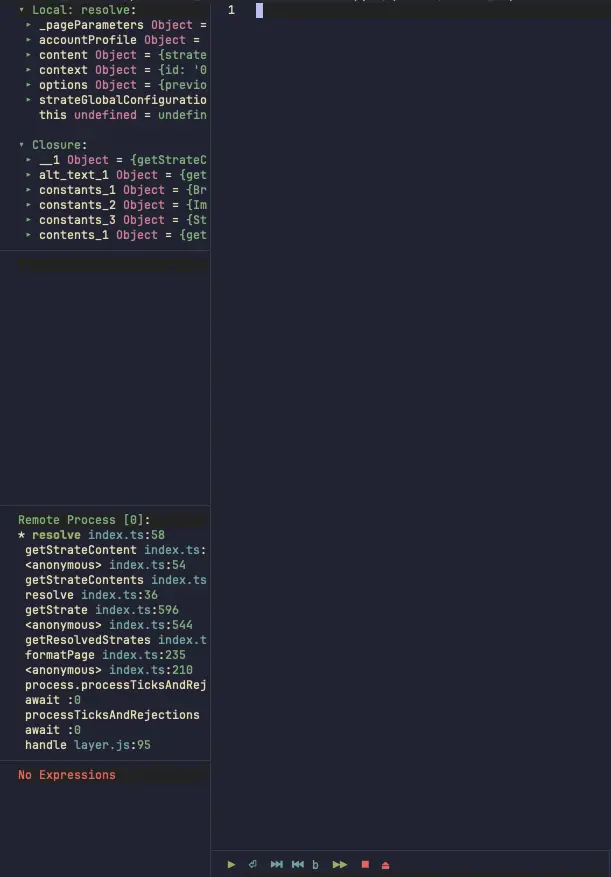

+++
title = "Neovim debugging for Node.js/TypeScript"
description = "My journey setting up debugging in Neovim. The struggle, the breakthrough, and what finally worked"
template = "post.html"
date = 2025-12-21
generate_feed = true
tags = ["neovim", "debug", "vim-dap", "nodejs", "typescript"]
series = "neovim"
series_order = 10

[extra]
comment = true
reaction = true
toc = true
copy = true
outdate_alert = true
outdate_alert_days = 365
img = "/img/dashboard.webp"
+++

Today I share how to debug Node.js and TypeScript projects in Neovim.

Debugging was the hardest part for me. I often had to switch back to VSCode just to debug, because it “just works” there. I never really thought about what happens behind the scenes. The key thing I was missing is simple: installing `nvim-dap` is not enough. You also need a debug adapter.

I think about it like this:

```
Neovim (nvim-dap) ←→ Debug Adapter (vscode-js-debug) ←→ My Node.js code
```

`nvim-dap` talks to the debug adapter, and the debug adapter talks to your code. To debug properly, both need to be installed and configured.

## The plugins I use

For debugging, I use 4 plugins. I usually keep my setup minimal, but these are the ones `nvim-dap` actually needs.

`nvim-dap` is the core plugin. It implements the Debug Adapter Protocol and does the actual debugging work.

`nvim-dap-ui` adds a UI on top of it: breakpoints, variables, call stack, and the console.

`nvim-nio` is a small async library required by `nvim-dap-ui`.

`nvim-dap-virtual-text` shows variable values inline in the code, similar to VSCode.

Together, they give a better debugging experience inside Neovim.

## Installing `vscode-js-debug`

For Node.js and TypeScript, I use `vscode-js-debug`. It’s the same debugger used by VSCode, and it’s open source.

### Option 1: Build from source

```bash
cd ~
git clone https://github.com/microsoft/vscode-js-debug.git
cd vscode-js-debug
npm install --legacy-peer-deps
npx gulp dapDebugServer
```

After a few minutes, the debug adapter is available at:

```
~/vscode-js-debug/dist/src/dapDebugServer.js
```

### Option 2: Download a release

- Download `js-debug-dap-${version}.tar.gz` from the releases page
- Version **1.77.0 or newer** is required
- Extract it with:

```bash
tar xvzf path/to/js-debug-dap-${version}.tar.gz
```

Then use the extracted `dapDebugServer.js` in your `nvim-dap` config.

## My complete setup

Here's my full config:

**File: `lua/plugins/dap.lua`**

```lua
vim.pack.add({
	"https://github.com/mfussenegger/nvim-dap",
	"https://github.com/rcarriga/nvim-dap-ui",
	"https://github.com/nvim-neotest/nvim-nio",
	"https://github.com/theHamsta/nvim-dap-virtual-text",
})

local _dap_initialized = false

local function init_dap()
	if _dap_initialized then
		return
	end

	_dap_initialized = true

	local dap = require("dap")
	local dapui = require("dapui")

	-- Point to vscode-js-debug
	local js_debug_path = vim.fn.expand("$HOME/vscode-js-debug/dist/src/dapDebugServer.js")

	-- Setup the adapter
	dap.adapters["pwa-node"] = {
		type = "server",
		host = "localhost",
		port = "${port}",
		executable = {
			command = "node",
			args = { js_debug_path, "${port}" },
		},
	}

	-- Alias "node" to "pwa-node"
	dap.adapters["node"] = function(cb, config)
		if config.type == "node" then
			config.type = "pwa-node"
		end
		local a = dap.adapters["pwa-node"]
		if type(a) == "function" then
			a(cb, config)
		else
			cb(a)
		end
	end

	-- Debug configurations for JS/TS
	local js_filetypes = { "typescript", "javascript", "typescriptreact", "javascriptreact" }
	for _, ft in ipairs(js_filetypes) do
		dap.configurations[ft] = {
			-- Attach to running Node.js process
			{
				type = "pwa-node",
				request = "attach",
				name = "Attach to Node.js",
				port = 9229,
				address = "localhost",
				localRoot = vim.fn.getcwd(),
				remoteRoot = "/usr/src/app",
				cwd = vim.fn.getcwd(),
				sourceMaps = true,
				protocol = "inspector",
			},
			-- Debug Mocha tests
			{
				type = "pwa-node",
				request = "launch",
				name = "Debug Mocha Tests",
				program = "${workspaceFolder}/node_modules/mocha/bin/_mocha",
				args = {
					"--require",
					"ts-node/register/transpile-only",
					"--require",
					"source-map-support/register",
					"--reporter",
					"spec",
					"--colors",
					"${workspaceFolder}/tests/unit/**/*.[tj]s",
				},
				cwd = vim.fn.getcwd(),
				runtimeExecutable = "node",
				internalConsoleOptions = "openOnSessionStart",
				skipFiles = { "<node_internals>/**" },
				sourceMaps = true,
				protocol = "inspector",
			},
			-- Debug Jest tests
			{
				type = "pwa-node",
				request = "launch",
				name = "Debug Jest Tests",
				program = "${workspaceFolder}/node_modules/jest/bin/jest.js",
				args = { "--runInBand", "--no-cache", "${relativeFile}" },
				cwd = "${workspaceFolder}",
				runtimeExecutable = "node",
				console = "integratedTerminal",
				internalConsoleOptions = "neverOpen",
				sourceMaps = true,
				skipFiles = { "<node_internals>/**" },
			},
		}
	end

	-- DAP UI setup
	dapui.setup({
		icons = { expanded = "▾", collapsed = "▸", current_frame = "*" },
		controls = {
			icons = {
				pause = "⏸",
				play = "▶",
				step_into = "⏎",
				step_over = "⏭",
				step_out = "⏮",
				step_back = "b",
				run_last = "▶▶",
				terminate = "⏹",
				disconnect = "⏏",
			},
		},
	})

	-- Auto-open/close UI
	dap.listeners.after.event_initialized["dapui_config"] = function()
		dapui.open({})
	end
	dap.listeners.before.event_terminated["dapui_config"] = function()
		dapui.close({})
	end
	dap.listeners.before.event_exited["dapui_config"] = function()
		dapui.close({})
	end
	dap.listeners.before.disconnect["dapui_config"] = function()
		dapui.close({})
	end

	-- Virtual text
	require("nvim-dap-virtual-text").setup()
end

-- Keymaps
-- stylua: ignore start
vim.keymap.set("n", "<leader>db", function() init_dap(); require("dap").toggle_breakpoint() end, { desc = "Toggle Breakpoint" })
vim.keymap.set("n", "<leader>dB", function() init_dap(); require("dap").list_breakpoints(); vim.cmd("copen") end, { desc = "List Breakpoints" })
vim.keymap.set("n", "<leader>dc", function() init_dap(); require("dap").continue() end, { desc = "Run/Continue" })
vim.keymap.set("n", "<leader>dC", function() init_dap(); require("dap").run_to_cursor() end, { desc = "Run to Cursor" })
vim.keymap.set("n", "<leader>dg", function() init_dap(); require("dap").goto_() end, { desc = "Go to Line (No Execute)" })
vim.keymap.set("n", "<leader>di", function() init_dap(); require("dap").step_into() end, { desc = "Step Into" })
vim.keymap.set("n", "<leader>dj", function() init_dap(); require("dap").down() end, { desc = "Down" })
vim.keymap.set("n", "<leader>dk", function() init_dap(); require("dap").up() end, { desc = "Up" })
vim.keymap.set("n", "<leader>dl", function() init_dap(); require("dap").run_last() end, { desc = "Run Last" })
vim.keymap.set("n", "<leader>do", function() init_dap(); require("dap").step_out() end, { desc = "Step Out" })
vim.keymap.set("n", "<leader>dO", function() init_dap(); require("dap").step_over() end, { desc = "Step Over" })
vim.keymap.set("n", "<leader>dP", function() init_dap(); require("dap").pause() end, { desc = "Pause" })
vim.keymap.set("n", "<leader>dr", function() init_dap(); require("dap").repl.toggle() end, { desc = "Toggle REPL" })
vim.keymap.set("n", "<leader>ds", function() init_dap(); require("dap").session() end, { desc = "Session" })
vim.keymap.set("n", "<leader>dt", function()
	init_dap()
	require("dap").terminate()
	vim.defer_fn(function()
		require("dapui").close({})
	end, 100)
end, { desc = "Terminate" })
vim.keymap.set("n", "<leader>dw", function() init_dap(); require("dap.ui.widgets").hover() end, { desc = "DAP Widgets" })
vim.keymap.set("n", "<leader>du", function() init_dap(); require("dapui").toggle({}) end, { desc = "Dap UI" })
-- stylua: ignore end
```

That's my complete debugging setup. Let me explain the important parts.

### Understanding the adapter setup

```lua
local js_debug_path = vim.fn.expand("$HOME/vscode-js-debug/out/src/dapDebugServer.js")

dap.adapters["pwa-node"] = {
	type = "server",
	host = "localhost",
	port = "${port}",
	executable = {
		command = "node",
		args = { js_debug_path, "${port}" },
	},
}
```

This tells nvim-dap how to start the debug adapter. I point to where I installed vscode-js-debug, and tell it to run with Node.js.

The name "pwa-node" is what vscode-js-debug calls its Node.js adapter internally. "pwa" stands for "progressive web app" but it works for regular Node.js too. I'm using the same naming convention as VSCode uses.

### Node.js debug

```lua
{
	type = "pwa-node",
	request = "attach",
	name = "Attach to Node.js",
	port = 9229,
	address = "localhost",
	localRoot = vim.fn.getcwd(),
	remoteRoot = "/usr/src/app",
	cwd = vim.fn.getcwd(),
	sourceMaps = true,
	protocol = "inspector",
}
```

I use this when my Node.js app is already running with debugging enabled. Like when I start my app with `node --inspect=9229 server.js`. Or when I debug inside Docker with `docker run -p 9229:9229 my-image node --inspect=0.0.0.0:9229 app.js`.

The `localRoot` and `remoteRoot` settings are really useful for Docker debugging. localRoot is where my code is on my machine, remoteRoot is where the code is inside Docker. This maps the file paths so breakpoints work correctly. When I set a breakpoint in my local file, DAP knows where that corresponds to inside the container.

### Tests debug

```lua
{
	type = "pwa-node",
	request = "launch",
	name = "Debug Mocha Tests",
	program = "${workspaceFolder}/node_modules/mocha/bin/_mocha",
	args = {
		"--require", "ts-node/register/transpile-only",
		"--require", "source-map-support/register",
		"--reporter", "spec",
		"--colors",
		"${workspaceFolder}/tests/unit/**/*.[tj]s",
	},
	-- ...
}
```

This configuration is for debugging my Mocha tests written in TypeScript. The `request = "launch"` option means it starts the test runner with debugging enabled. I had to adjust the arguments to match my test setup, since the paths depend on where the tests live. The same idea applies to Vitest, Jest, and other test runners.

## How I use it

Here's my typical debugging workflow.

I open a file and press `<leader>db` on lines where I want to stop. Red dots appear showing my breakpoints.

Then I press `<leader>dc` to start debugging. I select which configuration to use, Attach, Vitest, Jest ....

The debug UI opens and my code runs until it hits a breakpoint.

From there I use `<leader>dO` to step over the current line, `<leader>di` to step into a function, `<leader>do` to step out, or `<leader>dc` to continue to the next breakpoint. I can hover over variables to see their values, or check the variables panel in the UI.

When I'm done, I press `<leader>dt` to stop debugging. The UI closes automatically.

Here is example of nvim-dap debug UI:


<figcaption style="font-size: 0.8em; color: gray; margin-top: 4px; text-align: center;">Nvim-dap debug UI</figcaption>
<br/>

## Debugging other languages

This article focuses on Node.js and TypeScript because that’s what I use most. For other languages, the idea is the same: you need to find the appropriate debug adapter (like `debugpy` for Python, `delve` for Go, or `lldb` / `cpptools` for Rust), install it, and configure it by following the [nvim-dap wiki](https://codeberg.org/mfussenegger/nvim-dap/wiki/Debug-Adapter-installation).

If anyone wants to set up debugging for another language, or if something doesn't work for you, feel free to drop a comment. We can figure it out together.

## What's next

Now you have:

- Basic setup ([part 2](https://tduyng.com/blog/neovim-basic-setup/))
- LSP ([part 3](https://tduyng.com/blog/neovim-lsp-native/))
- Setup vim.pack with snacks.nvim ([part 4](https://tduyng.com/blog/vim-pack-and-snacks/))
- Tree-sitter syntax highlighting ([part 5](https://tduyng.com/blog/neovim-highlight-syntax))
- Auto-completion ([part 6](https://tduyng.com/blog/neovim-auto-completions/))
- Code formatter ([part 7](https://tduyng.com/blog/neovim-formatter-conform/))
- Git tools ([part 8](/blog/neovim-git-tools/))
- Setup debug (this article)

In the next article, I'll share how I enhanced my editing experience with flash.nvim, yanky.nvim, and grug-far.nvim.

---

My complete Neovim configuration: [https://github.com/tduyng/nvim](https://github.com/tduyng/nvim)
