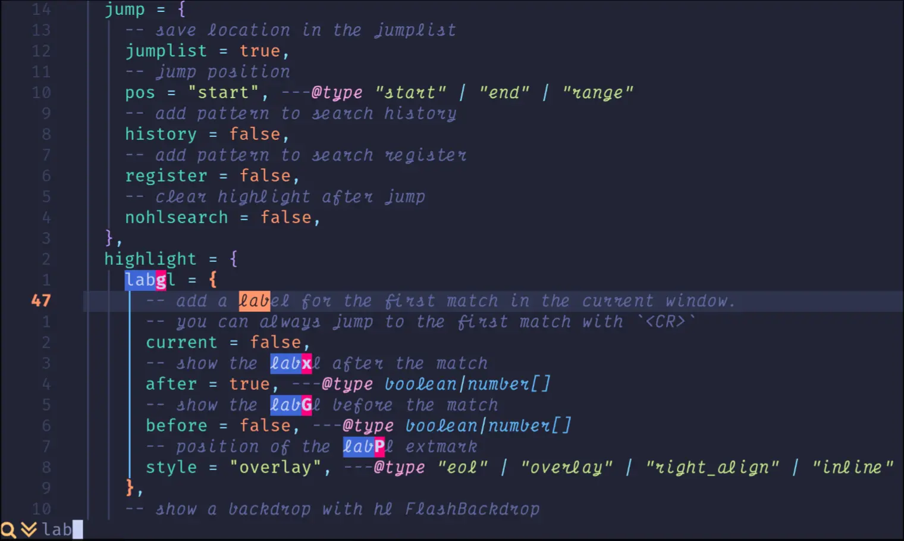
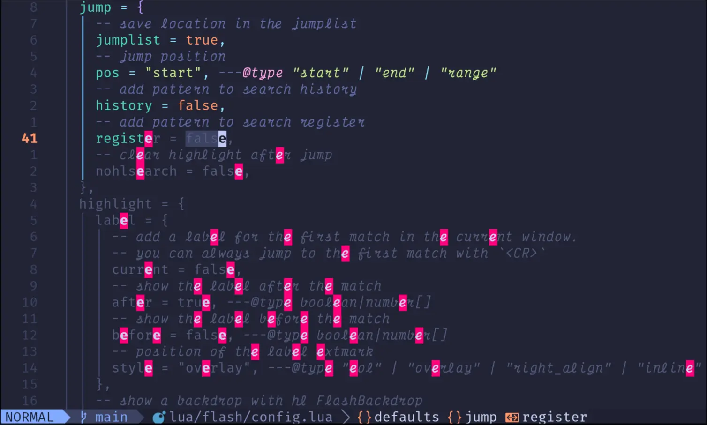

+++
title = "Neovim enhanced editing experience"
description = "Making editing feel magical with flash.nvim, yanky.nvim, grug-far.nvim, and noice.nvim"
template = "post.html"
date = 2025-12-22
generate_feed = true
aliases = ["/blog/neovim-editing", "/blog/flash-yanky-grug"]
tags = ["neovim", "flash", "yanky", "grug-far", "noice"]
series = "neovim"
series_order = 11

[extra]
comment = true
reaction = true
toc = true
copy = true
outdate_alert = true
outdate_alert_days = 365
img = "/img/dashboard.webp"
+++

Today I’ll show a few plugins that make editing way smoother.

Even with LSP, completion, formatting, and debugging, some things just get in the way: jumping around code is slow, copy-pasting feels clunky, search and replace across files is annoying, and the UI looks boring.

These plugins fix all that. They’re not essential, but they make editing faster and way more pleasant: `flash.nvim` for quick navigation, `yanky.nvim` for smarter clipboard, `grug-far.nvim` for search/replace, and `noice.nvim` for a nicer UI.

## flash.nvim

> flash.nvim lets you navigate your code with search labels, enhanced character motions, and Treesitter integration.

<div style="display: flex; gap: 16px;">
  
  
</div>

<p style="font-size: 0.8em; color: gray; text-align: center;">
  flash.nvim search and jump
</p>

Navigation was always the part I disliked most in Neovim.
`f` and `t` work, but cycling with `;` feels slow when a character appears many times on a line.

`flash.nvim` fixes that.

When I press `s`, Flash highlights all matches on screen and adds small labels. I type a couple of characters, press the label, and I’m there instantly. No cycling, no guessing.

Example:

```js
const user = await getUser(userId, config, options)
```

With native Neovim, jumping to `"options"` means `fo` then `;` several times.
With Flash: `s`, type `op`, hit the label. Done.

Flash also improves the classic motions (`f`, `t`, `F`, `T`) by showing labels, so jumps are always precise.

Bonus:

- `S` lets me jump to Treesitter nodes (functions, params, blocks, etc.)
- It works across splits, so I don’t care which window the code is in

You can see more a lot of good feature about flash.nvim [here](https://github.com/folke/flash.nvim?tab=readme-ov-file)

Here's how I configured flash:

**File: `lua/plugins/flash.lua`**

```lua
vim.pack.add({
	"https://github.com/folke/flash.nvim",
})

local flash = require("flash")
flash.setup({
	modes = {
		-- Enhanced f, t, F, T motions
		char = {
			enabled = true,
			jump_labels = true,
		},
	},
})

-- Keymaps
-- stylua: ignore start
vim.keymap.set({"n","x","o"}, "s", function() flash.jump() end, { desc = "Flash" })
vim.keymap.set({"n","x","o"}, "S", function() flash.treesitter() end, { desc = "Flash Treesitter" })
vim.keymap.set("o", "r", function() flash.remote() end, { desc = "Remote Flash" })
vim.keymap.set({"x","o"}, "R", function() flash.treesitter_search() end, { desc = "Treesitter Search" })
vim.keymap.set("c", "<c-s>", function() flash.toggle() end, { desc = "Toggle Flash Search" })
-- stylua: ignore end
```

## yanky.nvim

> The aim of yanky.nvim is to improve yank and put functionalities for Neovim.



The second big annoyance was the clipboard.

In Neovim, if I copy something and then delete something else, the delete replaces what I copied. This happens all the time: I copy a name, delete some code, then paste… and get the wrong thing. Then I have to copy again. It’s annoying and slow.

Yanky fixes this by keeping a **history** of everything I copy or delete.

With yanky, nothing gets lost. Every yank and delete goes into a list. When I paste, I can go back and choose exactly what I want.

The feature I use the most is `<leader>y`. It opens a picker with my full yank history. I can see everything I copied recently and pick the right one.

Yanky also gives small but nice feedback. When I copy something, it briefly highlights the text so I know exactly what was yanked.

### My setup

**File: `lua/plugins/yanky.lua`**

```lua
vim.pack.add({
	"https://github.com/gbprod/yanky.nvim",
})

local _yanky_loaded = false

local function load_yanky()
	if _yanky_loaded then
		return
	end
	_yanky_loaded = true

	require("yanky").setup({
		highlight = {
			timer = 150,
		},
	})
end

-- Lazy load on first yank
local group = vim.api.nvim_create_augroup("YankyLazyLoad", { clear = true })

vim.api.nvim_create_autocmd({ "TextYankPost" }, {
	pattern = "*",
	group = group,
	once = true,
	callback = function()
		load_yanky()
	end,
})

-- Keymaps
-- stylua: ignore start
vim.keymap.set({ "n", "x" }, "<leader>y", function() load_yanky(); require("snacks").picker.yanky() end, { desc = "Yank History" })
vim.keymap.set({ "n", "x" }, "y", function() load_yanky(); return "<Plug>(YankyYank)" end, { expr = true })
vim.keymap.set({ "n", "x" }, "p", function() load_yanky(); return "<Plug>(YankyPutAfter)" end, { expr = true })
vim.keymap.set({ "n", "x" }, "P", function() load_yanky(); return "<Plug>(YankyPutBefore)" end, { expr = true })
vim.keymap.set("n", "<C-p>", function() load_yanky(); return "<Plug>(YankyCycleForward)" end, { expr = true })
vim.keymap.set("n", "<C-n>", function() load_yanky(); return "<Plug>(YankyCycleBackward)" end, { expr = true })
-- stylua: ignore end
```

I lazy-load yanky on the first copy so it doesn’t affect startup time.

**How I use it**

Most of the time, I just copy things freely and don’t worry about losing them. When I need something specific, I press `<leader>y` and pick it from the list. For quick fixes, `<C-p>` and `<C-n>` let me cycle through recent yanks after pasting.

Yanky removes a whole category of small frustrations. Once you get used to it, going back to the default clipboard feels painful.

## grug-far.nvim

> Find And Replace plugin for neovim



Search and replace is easy in a single file. In Neovim, I can do:

```vim
:%s/search/replace/g
```

That works great when I’m only changing the current buffer. But for multiple files, things get more complicated.

The native way is usually:

1. Use `:grep` (or `:vimgrep`) to search across the project
2. This fills the quickfix list
3. Then run a replace on each file with:

```vim
:cdo %s/search/replace/g
```

It works, but it’s not very comfortable.

I can add `c` to confirm each change:

```vim
:cdo %s/search/replace/gc
```

In theory, this is safer. In practice, it’s painful.
If there are many matches, I end up pressing `y` or `n` over and over, often without enough context. I can’t easily preview all changes first. I’m forced to decide one match at a time, mid-command. It’s powerful, but it doesn’t feel great for real refactoring work.

That’s where `grug-far.nvim` comes in.

When I trigger it (`<leader>sr`), it opens a dedicated buffer that acts like a search-and-replace UI. I type what I want to search for, what I want to replace it with, and which files to target.

As I type, I see all matches across the project. I can scroll, inspect the context, and make sure the results look right before touching anything. When I’m ready, I apply the changes in one go.

It uses `ripgrep` under the hood, so it’s fast. It supports regex, file filters, and flags, but without making me remember complex commands.

The big difference is control. Instead of running a command and hoping it’s correct, I can see everything first, then decide.

That’s why I use `grug-far.nvim` for project-wide search and replace. It keeps Neovim powerful, but makes refactoring feel safer and more natural.

### My setup

**File: `lua/plugins/grug-far.lua`**

```lua
vim.pack.add({
	"https://github.com/MagicDuck/grug-far.nvim",
})

require("grug-far").setup({
	headerMaxWidth = 80,
})

vim.keymap.set({ "n", "v", "x" }, "<leader>sr", function()
	local grug = require("grug-far")
	local ext = vim.bo.buftype == "" and vim.fn.expand("%:e")
	grug.open({
		transient = true,
		prefills = {
			filesFilter = ext and ext ~= "" and "*." .. ext or nil,
		},
	})
end, { desc = "Search and Replace" })
```

## noice.nvim

> Highly experimental plugin that completely replaces the UI for messages, cmdline and the popupmenu.



This plugin is a bit different. It’s not about fixing annoyances or boosting productivity. It’s about polish.

Noice replaces Neovim’s UI for messages, command line, and popups. The default UI works, but it’s plain and sometimes annoying. With Noice:

- The command line becomes a clean popup with syntax highlighting for commands, functions, and strings.
- Messages appear as small notifications that fade automatically. No more `:messages` spam.
- The “Press ENTER or type command to continue” prompt is gone. Long messages are scrollable or shown in a split.
- LSP hover documentation looks cleaner and easier to read.

It’s optional, but once you use it, Neovim feels much more modern and polished.

### My setup

**File: `lua/plugins/noice.lua`**

```lua
vim.pack.add({
	"https://github.com/folke/noice.nvim",
	"https://github.com/MunifTanjim/nui.nvim",
})

if vim.o.filetype == "lazy" then
	vim.cmd([[messages clear]])
end

require("noice").setup({
	cmdline = {
		view = "cmdline",
	},
	lsp = {
		override = {
			["vim.lsp.util.convert_input_to_markdown_lines"] = true,
			["vim.lsp.util.stylize_markdown"] = true,
			["cmp.entry.get_documentation"] = true,
		},
	},
	routes = {
		{
			filter = {
				event = "msg_show",
				any = {
					{ find = "%d+L, %d+B" },
					{ find = "; after #%d+" },
					{ find = "; before #%d+" },
				},
			},
			view = "mini",
		},
	},
	presets = {
		bottom_search = true,
		command_palette = true,
		long_message_to_split = true,
	},
})

-- Keymaps
-- stylua: ignore start
vim.keymap.set({ "n" }, "<leader>sn", "", { desc = "+noice" })
vim.keymap.set("c", "<S-Enter>", function() require("noice").redirect(vim.fn.getcmdline()) end, { desc = "Redirect Cmdline" })
vim.keymap.set("n", "<leader>snl", function() require("noice").cmd("last") end, { desc = "Noice Last Message" })
vim.keymap.set("n", "<leader>snh", function() require("noice").cmd("history") end, { desc = "Noice History" })
vim.keymap.set("n", "<leader>sna", function() require("noice").cmd("all") end, { desc = "Noice All" })
vim.keymap.set("n", "<leader>snd", function() require("noice").cmd("dismiss") end, { desc = "Dismiss All" })
vim.keymap.set("n", "<leader>snt", function() require("noice").cmd("pick") end, { desc = "Noice Picker" })
vim.keymap.set({ "i", "n", "s" }, "<c-f>", function() if not require("noice.lsp").scroll(4) then return "<c-f>" end end, { silent = true, expr = true, desc = "Scroll Forward" })
vim.keymap.set({ "i", "n", "s" }, "<c-b>", function() if not require("noice.lsp").scroll(-4) then return "<c-b>" end end, { silent = true, expr = true, desc = "Scroll Backward" })
-- stylua: ignore end
```

**Key points in my setup:**

- `cmdline` view keeps commands at the bottom (some prefer `cmdline_popup`).
- LSP overrides improve hover documentation rendering.
- Routes filter common messages (like file save confirmations) into small notifications.
- Presets enable bottom search UI, command palette, and long messages in splits.

**How I use it:**
Mostly passively. Noice just makes Neovim look and feel better.

- `<leader>n` shows recent messages (configured via snack.picker in snacks.lua file)
- `<c-f>` and `<c-b>` scroll long LSP hover docs without closing the popup.

Using these plugins doesn’t make Neovim “magical” overnight, but it removes a lot of little annoyances. After a few days, navigation, yanking, replacing, and reading messages all feel smoother. It’s the kind of setup that just lets you focus on writing code instead of fighting the editor.

## What's next

Now you have:

- Basic setup ([part 2](https://tduyng.com/blog/neovim-basic-setup/))
- LSP ([part 3](https://tduyng.com/blog/neovim-lsp-native/))
- Setup vim.pack with snacks.nvim ([part 4](https://tduyng.com/blog/vim-pack-and-snacks/))
- Tree-sitter syntax highlighting ([part 5](https://tduyng.com/blog/neovim-highlight-syntax))
- Auto-completion ([part 6](https://tduyng.com/blog/neovim-auto-completions/))
- Code formatter ([part 7](https://tduyng.com/blog/neovim-formatter-conform/))
- Git tools ([part 8](/blog/neovim-git-tools/))
- Setup debug ([part 9](/blog/neovim-setup-debug-nodejs/))
- Enhance editing experiences (this article)

In future articles, I might cover custom statusline

---

My complete Neovim configuration: [https://github.com/tduyng/nvim](https://github.com/tduyng/nvim)
