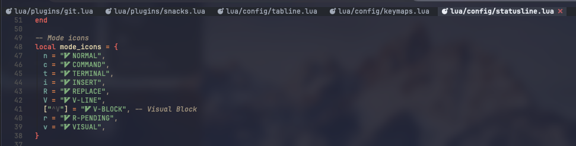

+++
title = "Simple Neovim Tab Management"
description = "Replacing bufferline.nvim with Neovim's built-in tabline"
template = "post.html"
date = 2026-02-10
generate_feed = true
tags = ["neovim", "productivity"]
series = "neovim"
series_order = 13

[extra]
comment = true
reaction = true
toc = true
copy = true
outdate_alert = true
outdate_alert_days = 365
img = "/img/dashboard.webp"
+++

I used `bufferline.nvim` for tab switching. It's really nice, but I do not use all features that supports. Neovim already has a built-in `'tabline'` option that can display buffers at the top of the window.

## Demo



## Configuration

Full file: [tduyng/nvim/lua/config/tabline.lua](https://github.com/tduyng/nvim/lua/config/tabline.lua)

Create `~/.config/nvim/lua/config/tabline.lua`:

```lua
local M = {}

local SEP = ""
local CLOSE = ""
local NO_NAME = "[NO NAME]"

function M.set_highlights()
  vim.api.nvim_set_hl(0, "MyBufInactive", { fg = "#ABB2BF", bg = "#282C34" })
  vim.api.nvim_set_hl(0, "MyBufActive", { fg = "#ECEFF4", bg = "#3E4451", bold = true })
  vim.api.nvim_set_hl(0, "MyBufSeparator", { fg = "#21252B", bg = "#282C34" })
  vim.api.nvim_set_hl(0, "MyBufClose", { fg = "#BF616A", bg = "#3E4451" })
end

local function get_icon(filename, name)
  local ok, devicons = pcall(require, "nvim-web-devicons")
  if not ok or not name or name == "" then
    return ""
  end
  local ext = vim.fn.fnamemodify(name, ":e")
  local icon = devicons.get_icon(filename, ext, { default = true })
  return icon and (icon .. " ") or ""
end

local function get_display_name(path)
  if path == "" then
    return NO_NAME
  end
  local parts = vim.split(path, "/", { plain = true })
  if #parts == 1 then
    return parts[1]
  elseif #parts == 2 then
    return parts[#parts - 1] .. "/" .. parts[#parts]
  else
    return parts[#parts - 2] .. "/" .. parts[#parts - 1] .. "/" .. parts[#parts]
  end
end

local function render_buf(bufnr, current)
  if not vim.api.nvim_buf_is_loaded(bufnr) then
    return ""
  end
  if not vim.bo[bufnr].buflisted then
    return ""
  end

  local name = vim.api.nvim_buf_get_name(bufnr)
  local display_name = get_display_name(name)
  local filename = (name ~= "" and vim.fn.fnamemodify(name, ":t")) or NO_NAME
  local icon = get_icon(filename, name)
  local content = icon .. display_name

  if bufnr == current then
    return table.concat({
      "%#MyBufActive# ",
      content,
      " %#MyBufClose#",
      CLOSE,
      " %#MyBufSeparator#",
      SEP,
    })
  else
    return table.concat({
      "%#MyBufInactive# ",
      content,
      "  %#MyBufSeparator#",
      SEP,
    })
  end
end

function M.tabline()
  local current = vim.api.nvim_get_current_buf()
  local parts = {}

  for _, bufnr in ipairs(vim.api.nvim_list_bufs()) do
    local chunk = render_buf(bufnr, current)
    if chunk ~= "" then
      table.insert(parts, chunk)
    end
  end

  if #parts == 0 then
    return ""
  end
  return table.concat(parts):gsub(vim.pesc(SEP) .. "$", "")
end

function _G.tabline()
  local current = vim.api.nvim_get_current_buf()
  local parts = {}

  for _, bufnr in ipairs(vim.api.nvim_list_bufs()) do
    local chunk = render_buf(bufnr, current)
    if chunk ~= "" then
      table.insert(parts, chunk)
    end
  end

  if #parts == 0 then
    return ""
  end

  local line = table.concat(parts)
  return line:gsub(vim.pesc(SEP) .. "$", "")
end

function M.setup()
  M.set_highlights()

  vim.api.nvim_create_augroup("MyTabline", { clear = true })
  vim.api.nvim_create_autocmd("ColorScheme", {
    group = "MyTabline",
    callback = M.set_highlights,
  })

  vim.opt.showtabline = 2
  vim.opt.tabline = "%!v:lua.tabline()"
end

vim.keymap.set("n", "<leader>bl", function()
  local cur = vim.api.nvim_get_current_buf()
  for _, buf in ipairs(vim.api.nvim_list_bufs()) do
    if vim.api.nvim_buf_is_loaded(buf) and vim.bo[buf].buflisted and buf < cur then
      pcall(vim.api.nvim_buf_delete, buf, { force = true })
    end
  end
end, { desc = "Close all left buffers" })

vim.keymap.set("n", "<leader>br", function()
  local cur = vim.api.nvim_get_current_buf()
  local bufs = vim.api.nvim_list_bufs()
  for i = #bufs, 1, -1 do
    local buf = bufs[i]
    if vim.api.nvim_buf_is_loaded(buf) and vim.bo[buf].buflisted and buf > cur then
      pcall(vim.api.nvim_buf_delete, buf, { force = true })
    end
  end
end, { desc = "Close all right buffers" })

M.setup()
```

## How to use it

### Buffer switching

Use these keymaps to navigate between buffers:

```lua
vim.keymap.se("n", "<Tab>", ":bnext<CR>", { desc = "Next buffer" })
vim.keymap.se("n", "<S-Tab>", ":bprevious<CR>", { desc = "Previous buffer" })
vim.keymap.se("n", "<leader>bn", ":bnext<CR>", { desc = "Next buffer" })
vim.keymap.se("n", "<leader>bp", ":bprevious<CR>", { desc = "Previous buffer" })
```

`<Tab>` and `<Shift-Tab>` feel like browser tabs. `<leader>bn` and `<leader>bp` are Vim-style alternatives.

### Close current buffer

With snacks.nvim:

```lua
{ "<leader>bd", function() Snacks.bufdelete() end, desc = "Delete buffer", mode = { "n" } }
```

Without snacks:

```lua
vim.keymap.set("n", "<leader>bd", ":bd<CR>")
```

### Clean up surrounding buffers

The config above also provides:

- `<leader>bl` – Close all buffers to the left of current
- `<leader>br` – Close all buffers to the right of current

Use these when you have many buffers open and want to focus on just the current one and a few neighbors.

## How the configuration works

### Highlight groups

```lua
vim.api.nvim_set_hl(0, "MyBufInactive", { fg = "#ABB2BF", bg = "#282C34" })
vim.api.nvim_set_hl(0, "MyBufActive", { fg = "#ECEFF4", bg = "#3E4451", bold = true })
vim.api.nvim_set_hl(0, "MyBufSeparator", { fg = "#21252B", bg = "#282C34" })
vim.api.nvim_set_hl(0, "MyBufClose", { fg = "#BF616A", bg = "#3E4451" })
```

These four highlight groups control the appearance. They match my theme colors, but you can change them to match your colorscheme. The `ColorScheme` autocmd re-applies these when you change colorschemes.

### Icons (optional)

```lua
local function get_icon(filename, name)
  local ok, devicons = pcall(require, "nvim-web-devicons")
  if not ok or not name or name == "" then
    return ""
  end
  local ext = vim.fn.fnamemodify(name, ":e")
  local icon = devicons.get_icon(filename, ext, { default = true })
  return icon and (icon .. " ") or ""
end
```

This function tries to load `nvim-web-devicons` (or snacks.nvim which includes it). If the plugin isn't installed, it returns an empty string. This means the tabline works without any icon plugin. If you have devicons, file type icons appear automatically.

### Path truncation

```lua
local function get_display_name(path)
  if path == "" then
    return NO_NAME
  end
  local parts = vim.split(path, "/", { plain = true })
  if #parts == 1 then
    return parts[1]
  elseif #parts == 2 then
    return parts[#parts - 1] .. "/" .. parts[#parts]
  else
    return parts[#parts - 2] .. "/" .. parts[#parts - 1] .. "/" .. parts[#parts]
  end
end
```

I don't want full paths cluttering the tabline. This shows at most three path components: `grandparent/parent/filename`. For `src/components/Button.jsx`, it shows `components/Button.jsx`. For a single file, just the filename. This keeps the tabline readable while giving enough context to identify files.

### Buffer rendering

```lua
local function render_buf(bufnr, current)
  if not vim.api.nvim_buf_is_loaded(bufnr) then
    return ""
  end
  if not vim.bo[bufnr].buflisted then
    return ""
  end

  local name = vim.api.nvim_buf_get_name(bufnr)
  local display_name = get_display_name(name)
  local filename = (name ~= "" and vim.fn.fnamemodify(name, ":t")) or NO_NAME
  local icon = get_icon(filename, name)
  local content = icon .. display_name

  if bufnr == current then
    return table.concat({
      "%#MyBufActive# ",
      content,
      " %#MyBufClose#",
      CLOSE,
      " %#MyBufSeparator#",
      SEP,
    })
  else
    return table.concat({
      "%#MyBufInactive# ",
      content,
      "  %#MyBufSeparator#",
      SEP,
    })
  end
end
```

Only listed buffers appear. The active buffer gets different styling (`MyBufActive`) and a close button (``). Inactive buffers get `MyBufInactive` styling. The separator (`SEP`) is empty by default; change it to `"|"` or `"▸"` if you want visual separation.

### The tabline function

```lua
vim.opt.tabline = "%!v:lua.tabline()"
```

This tells Neovim to call the global `tabline()` function to generate the tabline content. The function:

1. Gets current buffer number
2. Loops through all buffers
3. Calls `render_buf()` for each
4. Concatenates results
5. Removes trailing separator

## Limitations

- Shows buffers, not Neovim's native "tabs" (but Neovim's tabline is just a UI hook)
- No drag-and-drop reordering
- No buffer groups or filtering (can be added)

---

My complete Neovim configuration: [tduyng/nvim](https://github.com/tduyng/nvim)
