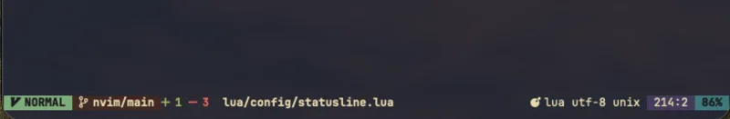
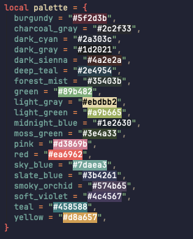

+++
title = "Simple Neovim Statusline"
description = "Replacing lualine.nvim with Neovim's built-in statusline"
template = "post.html"
date = 2026-02-12
generate_feed = true
tags = ["neovim", "productivity"]
series = "neovim"
series_order = 14

[extra]
comment = true
reaction = true
toc = true
copy = true
outdate_alert = true
outdate_alert_days = 365
img = "/img/dashboard.webp"
+++

I used `lualine.nvim` for a long time. It's really good, beautiful, easy to customize, and integrates well with external commands. But I always wanted to understand Neovim's API better. I knew Neovim has a built-in `'statusline'` option, and that you can use Lua to build custom statuslines. So I tried it.

## Demo



## Configuration

Full configuration file: [tduyng/nvim/lua/config/statusline.lua](https://github.com/tduyng/nvim/lua/config/statusline.lua)

```lua
local M = {}

local NONE = "NONE"
local palette = {
	burgundy = "#5f2d3b",
	charcoal_gray = "#2c2f33",
	dark_cyan = "#2a303c",
	dark_gray = "#1d2021",
	dark_sienna = "#4a2e2a",
	deep_teal = "#2e4954",
	forest_mist = "#35403b",
	green = "#89b482",
	light_gray = "#ebdbb2",
	light_green = "#a9b665",
	midnight_blue = "#1e2630",
	moss_green = "#3e4a33",
	pink = "#d3869b",
	red = "#ea6962",
	sky_blue = "#7daea3",
	slate_blue = "#3b4261",
	smoky_orchid = "#574b65",
	soft_violet = "#4c4567",
	teal = "#458588",
	yellow = "#d8a657",
}

-- Helper to issue highlight commands
local function hi(group, opts)
	local cmd = { "highlight!", group }
	if opts.guibg then
		table.insert(cmd, "guibg=" .. opts.guibg)
	end
	if opts.guifg then
		table.insert(cmd, "guifg=" .. opts.guifg)
	end
	if opts.gui then
		table.insert(cmd, "gui=" .. opts.gui)
	end
	vim.cmd(table.concat(cmd, " "))
end

hi("StatusLine", { guibg = NONE, guifg = NONE })
hi("StatusLineNC", { guibg = NONE, guifg = NONE })

hi("StatusMode", { guibg = palette.green, guifg = palette.dark_gray, gui = "bold" })
hi("StatusModeToNorm", { guibg = NONE, guifg = palette.green })

-- git
hi("StatusGit", { guibg = palette.dark_sienna, guifg = palette.light_gray, gui = "bold" })
hi("StatusGitToNorm", { guibg = NONE, guifg = palette.pink })
hi("StatusDiffAdd", { guibg = NONE, guifg = palette.light_green, gui = "bold" })
hi("StatusDiffChange", { guibg = NONE, guifg = palette.yellow, gui = "bold" })
hi("StatusDiffDelete", { guibg = NONE, guifg = palette.red, gui = "bold" })

--file
hi("StatusFile", { guibg = NONE, guifg = NONE, gui = "bold" })
hi("StatusFileToNorm", { guibg = NONE, guifg = NONE })

hi("StatusLSP", { guibg = NONE, guifg = NONE, gui = "bold" })
hi("StatusLSPToNorm", { guibg = NONE, guifg = NONE })

hi("StatusErrorIcon", { guibg = NONE, guifg = palette.red, gui = "bold" })
hi("StatusWarnIcon", { guibg = NONE, guifg = palette.yellow, gui = "bold" })
hi("StatusInfoIcon", { guibg = NONE, guifg = palette.sky_blue, gui = "bold" })
hi("StatusHintIcon", { guibg = NONE, guifg = palette.light_green })

hi("StatusBuffer", { guibg = palette.dark_cyan, guifg = palette.light_gray })
hi("StatusType", { guibg = palette.dark_cyan, guifg = palette.light_gray })
hi("StatusNorm", { guibg = NONE, guifg = NONE })
hi("StatusLocation", { guibg = palette.soft_violet, guifg = palette.light_gray })
hi("StatusPercent", { guibg = palette.teal, guifg = palette.dark_gray, gui = "bold" })

local fn = vim.fn

-- Git repo/branch with caching - uses gitsigns buffer variables for performance
local function get_git_branch()
	local branch = vim.b.gitsigns_head
	if not branch or branch == "" then
		return ""
	end

	-- Get repo name from gitsigns status dict if available
	local gs = vim.b.gitsigns_status_dict
	if gs and gs.root then
		-- Extract repo name from the root path
		local repo_name = vim.fn.fnamemodify(gs.root, ":t")
		return repo_name .. "/" .. branch
	end

	return branch
end

local function build_git_diff()
	local gs = vim.b.gitsigns_status_dict or {}
	local added = gs.added or 0
	local changed = gs.changed or 0
	local removed = gs.removed or 0

	local diff_str = ""
	if added > 0 then
		diff_str = diff_str .. "%#StatusDiffAdd# " .. added .. " "
	end
	if changed > 0 then
		diff_str = diff_str .. "%#StatusDiffChange# " .. changed .. " "
	end
	if removed > 0 then
		diff_str = diff_str .. "%#StatusDiffDelete# " .. removed .. " "
	end

	-- reset to StatusLine for everything that follows
	return diff_str .. "%#StatusLine#"
end

-- Diagnostics symbols
local function get_diagnostics()
	if not vim.diagnostic then
		return ""
	end
	local d = vim.diagnostic.get(0)
	local e, w, i, h = 0, 0, 0, 0
	for _, v in ipairs(d) do
		if v.severity == vim.diagnostic.severity.ERROR then
			e = e + 1
		elseif v.severity == vim.diagnostic.severity.WARN then
			w = w + 1
		elseif v.severity == vim.diagnostic.severity.INFO then
			i = i + 1
		elseif v.severity == vim.diagnostic.severity.HINT then
			h = h + 1
		end
	end

	local s = ""
	if e > 0 then
		s = s .. "%#StatusErrorIcon# " .. e .. " "
	end
	if w > 0 then
		s = s .. "%#StatusWarnIcon# " .. w .. " "
	end
	if i > 0 then
		s = s .. "%#StatusInfoIcon# " .. i .. " "
	end
	if h > 0 then
		s = s .. "%#StatusHintIcon# " .. h .. " "
	end

	-- reset to StatusLine for following text
	return s .. "%#StatusLine#"
end

-- File icon
local function get_file_icon()
	local ok, icons = pcall(require, "nvim-web-devicons")
	if not ok then
		return ""
	end
	local f = fn.expand("%:t")
	local e = fn.expand("%:e")
	local icon = icons.get_icon(f, e, { default = true })
	return icon and icon .. " " or ""
end

-- Word count & reading time
local function word_reading()
	local ft = vim.bo.filetype
	if ft:match("md") or ft:match("markdown") or ft == "text" then
		local w = fn.wordcount().words or 0
		return w .. "w " .. " " .. math.ceil(w / 200) .. "m"
	end
	return ""
end

-- Mode icons
local mode_icons = {
	n = " NORMAL",
	c = " COMMAND",
	t = " TERMINAL",
	i = " INSERT",
	R = " REPLACE",
	V = " V-LINE",
	[""] = " V-BLOCK", -- Visual Block
	r = " R-PENDING",
	v = " VISUAL",
}

-- 4) Build statusline
function M.build()
	local st = ""

	-- A: mode
	local m = fn.mode()
	st = st .. "%#StatusMode# " .. (mode_icons[m] or m) .. " " .. "%#StatusModeToNorm#"

	-- B: git
	local br = get_git_branch()
	if br ~= "" then
		st = st .. "%#StatusGit# " .. " " .. br .. " " .. "%#StatusGitToNorm#"

		local git_diff = build_git_diff()
		if git_diff ~= "" then
			st = st .. git_diff .. "%#StatusGitToNorm#"
		end
	end

	-- C: filename
	-- local fnm = fn.expand("%:t")
	local fnm = fn.expand("%:.")
	if fnm ~= "" then
		st = st .. "%#StatusFile# " .. fnm .. " " .. (vim.bo.modified and " " or "") .. "%#StatusFileToNorm#"
	end

	local di = get_diagnostics()
	if di ~= "" then
		st = st .. "%#StatusLSP# " .. di .. " " .. "%#StatusLSPToNorm#"
	end

	-- right align
	st = st .. "%="

	-- X: filetype
	local ft = vim.bo.filetype
	if ft ~= "" then
		st = st .. "%#StatusType# " .. get_file_icon() .. ft .. "%#StatusTypeToNorm#"
	end

	-- Y: word/reading
	local wr = word_reading()
	if wr ~= "" then
		st = st .. "%#StatusBuffer# " .. " " .. wr
	end

	-- Z: encoding, format, location, percent
	st = st
		.. "%#StatusBuffer# "
		.. vim.bo.fileencoding
		.. " "
		.. vim.bo.fileformat
		.. " "
		.. "%#StatusLocation# %l:%c "
		.. "%#StatusPercent# %p%% "

	return st
end

vim.opt.laststatus = 3 -- global statusline
vim.opt.showmode = false -- Dont show mode since we have a statusline
vim.o.statusline = "%!v:lua.require('config.statusline').build()"

return M
```

## Interesting parts

I use `vim.b.gitsigns_head` and `vim.b.gitsigns_status_dict` to get git information. `gitsigns.nvim` already caches these values at the buffer level, so reading them is extremely fast, no external command calls, no parsing.

### Color design



Instead of hardcoding colors in each highlight call, I define a small `palette` table. This makes it easy to tweak the entire color scheme by changing just a few values. The highlight groups (`StatusMode`, `StatusGit`, `StatusError`, etc.) use these palette colors with appropriate contrast (e.g., green background with dark text for mode, teal for location).

### Icons

The file icons come from `nvim-web-devicons` via `pcall` (protected call). If the plugin isn't installed, it falls back gracefully without errors. The git diff symbols (`+`, `~`, `-`) are simple text, while the mode indicator uses a font-awesome icon (`` from Nerd Fonts).

### Layout

The statusline is built left-to-right, then `%=` pushes the remaining items (filetype, location, percent) to the right side. This creates a clean two-sided layout without complex calculations.

### Performance

Because this runs on every statusline redraw (frequent), the code avoids expensive operations:

- Uses buffer-local gitsigns cache (`vim.b.*`) instead of calling `git` commands
- Minimal string concatenation
- No nested function calls in hot path
- Direct API access (`vim.fn.mode()`, `vim.bo.filetype`, etc.)

So that means with this configuration, we already have some really nice features:

- Mode indicator with color
- Git branch + staged/unstaged counts
- Diagnostics (errors/warnings)
- Current file (with modified marker)
- Cursor position and file percentage

---

My complete Neovim configuration: [tduyng/nvim](https://github.com/tduyng/nvim)
