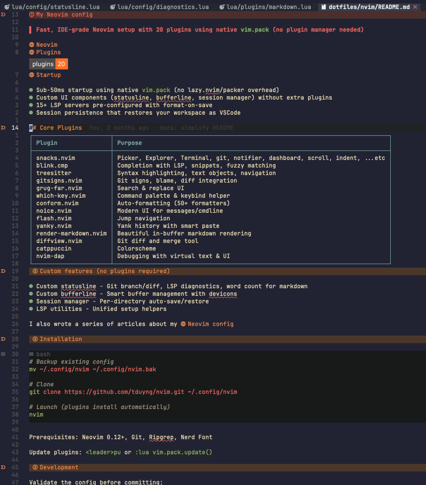

+++
title = "My Note Taking Setup in Neovim"
description = "I tried many markdown plugins. Here's the combination that finally works: clean, fast, and just the right features."
template = "post.html"
date = 2026-02-15
generate_feed = true
tags = ["neovim", "note-taking", "markdown"]
series = "neovim"
series_order = 15

[extra]
comment = true
reaction = true
toc = true
copy = true
outdate_alert = true
outdate_alert_days = 365
img = "img/markdown.png"
+++

Markdown is my favorite format for notes. It's portable, readable, and powerful. I've tried several Neovim plugins for markdown editing. Some are too complex, some crash, some miss my wanted features.

After testing various combinations, I settled on two plugins that together give me exactly what I need: [render-markdown.nvim](https://github.com/MeanderingProgrammer/render-markdown.nvim) for in-buffer rendering, and [markdown-preview.nvim](https://github.com/selimacerbas/markdown-preview.nvim) for browser preview.

## What I want

- Markdown renders directly in the buffer (like Obsidian)
- GitHub-flavored markdown appearance
- Fast, no lag
- Tables render nicely
- Optional browser preview
- Minimal configuration

## The plugins

- [render-markdown.nvim](https://github.com/MeanderingProgrammer/render-markdown.nvim)

This plugin renders markdown syntax _in the same buffer_ using Neovim's virtual text and extmarks. No split windows, no floating panels. It just shows formatted headings, bold, italic, code blocks, tables, math, etc., right where you type.

- [markdown-preview.nvim](https://github.com/selimacerbas/markdown-preview.nvim)

Simple browser preview as GitHub-flavored styling. Opens a browser window that updates as you edit.

## Demo



## My configuration

Full config: [nvim/lua/plugins/markdown.lua](https://github.com/tduyng/nixhub/blob/main/apps/nix-darwin/dotfiles/nvim/lua/plugins/markdown.lua)

```lua
vim.pack.add({
  "https://github.com/MeanderingProgrammer/render-markdown.nvim",
  "https://github.com/iamcco/markdown-preview.nvim",
})

local renderOpts = {
  heading = {
    enabled = true,
    render_modes = true,
    sign = true,
    icons = { "󰲡 ", "󰲣 ", "󰲥 ", "󰲧 ", "󰲩 ", "󰲫 " },
    position = "overlay",
    signs = { "󰫎 " },
    width = "full",
    left_margin = 0,
    left_pad = 0,
    right_pad = 0,
    min_width = 0,
    border = false,
    backgrounds = {
      "RenderMarkdownH1Bg", "RenderMarkdownH2Bg", "RenderMarkdownH3Bg",
      "RenderMarkdownH4Bg", "RenderMarkdownH5Bg", "RenderMarkdownH6Bg",
    },
    foregrounds = {
      "RenderMarkdownH1", "RenderMarkdownH2", "RenderMarkdownH3",
      "RenderMarkdownH4", "RenderMarkdownH5", "RenderMarkdownH6",
    },
  },
  code = {
    enabled = true,
    render_modes = true,
    sign = true,
    style = "full",
    position = "left",
    language_pad = 0,
    language_name = true,
    disable_background = { "diff" },
    width = "full",
    left_margin = 0,
    left_pad = 0,
    right_pad = 0,
    min_width = 0,
    border = "thin",
    above = "▄",
    below = "▀",
    highlight = "RenderMarkdownCode",
    highlight_inline = "RenderMarkdownCodeInline",
  },
  checkbox = {
    enabled = true,
    render_modes = true,
    position = "inline",
    unchecked = { icon = "󰄱 ", highlight = "RenderMarkdownUnchecked" },
    checked = { icon = "󰱒 ", highlight = "RenderMarkdownChecked" },
    custom = {
      todo = { raw = "[-]", rendered = "󰗡 Todo", highlight = "RenderMarkdownTodo" },
    },
  },
  pipe_table = {
    enabled = true,
    render_modes = true,
    preset = "none",
    style = "full",
    cell = "padded",
    padding = 1,
    border = {
      "┌", "┬", "┐", "├", "┼", "┤", "└", "┴", "┘", "│", "─",
    },
  },
  callout = {
    note = { raw = "[!NOTE]", rendered = "󰋽 Note", highlight = "RenderMarkdownInfo" },
    tip = { raw = "[!TIP]", rendered = "󰌶 Tip", highlight = "RenderMarkdownSuccess" },
    warning = { raw = "[!WARNING]", rendered = "󰀪 Warning", highlight = "RenderMarkdownWarn" },
    caution = { raw = "[!CAUTION]", rendered = "󰳦 Caution", highlight = "RenderMarkdownError" },
    -- Obsidian-style callouts
    todo = { raw = "[!TODO]", rendered = "󰗡 Todo", highlight = "RenderMarkdownInfo" },
  },
}

require("render-markdown").setup(renderOpts)
```

That's it. No complicated setup. The defaults from render-markdown are already good; I only tweaked a few things.

## Why I like this setup

### render-markdown.nvim is fast and consistent

I tested [markview.nvim](https://github.com/OXY2DEV/markview.nvim). It supports multiple formats and a _hybrid mode_, but I found it disruptive because the preview disappears as soon as you move the cursor or start typing, which breaks the writing flow.

By contrast, render-markdown.nvim renders inline persistently using Neovim’s extmarks. It’s lightweight, only renders visible content, and stays consistent across modes, even in large files.

Most importantly, it doesn’t toggle rendering based on mode: formatted text stays visible while editing, with only the cursor line hidden (anti-conceal). This makes writing much more predictable and uninterrupted.

### No floating windows

Some markdown plugins open floating preview windows. I find that distracting. render-markdown renders inline, so the buffer stays clean. The formatting is visual-only; the underlying file remains pure markdown.

### GitHub-flavored tables

The `pipe_table` configuration renders GitHub-style tables with borders. This is important because plain markdown tables are hard to read. The border characters (`┌┬┐├┼┤└┴┘│─`) give that familiar GitHub look.

### Callout support

I use Obsidian-style callouts (`[!NOTE]`, `[!TIP]`, `[!WARNING]`, `[!CAUTION]`, `[!TODO]`). render-markdown renders these as colored boxes with icons, just like Obsidian. This is great for notes with warnings, tips, and TODOs.

### Checkboxes with custom todo

The checkbox configuration shows `[ ]` and `[x]` with Nerd Font icons. I also added a custom `[-]` → `󰗡 Todo` for my personal todo marker.

### Browser preview with markdown-preview.nvim

Sometimes I want to see exactly how GitHub will render it. `:MarkdownPreviewToggle` opens a browser window with GitHub's CSS. It's fast and updates live.

## Keybindings

```lua
<leader>um  -- toggle render-markdown on/off
<leader>cp  -- toggle browser preview
```

I turn off rendering when I need to see raw markdown (e.g., for debugging formatting). The preview is handy for final checks.

---

My complete Neovim configuration: [tduyng/nvim](https://github.com/tduyng/nvim)
