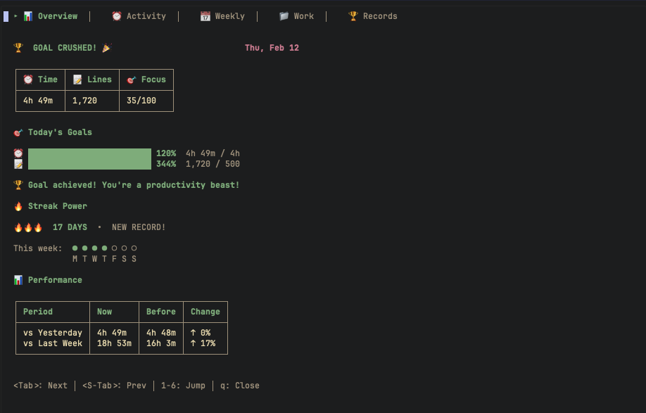
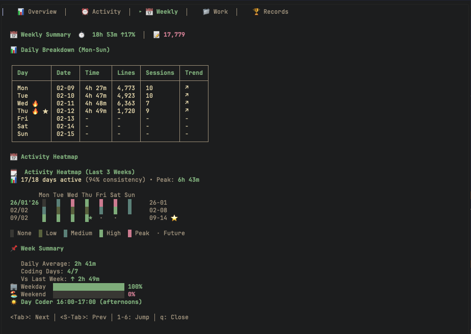
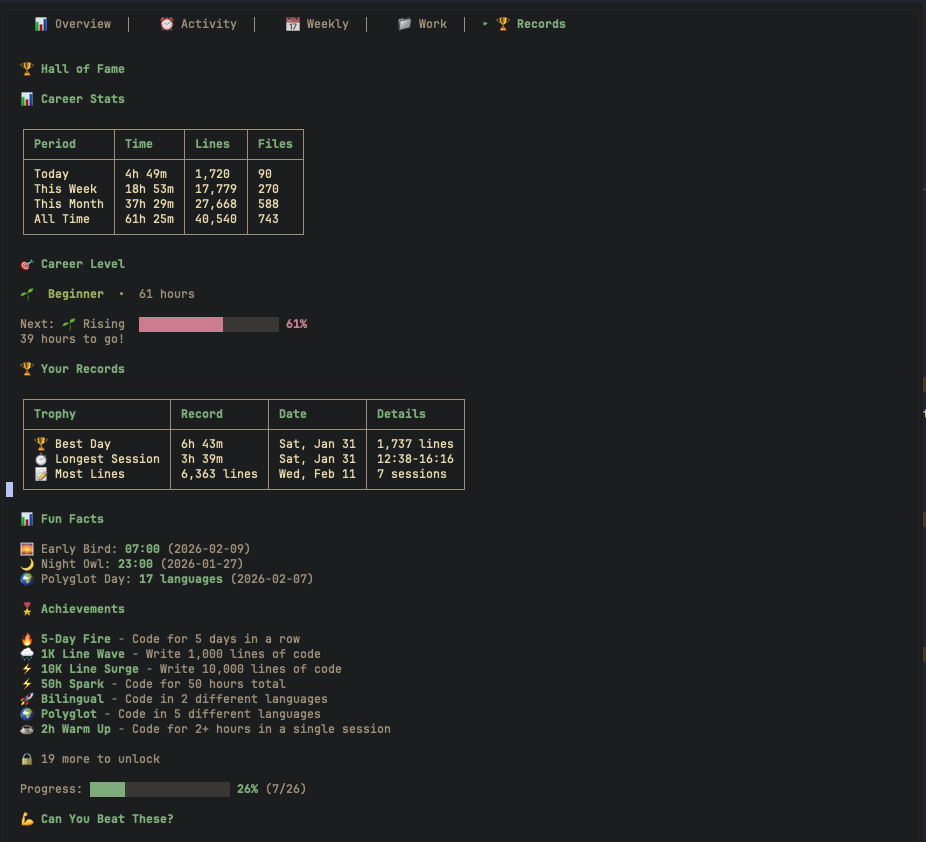

+++
title = "Codeme.nvim private coding activity tracking in Neovim"
description = "Local-first coding tracker with beautiful dashboard. All data stays on your machine."
template = "post.html"
date = 2026-02-28
generate_feed = true
tags = ["neovim", "productivity", "privacy", "open-source"]
draft = true


[extra]
comment = true
reaction = true
toc = true
copy = true
outdate_alert = true
outdate_alert_days = 365
img = "img/overview.png"
+++

I used to love WakaTime. It felt like a fitness tracker for coding. I could see how long I coded, which languages I used, and which projects took my time. Pretty nice.

But later, something bothered me. Every key I typed, every file I opened, every project I worked on was sent to WakaTime’s cloud and stored on their servers.

That felt a bit uncomfortable. Especially for client work or private code. I didn’t like the idea of my coding habits sitting in someone else’s database.

I also wanted a tool that works directly inside **Neovim**. No browser, no extra dashboard. Just my stats inside my editor. But I couldn’t find a good tool like that. Most trackers send data to the cloud or don’t show the stats in a clear way.

So I create [codeme](https://github.com/tduyng/codeme). It’s like WakaTime, but simpler, fully private, and runs locally inside Neovim, with a clean and easy-to-read dashboard.

## Why track your coding at all?

People track their coding for many simple reasons:

- It can be motivating: seeing progress and streaks feels good
- It helps you understand your habits: which languages you use most, when you work best, which projects take your time
- Freelancers can track hours for clients
- Developers can see how they improve
- Or just for fun 🙂

But tracking can also feel uncomfortable. You might focus too much on numbers instead of real work. And cloud tools based trackers can raise privacy worries — project names, file paths, and coding habits leave your computer.

**Codeme’s idea:** it’s there when you need it, quiet when you don’t. No pressure, no cloud, no outside tracking. Just your data, stored locally inside Neovim.

<br/>

<figcaption style="font-size: 0.8em; color: gray; margin-top: 4px; text-align: center;">Dashboard overview with goals and streaks</figcaption>
<br/>

## What is Codeme?

Codeme is a private coding tracker with two simple parts:

1. [codeme](https://github.com/tduyng/codeme) – a small Go CLI with SQLite (the backend)
2. [codeme.nvim](https://github.com/tduyng/codeme.nvim) – a Lua plugin for Neovim (the dashboard)

Everything stays on your computer. No cloud, no account, no third parties. Just your own data, stored locally.

## Zero config (it just works)

My goal was simple: minimal or zero config, fast for setup

To use Codeme:

- Install the binary
- Add the plugin
- Start coding

That’s all. No API keys. No accounts. No config files. No options to tweak. It works right away, out of the box. 🙂

## Auto-detection

Codeme figures things out automatically:

- Project - Detected from git root. Open any file in a repo, it knows which project you're working on.
- Language - Detected from file extension. `.py` → Python, `.ts` → TypeScript, `.rs` → Rust. No manual selection.
- Time
- Lines - Counts what you actually wrote, not total file size.

You don't tell codeme anything. It just knows.

## Automatic tracking

Most trackers require manual start/stop. Codeme tracks automatically:

- On save
- On buffer enter
- Idle detection - 15-minute timeout groups your work into sessions

You open Neovim → you code → you close Neovim. That's the entire workflow. No `codeme start`, no `codeme stop`. Nothing to remember.

## Beautiful dashboard that adapts

The dashboard opens with `:CodeMe`. Five tabs:

- 📊 Dashboard - goals, streaks, overview
- ⏰ Activity - today's sessions, languages, files
- 📅 Weekly - daily breakdown, trends
- 📁 Work - projects and languages breakdown
- 🏆 Records - achievements and personal bests

The dashboard auto-detects your colorscheme but more suite for dark theme.

<br/>

<figcaption style="font-size: 0.8em; color: gray; margin-top: 4px; text-align: center;">Weekly tab - see what you worked on this week</figcaption>
<br/>

## Fun & motivating dashboard

The dashboard doesn't just show numbers - it celebrates your coding journey.

Career level: Based on total hours, you level up from 🌱 Rising to 👑 Legendary. Shows your current level and hours to next with a progress bar.

Personal records: Your best day, longest session, most lines, and best streak. See when they happened.

Fun facts: Your earliest start time, latest end time, and your most polyglot day. Surprise yourself.

Challenges: Personalized goals based on your stats:

- "2 hours more to beat your best day"
- "5 more days to beat your streak record"
- "Can you beat 6 hours in one session?"

Achievements: Over 30 badges across categories:

- Streaks from 🔥 5 days to 🌞 365 days
- Lines from 🌧️ 1K to 🌊 100K
- Hours from ⚡ 50h to 💡 20K hours
- Languages from 🚀 2 to 🎓 15 languages
- Sessions from ☕ 2h to 👑 12h
- Time habits like 🌅 Dawn Coder and 🌙 Night Coder

The Records tab shows unlocked badges, locked ones, and your completion percentage.

This makes tracking feel like a game. You're chasing milestones, breaking records, leveling up.

<br/>

<figcaption style="font-size: 0.8em; color: gray; margin-top: 4px; text-align: center;">Records tab - track your unlocked badges</figcaption>
<br/>

## One file. Your data.

All your coding history lives in:

```
~/.local/share/codeme/codeme.db
```

One SQLite file. That's it.

- Want to back it up? Copy the file.
- Want to move to another machine? Copy the file.
- Want to delete everything? Delete the file.
- Want to inspect your data? Open with any SQLite client.

No cloud sync. No hidden folders. No complex directory structure. Just one file you own.

## Works offline

Since everything is local:

- No internet required
- No cloud service to fail
- Works on airplane mode
- Works in restricted networks
- No external dependencies

Your data never leaves your machine. Ever.

## What does it track?

Just the basics: which file you edited, which project it belongs to, how many lines you added, and when. No file contents. No code snippets. No sensitive data. The tracking is deliberately minimal.

You can see exactly what's stored in your database at any time.

## Does it slow down Neovim?

No. The tracking is lightweight: a simple SQLite write on file save, and a quick check on buffer enter. The binary starts in milliseconds. The dashboard only loads when you open it.

Most users won't notice it's running.

## Can I see my data?

Yes. Your data is in a plain SQLite file. Open it with any SQLite client or query it directly:

```bash
sqlite3 ~/.local/share/codeme/codeme.db "SELECT * FROM sessions LIMIT 10;"
```

Or use a GUI like DB Browser for SQLite. Your data is fully transparent.

## What about goals?

You can set daily goals in the config:

```lua
require("codeme").setup({
  goals = {
    daily_hours = 4,
    daily_lines = 500,
  },
})
```

Set to 0 to disable. The dashboard shows your progress visually. Simple.

## Using codeme

Install the binary:

```bash
# macOS
curl -L https://github.com/tduyng/codeme/releases/latest/download/codeme_darwin_arm64.tar.gz | tar xz
sudo mv codeme /usr/local/bin/

# Linux
curl -L https://github.com/tduyng/codeme/releases/latest/download/codeme_linux_amd64.tar.gz | tar xz
sudo mv codeme /usr/local/bin/
```

Add the Neovim plugin:

```lua
{ "tduyng/codeme.nvim", cmd = { "CodeMe", "CodeMeToggle" }, config = function() require("codeme").setup() end }
```

That's it. Start coding. It tracks automatically.

```vim
:CodeMe
:CodeMeToggle
```

Add a keybinding:

```lua
vim.keymap.set("n", "<leader>cm", "<cmd>CodeMe</cr>")
```

## Try it

If you've wanted to track your coding without sending data to the cloud, try codeme. Takes 2 minutes to set up.

Your coding history should stay yours.

---

**Links:**

- codeme CLI: [github.com/tduyng/codeme](https://github.com/tduyng/codeme)
- codeme.nvim: [github.com/tduyng/codeme.nvim](https://github.com/tduyng/codeme.nvim)
- My Neovim config: [github.com/tduyng/nvim](https://github.com/tduyng/nvim)

