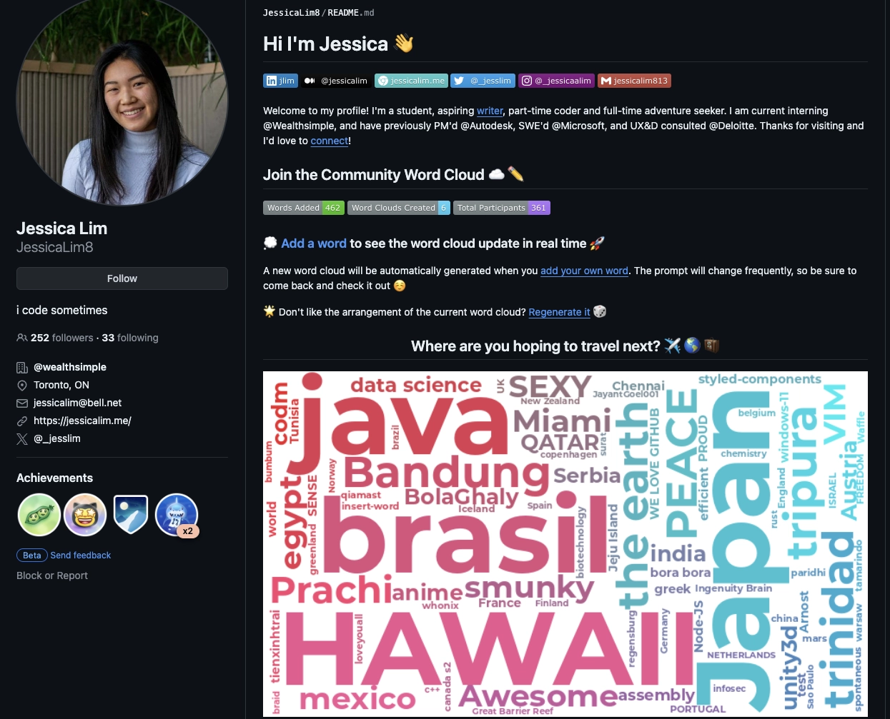
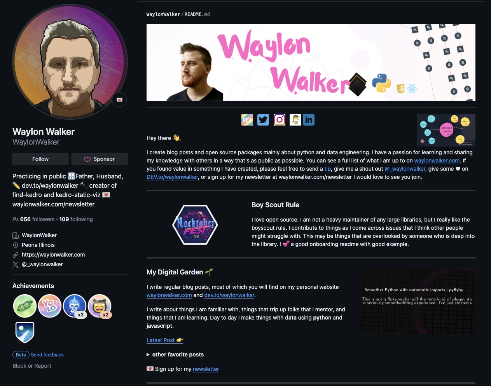
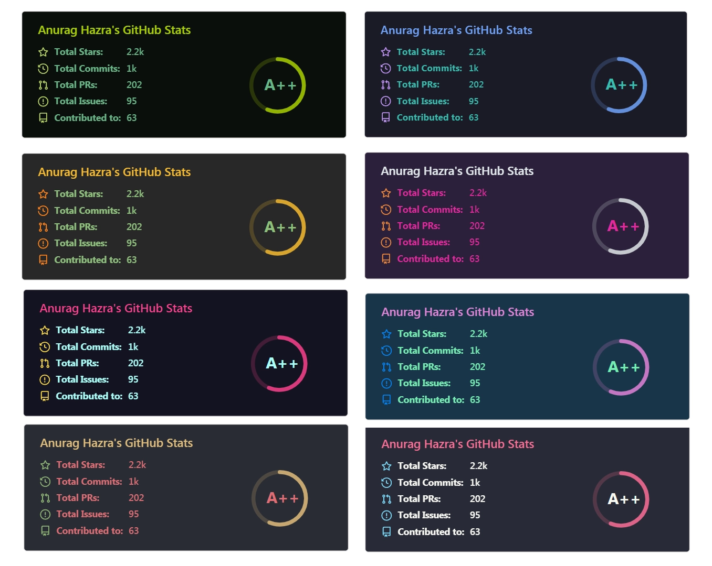
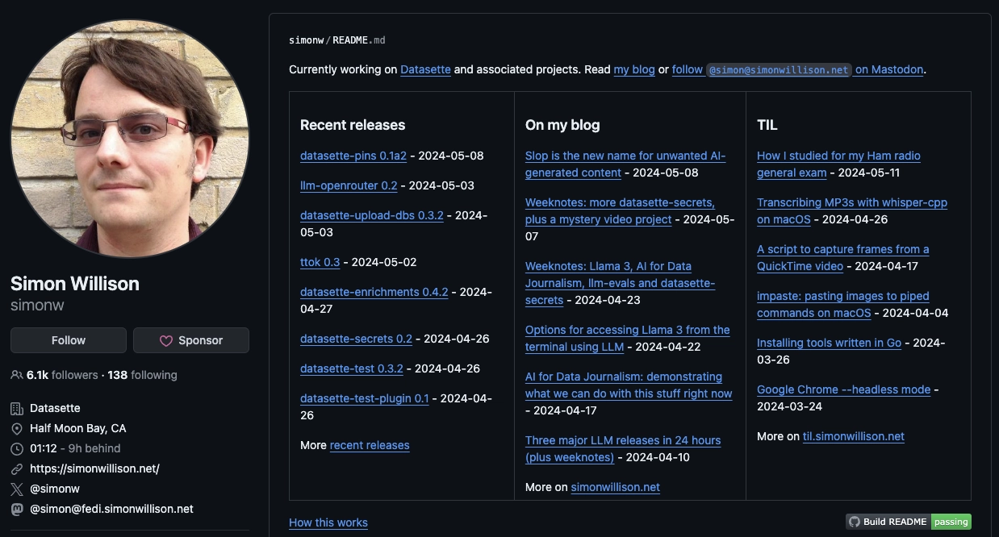
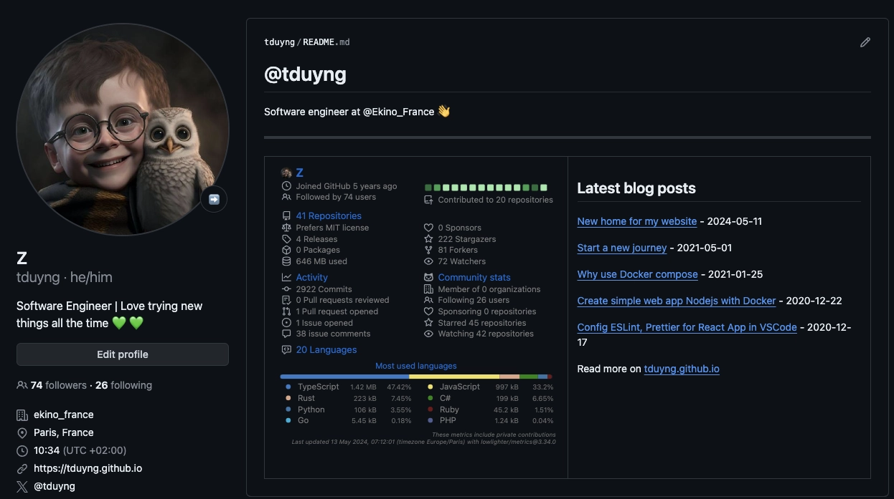

+++
title = "How I made my GitHub profile README dynamic"
description = "Explore the process of making your GitHub profile README dynamic with automated updates of your latest blog posts using GitHub Actions and Python scripting"
date = 2024-05-13
updated = 2024-05-21

[taxonomies]
tags = ["github-action", "profile", "readme", "dynamic", "python"]

[extra]
copy_button = true
footnote_backlinks = true
social_media_card = "img/tduyng.webp"
add_subscribe = true
+++

**Have you heard about GitHub profile READMEs?**

**Did you know you can add a README to your GitHub profile to tell others about yourself and create a really cool profile?**

To do that, you simply create a repository with the same name as your GitHub username. For more details on how to do this and how it works, check out [GitHub's guide on managing your profile README](https://docs.github.com/en/account-and-profile/setting-up-and-managing-your-github-profile/customizing-your-profile/managing-your-profile-readme).

**Now, how can you customize it to make a cool GitHub profile?**

There are numerous ways to do this. Some people design their profiles using HTML and CSS because README.md files are written in markdown, which supports them. Many individuals add more [icons](https://github.com/tandpfun/skill-icons) and [badges](https://github.com/alexandresanlim/Badges4-README.md-Profile) to enhance the appearance. You can find various ideas and tools in the repository [awesome-github-profile-readme](https://github.com/abhisheknaiidu/awesome-github-profile-readme).

Here are a couple of examples of cool profiles: 

[JessicaLim8](https://github.com/JessicaLim8)


[WaylonWalker](https://github.com/WaylonWalker)


However, for me, making something dynamic in the README is even cooler. This means displaying information about repositories, stars, languages written, followers, and more. To achieve this, we often use GitHub Actions to fetch the data and rewrite them to the README.

Luckily, some folks have already done this for us. Open source is awesome!

Two popular repositories for this purpose are:

- [github-readme-stats](https://github.com/anuraghazra/github-readme-stats): Dynamically generated stats for your GitHub READMEs.
- [metrics](https://github.com/lowlighter/metrics): An infographics generator with 30+ plugins and 300+ options to display stats about your GitHub account and render them as SVG, Markdown, PDF, or JSON.

Both projects are fantastic, but I prefer to use metrics because it offers a wide range of cool features and plugins. You can explore these repositories for more details and examples.

Here's an example of [github-readme-stats](https://github.com/anuraghazra/github-readme-stats)


and example of my profile using [metrics](https://github.com/lowlighter/metrics)


Additionally if you write a blog, it would be cool to include your latest post on your GitHub profile. I was inspired by how [Simon Willison](https://github.com/simonw) made the content of [his README profile](https://github.com/simonw/simonw) dynamic. He wrote a [Python script](https://github.com/simonw/simonw/blob/main/build_readme.py) and a [GitHub action](https://github.com/simonw/simonw/blob/main/.github/workflows/build.yml) for this job and explained the process in his article [Building a self-updating profile README for GitHub](https://simonwillison.net/2020/Jul/10/self-updating-profile-readme/).

Here's how his profile looks like:


Additionally, [Óscar](https://osc.garden/) - the creator of [Tabi theme](https://github.com/welpo/tabi), that [I use on this website](https://tduyng.github.io/blog/new-home-for-my-website/), also created a tool called [dōteki](https://github.com/welpo/doteki). [dōteki builds on Simon’s idea](https://osc.garden/blog/doteki-building-a-dynamic-github-profile/) but is more complete and flexible, supporting various plugins: [Feed, current date, FIGlet, Last.fm and Random choice plugin](https://doteki.org/docs/category/plugins).

dōteki supports these features via a GitHub action, making it easier to implement. For anyone looking for a quick and easy solution, I think dōteki is a great choice. Check out the tool and give it a star if you find it useful.

Thanks so much to Simon and Óscar for your contributions and for sharing your knowledge with the community.

Personally, I prefer to follow Simon’s original idea and write something from scratch. It helps me understand the different tools better and is more fun. Plus, it allows for more customization.

Now, it’s time for some coding. Here is the Python script I use to fetch posts from my blog:

```python
import logging
from typing import Any
import pathlib
import feedparser
import requests
import re
from datetime import datetime

DEFAULT_N = 5
DEFAULT_DATE_FORMAT = "%Y-%m-%d"

root = pathlib.Path(__file__).parent.resolve()

def fetch_feed(url: str) -> list[dict[str, str]]:
    try:
        response = requests.get(url)
        response.raise_for_status()
        feed = feedparser.parse(response.content)
        if not feed.entries:
            logging.error("Malformed feed: no entries found")
            return []
    except requests.exceptions.RequestException as e:
        logging.error(f"Error fetching the feed: {e}")
        return []
    except Exception as e:
        logging.error(f"Error processing the feed: {e}")
        return []

    return [
        {
            "title": entry.title,
            "url": entry.link,
            "date": format_entry_date(entry),
        }
        for entry in feed.entries[:DEFAULT_N]
    ]

def format_feed_entry(entry: dict[str, str]) -> str:
    title = entry.get("title", "No Title")
    link = entry.get("url", "")
    date = entry.get("date", "")

    return f"[{title}]({link}) - {date}"

def format_entry_date(entry: Any, date_format: str = DEFAULT_DATE_FORMAT) -> str:
    if hasattr(entry, "published_parsed"):
        published_time = datetime(*entry.published_parsed[:6])
        return published_time.strftime(date_format)
    return ""

def replace_chunk(content, marker, chunk, inline=False):
    pattern = f"<!-- {marker} start -->.*<!-- {marker} end -->"
    r = re.compile(pattern, re.DOTALL)
    
    if not inline:
        chunk = f"\n{chunk}\n"
        
    return r.sub(f"<!-- {marker} start -->{chunk}<!-- {marker} end -->", content)


if __name__ == "__main__":
    readme = root / "README.md"
    url = "https://tduyng.github.io/atom.xml"
    feeds = fetch_feed(url)
    feeds_md = "\n\n".join([format_feed_entry(feed) for feed in feeds])
    readme_contents = readme.read_text()
    rewritten = replace_chunk(readme_contents, "blog", feeds_md)
    readme.write_text(rewritten)
    print(feeds_md)
```

The script fetches data from the **`atom.xml`** feed on my blog and retrieves the five latest posts.

Here is an example of the result of the python script:
```markdown
[How I made my GitHub profile README dynamic](https://tduyng.github.io/blog/dynamic-github-profile-readme/) - 2024-05-13

[New home for my website](https://tduyng.github.io/blog/new-home-for-my-website/) - 2024-05-11

[Start a new journey](https://tduyng.github.io/blog/start-a-new-journey/) - 2021-05-01

[Why use Docker compose](https://tduyng.github.io/blog/why-use-dockercompose/) - 2021-01-25

[Create simple web app Nodejs with Docker](https://tduyng.github.io/blog/create-simple-project-nodejs-with-docker/) - 2020-12-22
```

Then the result will be inserted between the following sections in my README:

```markdown
<!-- blog start -->
<!-- blog end -->
```
To ensure the script functions properly, we should include that comment in our README.md file (before running the script).

You can find the complete source code for [this script](https://github.com/tduyng/tduyng/blob/master/feed.py) in my profile repository.

Integrating it with GitHub Actions is quite simple:

```yaml
name: Fetch latest posts from blog for README

on:
  push:
  workflow_dispatch:
  schedule:
    - cron: "0 0 * * *" # 00:00 AM every day

jobs:
  build:
    runs-on: ubuntu-latest
    steps:
    - uses: actions/checkout@v4
    - uses: actions/setup-python@v5
      with:
        python-version: '3.12'
    - uses: actions/cache@v4
      name: Configure pip caching
      with:
        path: ~/.cache/pip
        key: ${{ runner.os }}-pip-${{ hashFiles('**/requirements.txt') }}
        restore-keys: |
          ${{ runner.os }}-pip-
    - name: Install Python dependencies
      run: |
        python -m pip install -r requirements.txt
    - name: Update README
      run: |-
        python feed.py
    - name: Commit and push if changed
      run: |-
        git diff
        git config --global user.email "${{ vars.USER_EMAIL }}"
        git config --global user.name "${{ vars.USER_NAME }}"
        git add -A
        git commit -m "chore: update blog posts" || exit 0
        git push

```

To ensure your information remains secure, you can set **`USER_EMAIL`** and **`USER_NAME`** in the repository environment. After checking the differences for the latest posts, if there are any, GitHub Actions will then create a new commit and update your GitHub account's main/master branch.

And that's it! With the script and GitHub actions, all the information will update automatically.

Here's how my profile looks now:


Thank you for reading this far. I hope this method proves helpful to you. Feel free to read the comments or provide feedback on [my medium post](https://tduyng.medium.com/how-i-made-my-github-profile-readme-dynamic-933967d268ea).

Happy coding!