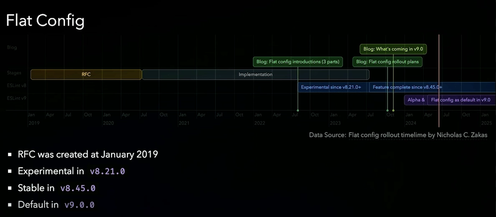

+++
title = "Migrate to ESLint 9.x"
description = "In this article, I share some experiences of migrating to ESLint 9.x, which includes significant breaking changes. We'll use the flat config, integrate ESLint plugins, and specify custom rules for various file types: .js, .cjs, .mjs and .ts"
date = 2024-07-16

[taxonomies]
categories = ["Development"]
tags = ["eslint", "typescript", "migration", "nodejs"]

[extra]
featured = true
outdate_alert = true
outdate_alert_days = 365
+++

Have you updated your ESLint setup to version 9.x? This version includes [many breaking changes](https://eslint.org/blog/2024/04/eslint-v9.0.0-released/). Two major changes you need to consider are:
- Node.js < v18.18.0 and v19 are no longer supported.
- Flat config is now the default and has some changes.

## Flat config

ESLint's new flat config system makes setting up easier by using just one JavaScript file (named `eslint.config.js, eslint.config.mjs, or eslint.config.cjs`). This is different from the old way, which used several different files like `.eslintrc*` and the `package.json`.

Here is a simple comparison between legacy config and flat config:

| Aspect                 | Legacy Config                                                    | Flat Config                       |
|:----------------------:|:----------------------------------------------------------------:|:---------------------------------:|
| Sources                | `.eslintrc` `.js, .json, .yml`, `package.json`, etc.             | `eslint.config.js` `.cjs, .mjs`   |
| Configuration style    | Convention-based `extends`                                       | Explicit native imports           |
| Plugin definition      | Package-named `plugins`                                          | Plugins are objects               |
| Inheritance tree       | Potentially complex                                              | Composable and traceable          |

**Benefits of the flat config**
- Performance: Reduced overhead due to a single configuration source.
- Maintainability: Easier to manage and update.
- Flexibility: More straightforward to compose and understand.

You can learn more about the reason for the flat config by visiting these links: [here](https://eslint.org/blog/2023/10/flat-config-rollout-plans/) and [here](https://eslint.org/docs/latest/use/configure/configuration-files). For more information on the syntax and concepts, check out the [ESLint configuration page](https://eslint.org/docs/latest/use/configure/).

Now, in ESLint 9.x, the flat config is enabled by default, which means the old `eslintrc*` configuration files won't work properly.

Here is the flat config rollout timeline:

<small>Image by Antony Fu (https://portal.gitnation.org/contents/eslint-one-for-all-made-easy)</small>

If you want to continue to use the legacy way, you can turn off the new system by setting an environment variable called `ESLINT_USE_FLAT_CONFIG` to `false`, but you'll see a warning message in your terminal. So the recommended way is to migrate to the flat config file. This might pose some challenges if you aren't familiar with this new system.
## Example of migrating ESLint 9.x in a Typescript project

We'll dive directly into an example to better understand how the flat config works. We will migrate a legacy ESLint config from ESLint 8.x to ESLint 9.x.
### Preparing for migration
Here are some steps to consider for the migration:
-  **Verify plugin support**: Ensure that all the plugins you use support ESLint 9.x and the flat config. You can track [ESLint v9 support](https://github.com/eslint/eslint/issues/18391) and [flat config support](https://github.com/eslint/eslint/issues/18093). Most popular plugins already support these changes.
- **Update NodeJS and dependencies**
- **Separate Prettier and ESLint**: (If you use the `plugin:prettier` plugin)  ESLint has [deprecated formatter rules](https://eslint.org/blog/2023/10/deprecating-formatting-rules/), meaning there is no format syntax with ESLint. This reduces conflicts between ESLint and Prettier. To simplify the ESLint config, I recommend separating ESLint and Prettier, and no longer using `plugin:prettier`. This also allows flexibility in choosing other formatter tools like Biome.

### Use the migrator tool
The ESLint team has developed a [migrator tool](https://eslint.org/blog/2024/05/eslint-configuration-migrator/) to help convert legacy config files (e.g., `.eslintrc*`) to the flat config. 

Here's how to use it:
```bash
npx @eslint/migrate-config .eslintrc.yml
```

Here is a simple example of a legacy config file `.eslintrc.yml`:

```yaml
parser: '@typescript-eslint/parser'
parserOptions:
    project: ./tsconfig.json
    sourceType: module
env:
    node: true
    jest: true
plugins:
  - import
extends:
    - eslint:recommended
    - plugin:@typescript-eslint/recommended
    - plugin:prettier/recommended
    - plugin:import/recommended
    - plugin:import/typescript
settings:
  import/resolver:
    typescript: true
    node: true
rules:
    '@typescript-eslint/no-use-before-define': 'off'
    'require-await': 'off'
    'no-duplicate-imports': 'error'
    'no-unneeded-ternary': 'error'
    'prefer-object-spread': 'error'
    '@typescript-eslint/no-unused-vars': ['error', { ignoreRestSiblings: true, args: 'none' }]
```

This simple ESLint config is for a TypeScript NodeJS project with Jest for testing and includes various plugins for different rules. Your project might contain more plugins, more rules, or use different config file types (`.eslintrc.{js, cjs, mjs}` or `.eslintrc`), but the process for updating your setup will be similar

Here is the generated config by migrator tool:
```js
import { fixupConfigRules, fixupPluginRules } from "@eslint/compat";
import _import from "eslint-plugin-import";
import globals from "globals";
import tsParser from "@typescript-eslint/parser";
import path from "node:path";
import { fileURLToPath } from "node:url";
import js from "@eslint/js";
import { FlatCompat } from "@eslint/eslintrc";

const __filename = fileURLToPath(import.meta.url);
const __dirname = path.dirname(__filename);
const compat = new FlatCompat({
    baseDirectory: __dirname,
    recommendedConfig: js.configs.recommended,
    allConfig: js.configs.all
});

export default [...fixupConfigRules(compat.extends(
    "eslint:recommended",
    "plugin:@typescript-eslint/recommended",
    "plugin:prettier/recommended",
    "plugin:import/recommended",
    "plugin:import/typescript",
)), {
    plugins: {
        import: fixupPluginRules(_import),
    },

    languageOptions: {
        globals: {
            ...globals.node,
            ...globals.jest,
        },

        parser: tsParser,
        ecmaVersion: 5,
        sourceType: "module",

        parserOptions: {
            project: "./tsconfig.json",
        },
    },

    settings: {
        "import/resolver": {
            typescript: true,
            node: true,
        },
    },

    rules: {
        "@typescript-eslint/no-use-before-define": "off",
        "require-await": "off",
        "no-duplicate-imports": "error",
        "no-unneeded-ternary": "error",
        "prefer-object-spread": "error",

        "@typescript-eslint/no-unused-vars": ["error", {
            ignoreRestSiblings: true,
            args: "none",
        }],
    },
}];
```

The migrator will prompt you to install additional packages:
```bash
Wrote new config to ./eslint.config.mjs

You will need to install the following packages to use the new config:
- @eslint/compat
- globals
- @eslint/js
- @eslint/eslintrc
```
- [@eslint/js](https://www.npmjs.com/package/@eslint/js): ESLint team start to [make a core rewrite the ESLint](https://eslint.org/blog/2024/07/whats-coming-next-for-eslint/), all the rules, documentations will move to the new package. This is a ESLint Javascript package rules. We will also have `@eslint/json` for json linter, `@eslint/markdown` for markdown linter.
- [@eslint/eslintrc](https://www.npmjs.com/package/@eslint/eslintrc): This gabage contains the legacy `eslintrc` configuration file format for ESLint. You will not need it if you start to write  a new flat config files
- [@eslint/compat](https://www.npmjs.com/package/@eslint/compat): This package allow you to wrap existing previous ESLint rules, plugins and configurations.

After using the migrator, we can identify additional dependencies we need to install: `@eslint/js` and `globals`. 
We no longer need the package `@eslint/eslintrc` since we are now using the flat config file. Additionally, `@eslint/compat` is not necessary unless certain plugins in your project do not support the flat config.

This tool might not produce a perfect result, but it provides a good starting point. That help us understand better how the syntax of the flat config look like. But in all cases, it will not work directly, we need to require a lot of manual adjustments. We will see the next part to know how better writting the flat config.

### Writing the new config

Considering our project contains different file extensions such as `js, mjs, ts`, the new config should be written like this:

```js
import importPlugin from 'eslint-plugin-import'
import globals from 'globals'
import tsParser from '@typescript-eslint/parser'
import eslintJs from '@eslint/js'
import eslintTs from 'typescript-eslint'

const tsFiles = ['{app,tests}/**/*.ts']

const languageOptions = {
    globals: {
        ...globals.node,
        ...globals.jest,
    },
    ecmaVersion: 2023,
    sourceType: 'module',
}

const customTypescriptConfig = {
    files: tsFiles,
    plugins: {
        import: importPlugin,
        'import/parsers': tsParser,
    },
    languageOptions: {
        ...languageOptions,
        parser: tsParser,
        parserOptions: {
            project: './tsconfig.json',
        },
    },
    settings: {
        'import/parsers': {
            '@typescript-eslint/parser': ['.ts'],
        },
    },
    rules: {
        'import/export': 'error',
        'import/no-duplicates': 'warn',
        ...importPlugin.configs.typescript.rules,
        '@typescript-eslint/no-use-before-define': 'off',
        'require-await': 'off',
        'no-duplicate-imports': 'error',
        'no-unneeded-ternary': 'error',
        'prefer-object-spread': 'error',

        '@typescript-eslint/no-unused-vars': [
            'error',
            {
                ignoreRestSiblings: true,
                args: 'none',
            },
        ],
    },
}

// Add the files for applying the recommended TypeScript configs 
// only for the Typescript files.
// This is necessary when we have the multiple extensions files 
// (e.g. .ts, .tsx, .js, .cjs, .mjs, etc.).
const recommendedTypeScriptConfigs = [
    ...eslintTs.configs.recommended.map((config) => ({
        ...config,
        files: tsFiles,
    })),
    ...eslintTs.configs.stylistic.map((config) => ({
        ...config,
        files: tsFiles,
    })),
]

export default [
    { ignores: ['docs/*', 'build/*', 'lib/*', 'dist/*'] }, // global ignores
    eslintJs.configs.recommended,
    ...recommendedTypeScriptConfigs,
    customTypescriptConfig,
]
```

You might notice that we don’t need to use tools like `@eslint/compat` or `@eslint/eslintrc`, which keeps the config cleaner and easier to maintain.

If some plugins in your project do not yet support the flat config, you will need to use `@eslint/compat`. For example, the package `eslint-plugin-import` [does not fully support the flat config yet](https://github.com/import-js/eslint-plugin-import/issues/2556), so some rules might not work correctly. In my case, I use `importPlugin.configs.typescript.rules` which works without using `@eslint/compat`.

For specific rules and file extensions, such as `common.js` files, we provide separate configurations to ensure they are correctly linted according to their specific requirements:

```js
const customCommonJSConfig = {
    files: ['{app,tests}/**/*.cjs'],
    languageOptions: {
        ...languageOptions,
        sourceType: 'commonjs',
    },
    rules: customCommonJSRules
}

const customESMConfig = {
    files: ['{app,tests}/**/*.{.js,mjs}'],
    languageOptions,
    rules: customESMRules
}

// And add it to the export config
export default [
    { ignores: ['docs/*', 'build/*', 'lib/*', 'dist/*'] }, // global ignores,
    eslintJs.configs.recommended,
    customESMConfig,
    customCommonJSConfig,
    ...recommendedTypeScriptConfigs,
    customTypescriptConfig,
]
```
By using the `files` field, you can ensure that the defined rules apply only to the specified files, providing more granular control over your linting process. This is especially useful in projects with multiple file types, such as JavaScript, TypeScript, and CommonJS files, etc..., where each type may require different linting rules.

That's all!

**Bonus: ESLint Inspector**

Once you have finished writing your ESLint config file, you can use the tool [eslint-config-inspector](https://eslint.org/blog/2024/04/eslint-config-inspector/). It's a visual tool for inspecting and understanding your ESLint flat configs. Give it a try to better understand your config.