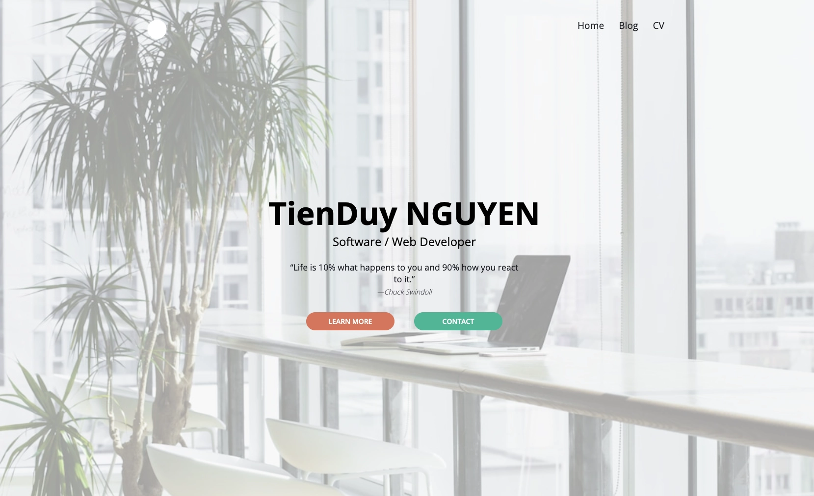
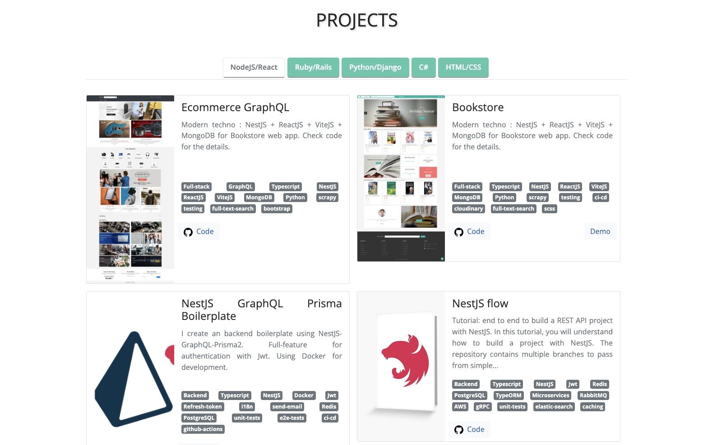
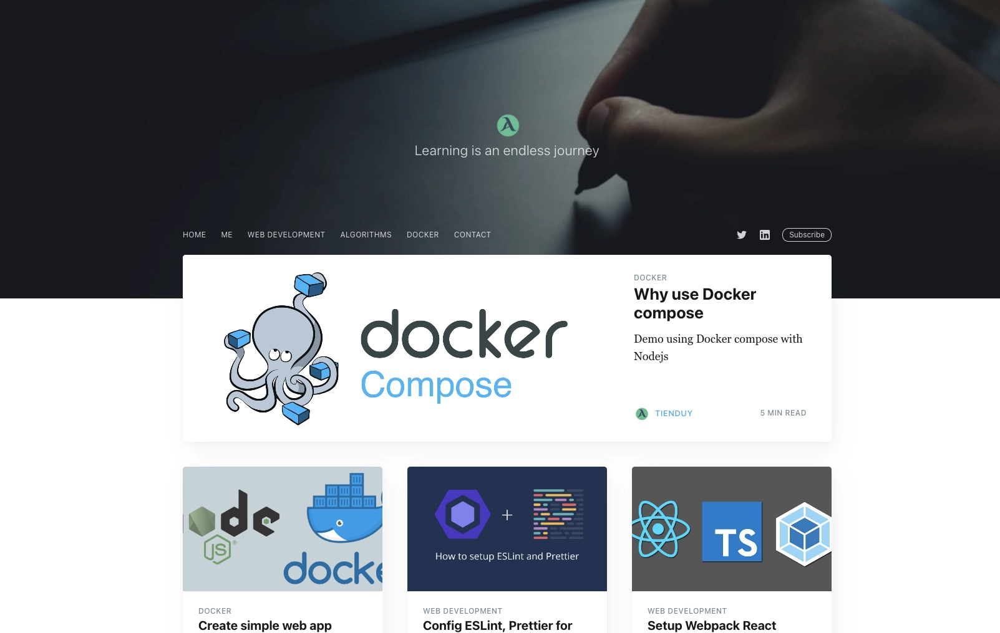
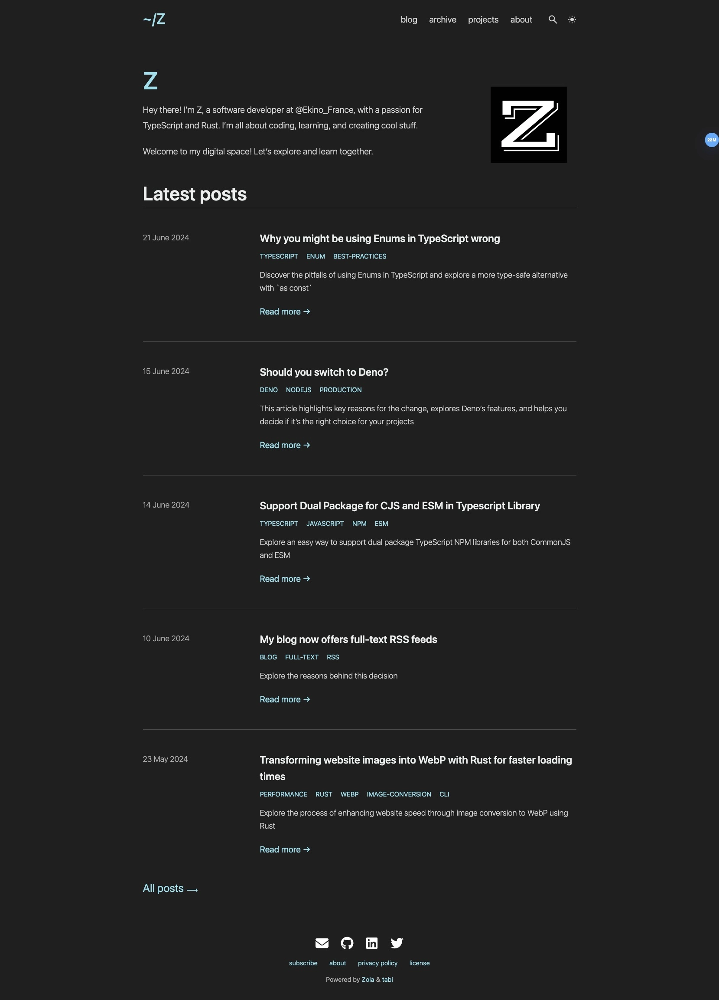

+++
title = "New home for my website"
description = "Discover why I switched my website and blog from Jekyll to Zola."
date = 2024-05-11

[taxonomies]
categories = ["WEBSITE"]
tags = ["blog", "static-site-generator"]

[extra]

+++

Hey there, it's been quite a while since my last article—almost 3 years. I'm not sure if anyone is still reading my posts because I've stopped using analytics for my website. Now, I've moved it to GitHub and use the free domain of GitHub Pages. It might not be great for SEO, but I'm happy with it. After all, the main reason I write is for myself. Each time I write, I learn something new and improve my skills on various topics.

So, I've decided to get back into the habit of writing regularly. It's a good practice for developers to improve day by day.

But first things first: I need to update my website. In the past, I usually used Jekyll to create my site. It runs on Ruby and used to fit my needs perfectly because it's free, powerful, and offers many themes for customization.

For my main website where I display my work, projects, and some information about me, I used Jekyll but did a lot of customization using SCSS. And for the blog, I used a customized theme named "Ghost." It looks really nice, so I'm quite happy with it.

However, these days, some of the tools I use are outdated. If I want to update them, it means updating Jekyll, Ruby, and tweaking gemfile configurations because there have been some major changes.

Here's how my two websites looked before the migration:

The main site: 

my blog:

Nowadays, I mostly work with [Node.js](https://nodejs.org/en), [Deno](https://deno.com/) and [Rust](https://www.rust-lang.org/), and I don't want to clutter my laptop with unnecessary tools.

Another reason is that I have two separate sites for my main site and my blog, which makes maintenance a bit complicated. So, I've decided to combine them into one site.

I've decided to try something new, keeping the website simple and aligning it with the technologies I use nowadays. I love markdown, so I'll only look for solutions involving static site generators.

Initially, I thought about using Deno. I did some research and found [Lume](https://lume.land/).

It looks good. It uses Deno as its runtime, it's fast, and supports many template engines. But the problem is, there aren't many custom themes right now and no one of them fit for both my main website and blog. That means if I use a theme, I'd have to do a lot of work on HTML and CSS templates, which I don't want to spend time on for this moment.

So, I thought, why not go directly with Rust? Deno is a JavaScript runtime written in Rust, but it's not quite the same as using Rust tools directly. So, I did some more research and found some options, but I chose [Zola](https://github.com/getzola/zola) because it's more popular, super fast, easy to use, and has a very active development community on GitHub. Plus, it has a rich ecosystem of themes but of course it's still relatively small compared to Jekyll, Hugo, Pelican, or Eleventy.

I found an interesting theme called [Tabi](https://www.getzola.org/themes/tabi/) that fits exactly what I want:

- Fast, pretty, easy to configure
- Good user interface and experience
- Supports internationalization (i18n)
- Supports dark mode and light mode
- Easy to write blog posts and showcase projects
- Easy integration with comment systems
- Good syntax highlighting
- Simple pagination customization
- Good SEO, search and analytics support
- Support image preview for social sharing posts

You can find more details in the [Tabi documentation](https://github.com/welpo/tabi).

And the best part about static site generators is that they use markdown, so I won't lose much time migrating the technology.

Take a look at these tools! If you like them, give them a star. The folks behind them did a great job.

By the way, you're already on my new website. Welcome!

I'm really happy with it. It's super fast when build locally.

Here is my blog now:

