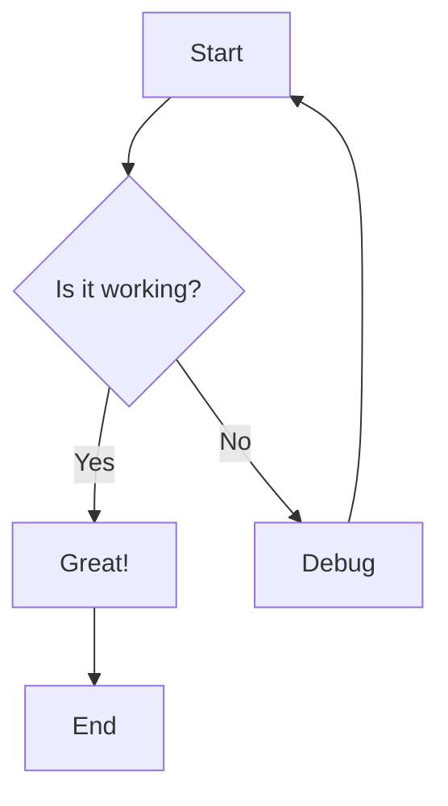
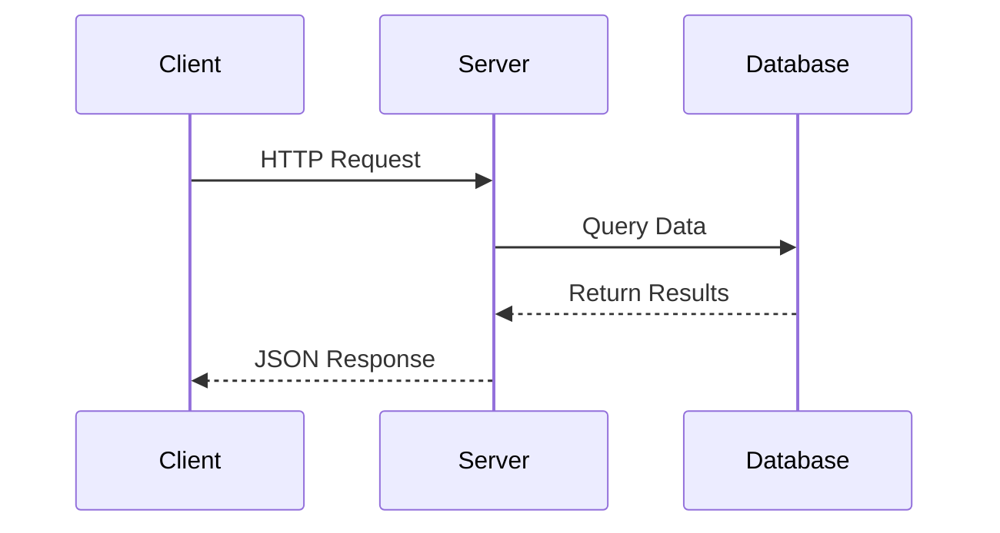
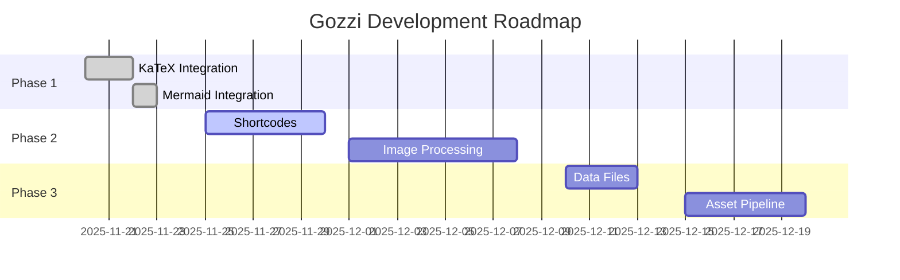
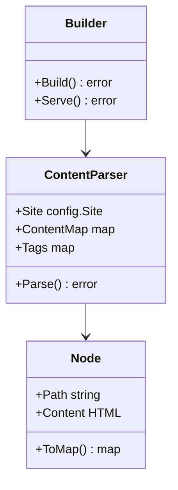
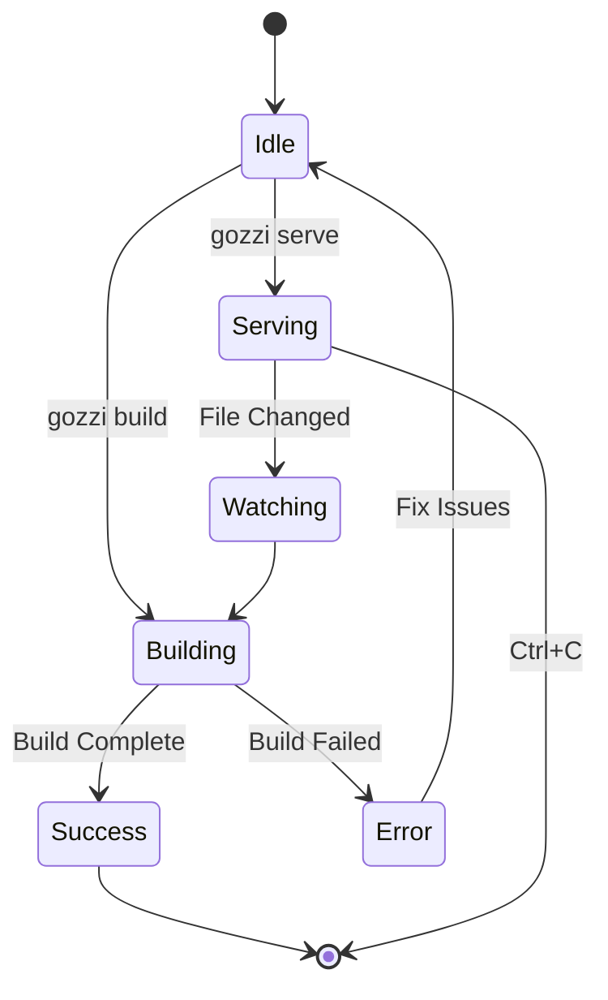
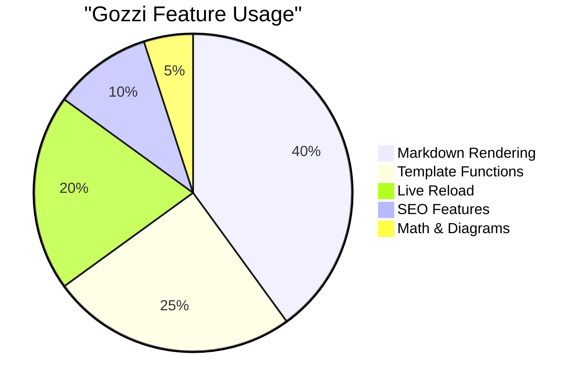
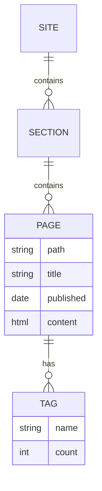
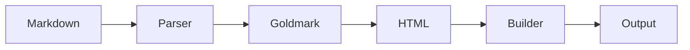

+++
title = "[Gozzi] Native mermaid support"
date = 2025-11-23
template = "note.html"
generate_feed = true
aliases = ["/notes/mermaid", "/notes/diagram-support"]

[extra]
comment = true
copy = true
mermaid = true
+++

# [Gozzi] Native mermaid support

Gozzi now has native Mermaid diagram support! Let's test various diagram types.

## Flowchart

A simple flowchart showing decision logic:

## Sequence Diagram

Showing interaction between components:

## Gantt Chart

Project timeline visualization:

## Class Diagram

Object-oriented structure:

## State Diagram

Application state management:

## Pie Chart

Usage statistics:

## Entity Relationship Diagram

Database schema:

## Mixed Content

You can mix diagrams with regular text and other features. For example, the complexity of our build process can be expressed as $O(n)$ where $n$ is the number of pages.

And that's it! All diagrams render beautifully with MermaidJS.
